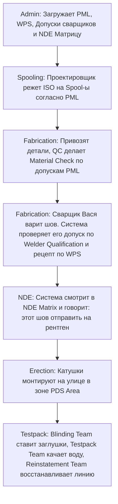

## Я спрашиваю у Gemini 3.5:

Расскажи теперь про предметную часть в Admin модуле который мы недавно создали, там перечислены разные сущности о которых я раньше никогда не слышал + все на английском. Как я понял первая стадия проекта это человек со специальными правами и должностью (system admin) делает первоначальный setup проекта, создает описание в project definition, дальше сначала оформляет системный справочник, создает там какие то сущности пока мне непонятные, дальше идет проектый справочник с еще больше непонятными мне сущностями, их там огромное колличество, зачем он их заполняет мне непонятно и зачем эти сущности нам нужны мне тоже непонятно, они на что-то влиять будут в будущем, расскажи кратко про каждую. И давай как нибудь попробуем админ модуль поместить в целостную картину по проекту строительства, трубам и нашем приложении

## Я Gemini 3.5 отвечает:

Давай теперь заглянем «под капот» приложения — в **Admin-модуль**.

Ты абсолютно прав: **System Admin** делает первоначальный сетап. Представь, что мы строим не просто трубопровод, а гигантский Lego-город. Модули _Fabrication_ (производство) и _Erection_ (монтаж) — это сам процесс сборки деталей. Но **Admin-модуль — это правила вселенной, в которой происходит эта сборка.**

Если мы не заполним эти справочники, приложение PipeQC просто не поймет:

- Имеет ли право сварщик Вася варить высоконапорную газовую трубу?
- Сколько рентгеновских снимков нужно сделать для шва №12?
- Каким цветом красить готовую катушку?

Давай сначала разберем глобальную разницу между двумя справочниками, а затем пройдемся по самым загадочным терминам.

---

### Глобальное разделение: System vs. Project Referential

В PipeQC справочники разделены на два уровня не просто так. Это сделано для экономии времени и стандартизации:

1. **System Referential (Системный справочник)**:
   - **Что это:** Мировые стандарты, законы физики и металлургии. Они одинаковы для всех проектов компании.
   - **Пример:** Марка стали `CS-A106B` (углеродистая сталь) ведет себя одинаково и на проекте в Сибири, и на проекте в Саудовской Аравии. Формулы расчета ультразвука (UT) тоже не меняются от проекта к проекту.
   - **Кто ведет:** Глобальный администратор компании (HQ Admin).

2. **Project Referential (Проектный справочник)**:
   - **Что это:** Локальные правила, контракты и ресурсы для **конкретной стройки**.
   - **Пример:** На проекте в Тюмени подрядчиком нанята фирма «Сибирь-Монтаж», а красить трубы клиент просит в синий цвет (RAL 5015). На проекте в Астрахани подрядчики и цвета будут другими.
   - **Кто ведет:** Администратор конкретного проекта (Project Admin / Lead QC).

---

### Подробный разбор «непонятных сущностей»

Давай разберем сущности из **Project Referential** по группам, как они разбиты в коде, переведем их на человеческий язык и поймем, **зачем они нужны**.

#### 1. Вкладка "General" (Общие настройки проекта)

| Сущность в Admin                   | Что это на человеческом языке     | Зачем это нужно приложению?                                                                                                                                                                                                                      |
| :--------------------------------- | :-------------------------------- | :----------------------------------------------------------------------------------------------------------------------------------------------------------------------------------------------------------------------------------------------- |
| **Subcontractor List**             | Список субподрядчиков.            | Мы нанимаем разные компании для работ. PipeQC должен знать, какой стык варил подрядчик «А», а какой — подрядчик «Б», чтобы потом выставить им счета или предъявить претензии по качеству.                                                        |
| **Progress Weight Factor**         | «Вес» каждого этапа работы (в %). | Сварка шва сложнее, чем его покраска. В этом справочнике задается вес: например, сборка катушки — это 20% прогресса, сварка — 50%, NDE-контроль — 20%, покраска — 10%. Благодаря этому менеджер проекта видит реальный процент готовности трубы. |
| **Area Classification / PDS Area** | Физическое зонирование стройки.   | Стройплощадка огромна (может быть 2х2 км). Её делят на Зоны (Area 100, Area 200). Каждая катушка жестко привязана к своей зоне, чтобы монтажники понимали, куда её везти.                                                                        |

---

#### 2. Вкладка "Spooling" (Проектирование и Материалы)

На этом этапе мы загружаем чертежи (ISO) и делим их на катушки (Spools).

| Сущность в Admin                              | Что это на человеческом языке                  | Зачем это нужно приложению?                                                                                                                                                                                                                                                                                                |
| :-------------------------------------------- | :--------------------------------------------- | :------------------------------------------------------------------------------------------------------------------------------------------------------------------------------------------------------------------------------------------------------------------------------------------------------------------------- |
| **Piping Material List (PML) / Piping Class** | «Продуктовая корзина» проекта (Трубный класс). | Клиент (например, Газпром) разрешает использовать на проекте только определенные типы труб, фланцев и болтов. PML — это жесткий каталог разрешенных деталей. Если инженер попытается добавить в чертеж деталь не из этого списка, приложение выдаст ошибку.                                                                |
| **NDE Matrix**                                | Матрица контроля качества.                     | **Критически важная вещь!** Она говорит: «Если по трубе течет взрывоопасный газ (Class A), мы обязаны просветить рентгеном (RT) **100%** стыков. Если течет техническая вода (Class C) — достаточно проверить **5%** стыков». Приложение автоматически рассчитывает объем контроля для каждого шва на основе этой матрицы. |
| **Spooling Check List**                       | Чек-лист проверки чертежа.                     | Инспектор не может просто сказать «чертеж норм». Он должен поставить галочки: «Диаметры сходятся», «Толщина стенки правильная», «Материал из PML». Справочник задает список этих вопросов.                                                                                                                                 |

---

#### 3. Вкладка "Fabrication & Erection" (Сварка и Монтаж)

Здесь мы описываем всё, что связано со сварными швами и фланцами.

| Сущность в Admin                                 | Что это на человеческом языке                        | Зачем это нужно приложению?                                                                                                                                                                                                                          |
| :----------------------------------------------- | :--------------------------------------------------- | :--------------------------------------------------------------------------------------------------------------------------------------------------------------------------------------------------------------------------------------------------- |
| **WPS List** _(Welding Procedure Specification)_ | Технологическая карта сварки («Рецепт шеф-повара»).  | Сварка — это наука. WPS описывает: какой сварочный аппарат взять, какой электрод использовать, до какой температуры греть стык. **Каждый** шов в системе обязан ссылаться на свой WPS. Без этого варить запрещено.                                   |
| **Welder Qualification**                         | Паспорта и допуски сварщиков.                        | Сварщик не может варить всё подряд. Сварщик Вася сдал экзамен только на углеродистую сталь. Сварщик Джон — на титан. Приложение сверяет стык и допуск сварщика. Если Вася попытается сварить титановый шов, система заблокирует его внесение.        |
| **Joint Category Definition**                    | Категории стыков.                                    | Стыки бывают угловые, стыковые, под нахлестку. У них разные нормы дефектов и разные способы сварки.                                                                                                                                                  |
| **Jointer List / Torquing Requirement**          | Список «болтокрутов» и требования к затяжке фланцев. | Фланцы (соединения на болтах) не варят, их стягивают огромными ключами с определенным усилием (Torque). Если затянуть слабо — потечет, сильно — сорвет резьбу. Здесь мы ведем список сертифицированных монтажников фланцев и таблицы усилий затяжки. |

---

#### 4. Вкладка "Testpack" (Гидравлические испытания)

Самый ответственный этап — проверяем собранный трубопровод на прочность. Мы закачиваем туда воду под диким давлением (например, 150 атмосфер).

> [!IMPORTANT]
> Чтобы вода под давлением 150 атмосфер не хлынула в дорогое оборудование (турбины, насосы), этот участок трубы нужно физически изолировать. Для этого в места фланцевых соединений вставляют временные стальные диски-заглушки (**Blinds**). Этим занимаются специальные бригады.

| Сущность в Admin       | Что это на человеческом языке                     | Зачем это нужно приложению?                                                                                                                                                                                                                           |
| :--------------------- | :------------------------------------------------ | :---------------------------------------------------------------------------------------------------------------------------------------------------------------------------------------------------------------------------------------------------- |
| **Blinding Team**      | Бригада по установке заглушек.                    | Отвечает за то, чтобы перед тестом перекрыть все выходы из трубы заглушками. Система должна знать, кто несет ответственность за безопасность изоляции.                                                                                                |
| **Line Checker Team**  | Инспекторы по проверке линии.                     | Перед тестом они проходят по всей трубе с чертежом в руках и сверяют: все ли швы заварены, все ли опоры установлены.                                                                                                                                  |
| **Reinstatement Team** | Бригада по «восстановлению» (демонтажу заглушек). | После успешного теста воду сливают. Но трубу нельзя пускать в работу с заглушками внутри! Эта бригада вытаскивает временные диски и ставит постоянные прокладки. Система строго отслеживает: «Сколько заглушек поставили — столько же обязаны снять». |
| **System / Subsystem** | Технологические системы завода.                   | Трубы группируются не только по зонам, но и по смыслу. Например: «Система подачи факельного газа» или «Система пожаротушения».                                                                                                                        |

---

### Целостная картина: как Админка связывает проект воедино

Давай посмотрим на жизненный путь трубы через призму админки:

### Резюме:

Админ-модуль — это **база знаний и ограничений**. Без него приложение PipeQC превратилось бы в простой текстовый блокнот, где каждый пишет что хочет. Благодаря справочникам система работает как **строгий QC-полицейский**, который автоматически гарантирует безопасность строительства завода.

Если у тебя остались вопросы по каким-то конкретным аббревиатурам или терминам — смело спрашивай!
