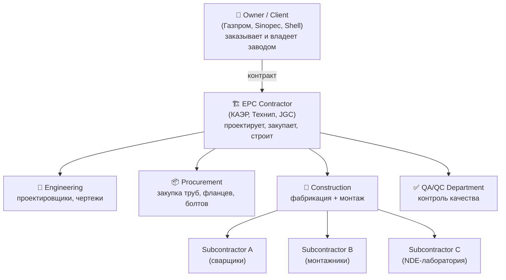
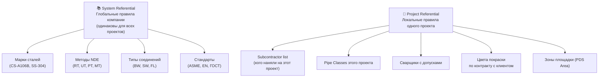
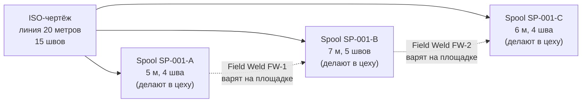
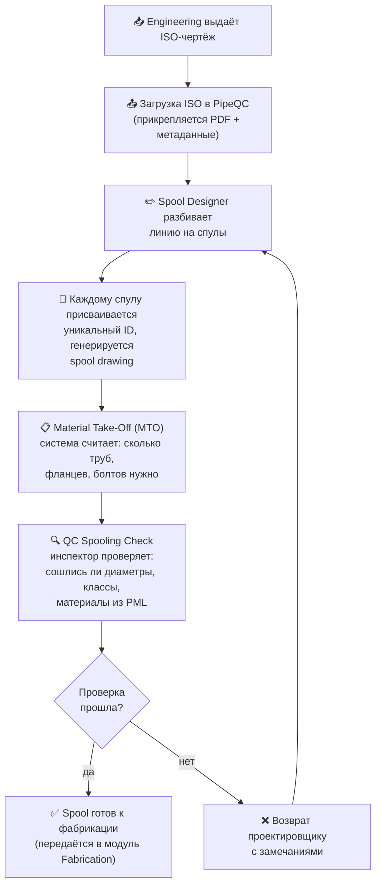
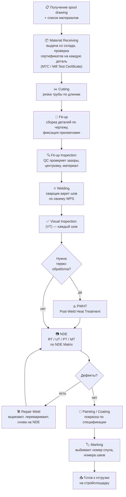
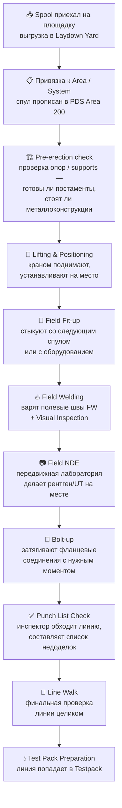
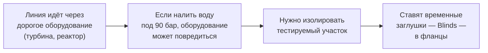
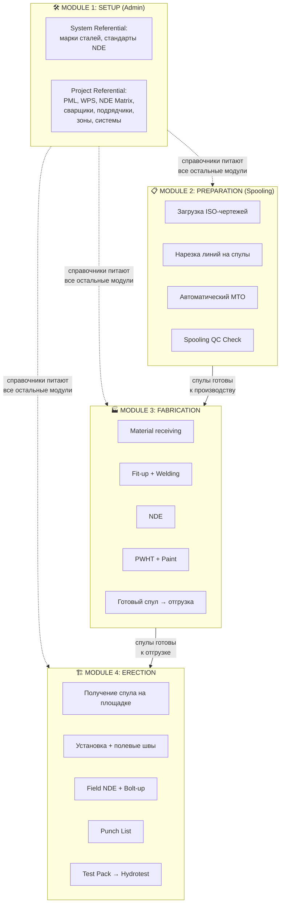

# Трубопроводное строительство: от чертежа до пуска завода

> Гид по предметной области для разработчика PipeQC. Цель — чтобы ты мог уверенно сесть напротив заказчика, услышать любой термин и понимать, **что это, зачем это и где это живет в твоем приложении**.

---

## Часть 1. Что мы вообще строим

### Уточнение №1, без которого всё остальное бессмысленно

Когда говорят «трубопровод», обыватель представляет «Северный поток» или нефтепровод «Дружба» — длинные трубы через тысячи километров. **Это не наша история.**

PipeQC — это про трубы **внутри промышленных объектов**:
- Нефтеперерабатывающие заводы (НПЗ)
- Газоперерабатывающие заводы (ГПЗ), LNG-терминалы
- Химические комбинаты, удобрения
- Электростанции (особенно ТЭЦ, АЭС)
- Фармацевтические производства
- Целлюлозно-бумажные комбинаты

Завод — это не только башни, реакторы и резервуары. **Всё это связано трубами**: пар, газ, нефть, кислоты, охлаждающая вода, азот, водород. Если убрать с завода все трубы — останется голый каркас и оборудование, которое ничего не делает.

### Масштаб, чтобы прочувствовать

Чтобы у тебя в голове была шкала:

| Объект | Длина труб | Сварных швов | Длительность стройки |
|---|---|---|---|
| Небольшая котельная | 5–10 км | 1 000–3 000 | 6–12 мес |
| Средний нефтехим. цех | 30–80 км | 15 000–40 000 | 1.5–3 года |
| Крупный НПЗ / LNG | 200–500 км | 80 000–200 000 | 3–6 лет |

> [!IMPORTANT]
> **Каждый из этих десятков тысяч швов** должен иметь паспорт: кто его сварил, какими электродами, по какому рецепту, кто его проверил, какой результат рентгена. И всё это — на случай, если через 10 лет где-то рванёт и приедет следователь. Без программы это либо горы бумаги в архивах, либо Excel-ад, в котором уже на 3-м месяце никто не понимает, что где.

Это и есть главная боль заказчика, и главное «зачем» твоего приложения.

### Действующие лица



**Главное, что нужно запомнить:**
- **Owner** платит и принимает. У него свои инспекторы (Owner's QC) на стройке.
- **EPC** делает «всё под ключ» — от чертежа до запуска. Это часто тот, кому ты продаёшь PipeQC.
- **Subcontractors** — фирмочки, которые EPC нанимает на конкретные виды работ. Один варит, другой возит, третий красит, четвертый просвечивает рентгеном.
- **QA/QC** — это отдельный «отряд полицейских» внутри EPC, который следит, чтобы все остальные не накосячили. **PipeQC — это в первую очередь инструмент именно для них.**

### Физика, без которой не понять «зачем такие сложности»

По трубам течет среда. Среда бывает:

| Класс | Что течет | Опасность | Требования к трубам и швам |
|---|---|---|---|
| **Class A / Lethal** | Кислый газ (H₂S), хлор, водород высокого давления | Утечка = смерть, взрыв | Каждый шов проверяют рентгеном (100% RT), особые стали, термообработка после сварки |
| **Class B / Critical** | Углеводороды, пар высокого давления | Пожар, ожоги | Выборочный рентген (10–25%), строгие требования |
| **Class C / Normal** | Техническая вода, воздух КИП | Низкая | Минимальный контроль (5%), обычные материалы |
| **Class D / Utility** | Сжатый воздух, дренаж | Очень низкая | Только визуальный осмотр |

> Это и есть **Pipe Class** (или **Piping Material Specification, PMS**). На каждом ISO-чертеже сверху указан класс — например, `A1A`, `CS-150`, `1B12` — и от него зависит абсолютно всё: марка стали, толщина стенки, тип фланцев, нужен ли рентген, нужен ли отжиг.

Запомни эту иерархию — она будет всплывать постоянно.

---

## Часть 2. Жизненный цикл проекта (макро-карта)

Прежде чем нырять в модули, посмотри на всю стройку с высоты птичьего полёта:

```mermaid
flowchart LR
    A["1 Engineering<br/>📐 Проектируют завод<br/>выдают ISO-чертежи"]
    B["2 Procurement<br/>📦 Закупают трубы,<br/>фланцы, болты"]
    C["3 Preparation<br/>📋 Spooling<br/>режут чертежи на катушки"]
    D["4 Fabrication<br/>🏭 В цеху варят<br/>катушки из деталей"]
    E["5 Erection<br/>🏗️ На площадке<br/>монтируют катушки"]
    F["6 Testing<br/>💧 Гидроиспытания<br/>под давлением"]
    G["7 Reinstatement<br/>🔧 Снимают заглушки,<br/>ставят постоянные<br/>прокладки"]
    H["8 Commissioning<br/>🚀 Передача<br/>в эксплуатацию"]
    
    A --> B --> C --> D --> E --> F --> G --> H
    
    style C fill:#ffd966
    style D fill:#ffd966
    style E fill:#ffd966
    style F fill:#ffd966
```



**Жёлтым** — фазы, в которых живёт PipeQC. То есть в Engineering и Procurement приложение почти не участвует (это делается в других программах: AVEVA, SmartPlant, SAP). А вот с момента, когда чертежи переданы строителям — начинается твоя зона ответственности.

Теперь по модулям.

---

## Часть 3. Модуль 1 — Setup (Admin). Установка правил вселенной

### Аналогия

Представь, что ты открываешь новое казино. Прежде чем впустить первого гостя, ты должен:
- Распечатать правила каждой игры (что такое выигрыш, что — проигрыш)
- Раздать дилерам бейджи и проверить их сертификаты
- Установить минимальные и максимальные ставки на каждый стол
- Назначить службу безопасности и их полномочия

**Только после этого** игроки могут зайти и начать играть. Если казино откроется без правил — будет хаос и судебные иски.

Модуль **Admin** — это ровно то же самое для стройки. До того как первый чертёж попадёт в систему, кто-то с ролью **System Admin** должен заполнить справочники. Иначе приложение «не знает», что хорошо, а что плохо.

### Два уровня справочников



**Почему так разделено:** Если бы вся справочная информация хранилась внутри одного проекта, при старте нового проекта пришлось бы заново вбивать все марки сталей мира. Глупо. Поэтому глобальные вещи (которые не меняются от стройки к стройке) живут в **System**, а локальные — в **Project**.

### Что лежит в Project Referential — по группам

Я не буду повторять полную таблицу Gemini, дам только то, что **обязательно нужно понимать и уметь объяснить** заказчику. Группы условно бьются по модулям-потребителям:

#### Для модуля Spooling

| Сущность | Зачем |
|---|---|
| **PML / Piping Material List** | Каталог разрешённых на проекте труб, фланцев, отводов. Если проектировщик нарисует на чертеже фланец, которого нет в PML — система не пропустит. Защита от «самодеятельности». |
| **NDE Matrix** | Таблица «если класс трубы такой-то, то рентген стольких процентов швов». Приложение автоматически выставит план контроля для каждого шва. Это критично — иначе бригадир по памяти решает, что просвечивать, а что нет. |

#### Для модуля Fabrication

| Сущность | Зачем |
|---|---|
| **WPS** (Welding Procedure Specification) | «Рецепт сварки». Описывает: для соединения стали такой-то марки и толщины — варить таким-то электродом, при такой-то силе тока, с предварительным нагревом до 150 °C. **Каждый шов в системе обязан ссылаться на WPS.** |
| **Welder Qualification** | «Водительские права» сварщика. Сварщик Иванов сдал экзамен на углеродистую сталь до 12 мм. Если он попытается варить трубу из нержавейки или толщиной 30 мм — система заблокирует. |
| **Heat Treatment Procedures** | Для толстостенных и легированных труб после сварки обязательно «отпускать» сталь в печи. Здесь — режимы (температура, время). |

#### Для модуля Erection и Testpack

| Сущность | Зачем |
|---|---|
| **PDS Area** | Физические зоны стройплощадки. Завод 2×2 км разбит на квадраты Area 100, 200, 300. Каждая катушка «прописана» в своём квадрате — чтобы шофёр знал, куда везти. |
| **System / Subsystem** | Логическая группировка труб по назначению («Система подачи факельного газа», «Система пожаротушения»). Гидроиспытания делаются именно по системам, а не по зонам. |
| **Torquing Requirement** | Таблица «фланец такого-то размера затягивать с моментом таких-то Н·м». Перетянешь — сорвёт резьбу, недотянешь — потечёт. |
| **Blinding / Line Check / Reinstatement Teams** | Бригады, отвечающие за подготовку и восстановление трубы вокруг гидроиспытания. См. часть про Erection. |

#### Для отчётности

| Сущность | Зачем |
|---|---|
| **Progress Weight Factor** | Сборка катушки = 20% готовности, сварка = 50%, NDE = 20%, покраска = 10%. Менеджер проекта видит, что катушка готова на 70%, а не «ну, варится». |
| **Subcontractor List** | Чтобы каждое действие было привязано к конкретному подрядчику. Потом по этому списку формируются счета и претензии. |

### Главная мысль про Admin

> **Admin-модуль ничего не строит и ничего не показывает прогресса.** Это — «фундамент под фундаментом». Если он заполнен криво, в фабрикации и монтаже всё рассыпется: приложение будет либо разрешать запрещённое, либо блокировать законное, и пользователи возненавидят систему.
>
> Это первое, что нужно объяснить заказчику: **первые 2–4 недели проекта твоя команда (или его) будет загружать справочники.** Это не баг, это фича. Это инвестиция в строгий контроль на следующие 3 года.

---

## Часть 4. Модуль 2 — Preparation (Spooling). Превращаем чертежи в задачи

### Что такое ISO-чертёж

После того как проектировщики (инженерия) спроектировали завод, они выдают на стройку пачку чертежей в формате **ISO (Isometric drawing)**. Это **не план сверху**, а изометрия — трёхмерный вид трубы, развёрнутый в плоскость.

Один ISO-чертёж описывает **одну линию** — путь одной трубы от точки А (например, выход из насоса) до точки Б (например, вход в теплообменник). На чертеже:

- Каждый прямой кусок трубы пронумерован
- Каждое колено, тройник, фланец — пронумерованы
- В правом нижнем углу — **BOM (Bill of Materials)**: спецификация, сколько каких деталей нужно
- Сверху — служебная информация: pipe class, давление, температура, среда

Псевдо-картинка ISO-чертежа:

```
   ┌─────────────────────────────────────────────────────────┐
   │  LINE No: 10-PG-A1A-001    Pipe Class: A1A              │
   │  Service: HP Steam         Pressure: 60 bar             │
   │                                                          │
   │                                    [F2]                  │
   │                                     │                    │
   │                                     │ ←pipe segment #3   │
   │                  [E1]              [V1]                  │
   │                   │                                      │
   │   from Pump P-101 ●───────┬─────────┘                    │
   │                  #1        #2                            │
   │                          [T1]                            │
   │                            │                             │
   │                            │ #4                          │
   │                            ●  to Heat Exchanger E-205    │
   │                                                          │
   │  BOM:  Pipe 6" Sch40  — 14 m                             │
   │        90° elbow LR    — 2 pcs                           │
   │        Tee equal       — 1 pc                            │
   │        Flange WN 6"    — 2 pcs                           │
   │        Gate valve 6"   — 1 pc                            │
   └─────────────────────────────────────────────────────────┘
```

Таких чертежей на средний завод — **5 000 — 15 000 штук**. Их печатают на бумаге, разрабатывают, потом сканируют и загружают в PipeQC.

### Что такое Spool (катушка) и зачем резать трубы

Линия на ISO — это, скажем, 20 метров трубы со всеми коленями и фланцами. **Целиком привезти её на стройку невозможно**: 20-метровая Г-образная конструкция не пролезает в дверь цеха и не помещается в фуру.

Поэтому **Spool Designer** (или **Pipe Detailer**) режет линию на куски — **спулы / катушки**. Каждый Spool:

- Помещается в стандартный транспортный контейнер (обычно ≤ 12 м)
- Изготавливается **целиком в цеху** (это называется **Shop Fabrication**)
- Имеет свой уникальный номер (например, `SP-10-001-A`)
- Имеет свою мини-спецификацию деталей и швов
- Имеет свой чертёж (Spool Drawing — отдельный документ, производный от ISO)

Граница между двумя спулами становится **полевым стыком (Field Joint, FW — Field Weld)** — его будут варить уже на стройплощадке, при монтаже.



**Главный принцип:** чем больше работы перенесено в цех (Shop Welds), тем дешевле и качественнее. Цеховые швы варятся в комфортных условиях, на поворотных стендах, любой позиции. Полевые швы (Field Welds) варятся на 30-метровой высоте, в дождь, в неудобной позе — поэтому их стараются минимизировать.

### Workflow Spooling



### Ключевые роли в Spooling

- **Spool Designer / Pipe Detailer** — режет линии, рисует spool drawings. Часто это уже не EPC, а специализированная фирма.
- **QC Spooling Inspector** — проверяет, что разбиение корректное, материалы из PML, размеры сходятся.
- **Material Coordinator** — следит за MTO: что у нас на складе уже есть, что нужно докупить, что в пути.

### Что часто болит без программы

- Дублирование номеров спулов, путаница версий чертежей
- Несоответствие между ISO и заказанными материалами — на стройке вдруг выясняется, что фланцев на 2 меньше, чем нужно
- Spool готов в цеху, но на площадке для него ещё не готова опора → катушки годами лежат во дворе под дождём

**PipeQC закрывает это так:**
- Уникальность ID гарантируется
- MTO считается автоматически при изменении чертежа
- Видно статус спула в любой момент: спроектирован → одобрен → в производстве → готов → на площадке → смонтирован

---

## Часть 5. Модуль 3 — Construction: Fabrication. Цех

### Где это происходит

**Fabrication Shop** — это огромный ангар (часто 5–10 тыс. м²) рядом со стройплощадкой или вообще в другом городе. В нём:

- Стеллажи с трубами разных диаметров
- Станки для резки (плазма, газ, дисковая пила)
- Сварочные посты (полуавтоматы, аргонодуговая сварка)
- Поворотные стенды для удобной сварки
- Печи для термообработки
- Камеры для просвечивания (RT) и стол для ультразвука (UT)
- Покрасочная камера
- Зона готовой продукции

Сюда приходит **spool drawing** из PipeQC, и здесь рождается физическая катушка.

### Жизненный цикл спула в цеху



### Концепция **Joint Card** — паспорт шва

На каждый сварной шов система автоматически заводит **Joint Card** (или **Weld Log**). В нём:

| Поле | Пример |
|---|---|
| Joint ID | `SP-001-A / W-03` |
| Spool | SP-001-A |
| Pipe Class | A1A |
| Joint Type | BW (Butt Weld) |
| WPS | WPS-CS-001 |
| Welder | Иванов И.И. (stamp `I-15`) |
| Date welded | 2026-03-15 |
| Visual result | Accepted |
| NDE required | RT 100% |
| NDE result | Accepted (RT report #RT-345) |
| PWHT | not required |
| Status | ✅ Closed |

> [!IMPORTANT]
> **Это и есть тот самый «паспорт на каждый шов», ради которого вообще существует подобный софт.** Если через 5 лет потечёт шов где-то в трубе — заходишь в PipeQC, находишь joint, видишь: кто сварил, по какому рецепту, кто проверял, что показал рентген. На этом стоит вся отраслевая безопасность.

### Welder Traceability (прослеживаемость сварщика)

Каждый сварщик имеет личный **stamp** (клеймо) — буквенно-цифровой код, который он физически выбивает рядом с каждым своим швом. В PipeQC это поле в Joint Card.

**Зачем:**
- Если у сварщика подряд несколько швов с дефектами по рентгену — система сигнализирует. Возможно, у него «поплыла» техника или сломался аппарат, и его временно отстраняют.
- Если выявится систематический брак — претензии конкретно к нему и к его субподрядчику.
- Сварщик не может физически «сварить» шов, на который у него нет допуска: PipeQC заблокирует регистрацию.

### Что часто болит без программы

- Сварщик потерял свой допуск 2 месяца назад, а продолжает варить — обнаруживается только при аудите
- На один joint случайно повесили двух разных сварщиков (в Excel перепутали строки)
- NDE-лаборатория сделала рентген, но отчёт потерялся, шов лежит без статуса
- Дефекты переваривали 3 раза подряд — никто не отслеживает: по нормам, после 3 ремонтов шов должен быть полностью вырезан и переделан

### Когда катушка считается готовой

Spool готов к отгрузке только когда:
1. Все швы внутри него прошли VT (визуальный контроль) — ✅
2. Все обязательные NDE выполнены и приняты — ✅
3. Если требовалась PWHT — выполнена и есть протокол — ✅
4. Покраска по спецификации — ✅
5. Маркировка нанесена — ✅

PipeQC автоматически меняет статус спула на **Ready for Dispatch**, и его можно везти на площадку.

---

## Часть 6. Модуль 4 — Construction: Erection. Стройплощадка

### Где это происходит

В отличие от цеха, **Erection** — это работа на улице, на самой будущей территории завода. Здесь стоят бетонные постаменты, металлоконструкции (эстакады) и оборудование (колонны, насосы, теплообменники). Задача — **смонтировать спулы между ними так, чтобы получились те самые линии с ISO-чертежей**.

### Жизненный цикл монтажа



### Ключевые особенности Erection (отличия от Fabrication)

| Аспект | Fabrication (цех) | Erection (площадка) |
|---|---|---|
| Условия | Тёплый ангар, столы, краны мостовые | Улица, дождь, ветер, высота |
| Сварка | Любая позиция, поворотный стенд | Часто 5G, 6G — над головой, в стеснении |
| Контроль | Стационарная RT-камера | Передвижная RT-машина, иногда заменяют на UT |
| Скорость | Высокая | Низкая, много логистики |
| Стоимость шва | Условно ×1 | Условно ×3–5 |

Поэтому весь смысл фазы Preparation/Spooling — **максимум работы перенести в цех**, минимум — оставить на полевые швы.

### Punch List — список «хвостов»

После того как линия физически собрана, инспектор Owner'а (или EPC) делает **Walk-down** — обходит её всю и составляет **Punch List**. Это список мелких недоделок: «не хватает гайки на опоре #5», «не покрашен участок 30 см», «не установлен манометр».

Punch List бывает двух категорий:
- **Category A** — блокирует пуск (например, отсутствие шва или дефект). Без устранения линию нельзя испытывать.
- **Category B** — не блокирует пуск, но должно быть устранено до сдачи (косметика, маркировка).

PipeQC ведёт этот список, и пока **все А-пункты не закрыты** — линию нельзя перевести в статус **Ready for Hydrotest**.

### Test Pack — гидроиспытания (про это часто спрашивают)

После монтажа группа связанных линий объединяется в **Test Pack** — пакет, который тестируется одним гидроиспытанием. В трубу заливают воду и накачивают её под давлением в 1.5 раза выше рабочего (например, рабочее 60 бар → испытание 90 бар) и держат несколько часов. Если нигде не подтекает — линия прошла.

**Почему это сложно:**



И тут появляются те самые три бригады, про которые писал Gemini:

1. **Blinding Team** — перед тестом ставит временные заглушки в нужные фланцы. Каждая заглушка регистрируется в PipeQC.
2. **Line Checker Team** — обходит весь Test Pack и сверяется с чертежом: все ли швы заварены, все ли опоры на месте, все ли блайнды поставлены.
3. **Reinstatement Team** — после успешного теста **снимает временные заглушки** и ставит постоянные прокладки. Здесь критично: **количество поставленных блайндов должно совпадать с количеством снятых**. Если хоть один забудут вытащить — после пуска завода труба будет глухая, и где-то рванёт. PipeQC жёстко считает баланс «поставили — сняли».

> Хотя Testpack — это формально отдельный модуль или подмодуль, на ранней фазе общения с заказчиком его обычно показывают в связке с Erection: «вот мы смонтировали — вот мы испытали».

---

## Часть 7. Шпаргалка: как говорить с заказчиком

### Если коротко спросят «А что вообще делает ваша программа?»

> «PipeQC ведёт цифровой паспорт на каждый сварной шов и на каждую катушку от момента, как чертёж пришёл из проектного отдела, и до момента, как линия успешно прошла гидроиспытание. Программа знает все правила вашего проекта — какие материалы можно использовать, кто из сварщиков что имеет право варить, какой шов нужно просвечивать рентгеном. Она не даёт людям нарушать эти правила и одновременно собирает доказательную базу качества для приёмки клиентом.»

### Какие боли заказчика ты решаешь (запомнить наизусть)

| Боль до PipeQC | Что меняет PipeQC |
|---|---|
| Excel-ад: 40 таблиц, у каждого инженера своя версия, нестыковки | Один источник истины, версия одна |
| Сварщик с просроченным допуском продолжает варить | Система блокирует регистрацию шва |
| NDE-отчёты теряются, до 30% швов «зависают» без статуса | Каждый шов имеет статус и владельца действия |
| При аудите Owner'а готовят пачку документов 2 недели вручную | Отчёт выгружается в один клик |
| На площадке выясняется, что фланцев на 5 штук меньше, чем надо | MTO считается из чертежа автоматически |
| После гидроиспытания забыли снять блайнд → катастрофа | Жёсткий учёт баланса blind in / blind out |
| Subcontractor завысил объёмы в счёте | Прогресс по швам/спулам фиксируется в системе и автоматически конвертируется в %% выполнения |

### Если спросят «Чем вы отличаетесь от YCLIENTS/SAP/AVEVA/SmartPlant?»

Это разные классы продуктов:
- **AVEVA / SmartPlant 3D** — это **проектирование**: там рисуют завод в 3D и генерируют ISO-чертежи. PipeQC начинается **после** того, как они закончили.
- **SAP / Maximo** — это **бухгалтерия и склад**: закупки, складские остатки, финансы. PipeQC знает, что **физически уже сварено**, а SAP знает **что закуплено и оплачено**. Они дружат через интеграцию, но не пересекаются.
- **Конкуренты в QC-нише** (PipeCare, SmartPlant Construction, локальные системы) — здесь как раз ваша конкуренция, и здесь играют **UX, скорость, цена, локализация под РФ/СНГ**.

### Микро-словарь, чтобы не теряться

| Английский термин | По-русски |
|---|---|
| ISO (Isometric Drawing) | Изометрический чертёж линии |
| Spool | Катушка, монтажный узел |
| Joint / Weld | Сварной шов |
| Field Weld (FW) | Полевой шов (варится на площадке) |
| Shop Weld (SW) | Цеховой шов |
| WPS | Технологическая карта сварки |
| WPQ / Welder Qualification | Допуск сварщика |
| Pipe Class / PMS | Класс трубопровода |
| PML / BOM | Список разрешённых материалов / спецификация |
| MTO (Material Take-Off) | Подсчёт материалов из чертежа |
| MTC (Mill Test Certificate) | Сертификат на партию металла с завода-изготовителя |
| NDE / NDT | Неразрушающий контроль |
| RT / UT / PT / MT | Рентген / ультразвук / капиллярный / магнитный |
| PWHT | Послесварочная термообработка |
| Punch List | Список «хвостов» (недоделок) |
| Blind | Заглушка фланца |
| Test Pack | Группа линий для одного гидроиспытания |
| EPC | Подрядчик «проектирование + закупка + строительство» |
| QC / QA | Контроль качества / обеспечение качества |
| HSE | Охрана труда и экология (про это тоже могут спросить) |

---

## Часть 8. Финальная mind-map — как 4 модуля сцеплены



> **Главная мысль для презентации:** Admin — это **бэкенд правил** (живёт всегда, не виден). Spooling — **подготовка работы**. Fabrication — **производство в комфортных условиях**. Erection — **финальная сборка пазла на месте**. Все четыре модуля делят одну общую базу справочников и одну сквозную идею: **каждый шов и каждый спул — это объект с историей, у которого всегда известны статус, владелец и доказательства качества.**

---

## Что почитать / посмотреть, чтобы углубиться

- **ASME B31.3** — это «библия» промышленных трубопроводов. Не нужно читать целиком, но полезно знать, что она есть, и заказчики на неё ссылаются.
- **API 570** — стандарт по инспекции трубопроводов в эксплуатации.
- На YouTube ищи «piping fabrication shop tour» и «pipe fitter daily work» — за час визуальных видео ты получишь больше интуиции, чем за день чтения. Реально стоит посмотреть.
- Гугли картинки по запросам: `pipe spool`, `isometric piping drawing`, `pipe welding 6G position`, `radiographic testing pipe`. Чем больше визуального бэкграунда — тем увереннее ты будешь на встречах.

---

*Этот документ — рабочий черновик. Если на встречах будут всплывать термины, которых здесь нет, или какие-то вещи окажутся объяснены некорректно — возвращайся, добавим/исправим.*
