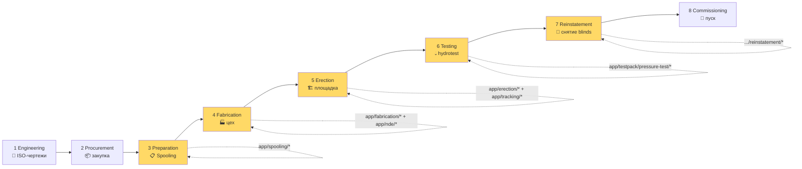
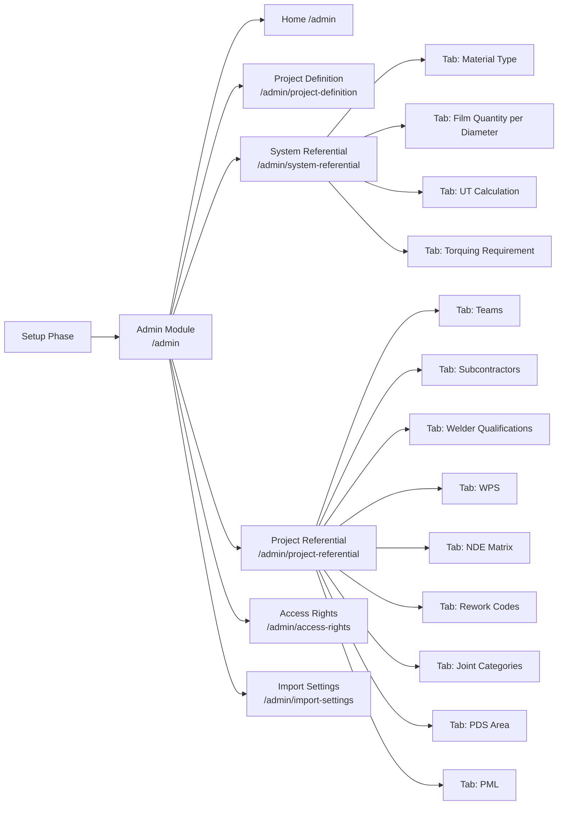
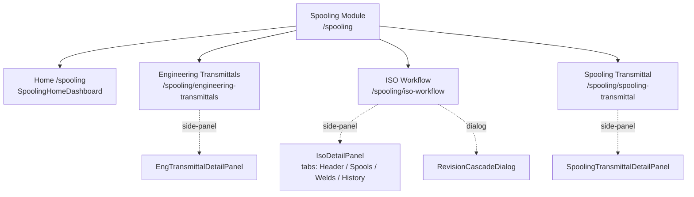
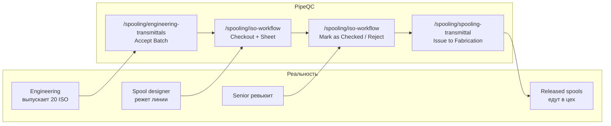
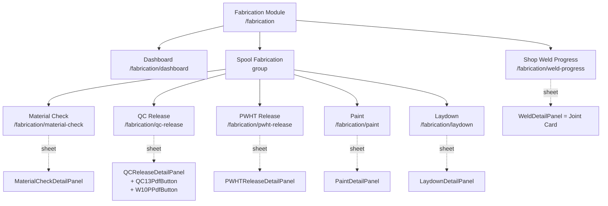
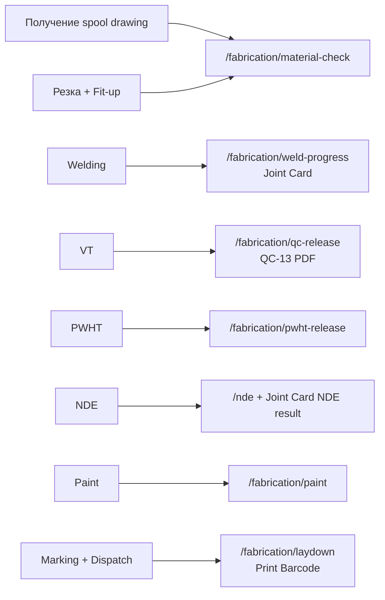
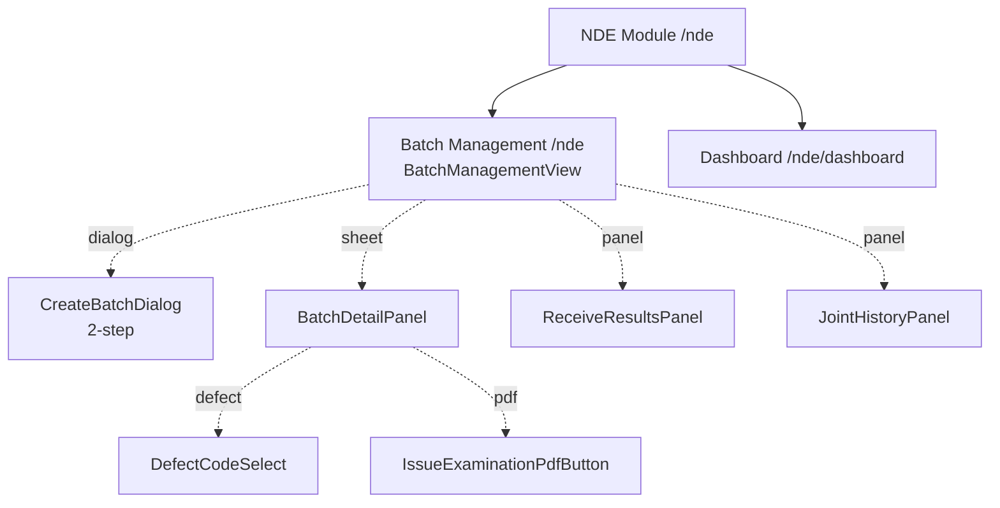
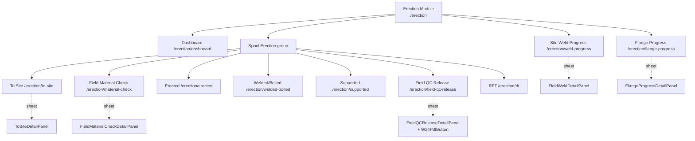
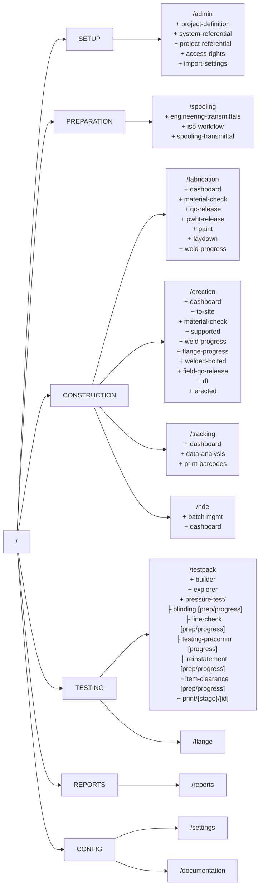

# Трубопроводное строительство × PipeQC: гайд для разговора с заказчиком

> **Что это за документ.** Это обогащённая версия [`pipeline_construction_guide.md`](pipeline_construction_guide.md). Левая колонка каждой части — бизнес-процесс отрасли (как на реальной стройке). Правая колонка — **где именно в PipeQC** это делается: какой модуль, подмодуль, страница, какие на ней таблицы, диалоги, формы и зачем каждая колонка/поле существует.
>
> **Кому показывать.** Заказчику, который уже понимает что такое spool, joint и hydrotest, и спрашивает: «Окей, а как ваше приложение это закрывает?» Презентационный, но опирающийся на реальный код (`app/*`, `components/*`, `config/navigation.ts`).
>
> **Как читать.** Сначала пройди executive-таблицу «боль ↔ экран PipeQC» (Часть 0) — это «лифт-питч» документа. Дальше — фазы стройки слева направо: Setup → Spooling → Fabrication → NDE → Erection → Testpack → Reports. В конце — sitemap всего приложения, сквозные паттерны и шпаргалка «роль → 3 главных экрана».

---

## Условные обозначения

- `маршрут` — путь в Next.js App Router. Открывается прямой ссылкой `/spooling/iso-workflow`.
- **Sheet** — выезжающая боковая панель справа. Сохраняет контекст списка слева. Главный приём навигации в PipeQC.
- **Dialog** — модальное окно поверх страницы (создание/редактирование сущности).
- **Tab** — внутренняя вкладка страницы.
- 🎯 **Зачем поле** — почему именно эта колонка/поле нужна заказчику для compliance / SLA / биллинга.

---

## Часть 0. Executive summary — боль заказчика ↔ экран PipeQC

> Один слайд, который продаёт. Слева — то, на что жалуется любой EPC-подрядчик; справа — конкретное место в приложении, которое это закрывает.

| Боль до PipeQC | Закрывается в PipeQC |
|---|---|
| «Excel-ад: 40 таблиц, у каждого инженера своя версия» | Единый shell с 7 модулями (`SidebarNav`), одна база справочников `app/admin/*` |
| «Сварщик с просроченным допуском продолжает варить» | `app/admin/project-referential` → tab **Welder Qualifications** + dialog `EditWelderExpiryDialog`. Поле expiry date → блок в `WeldTable` (`/fabrication/weld-progress`) |
| «NDE-отчёты теряются, до 30% швов "зависают" без статуса» | `app/nde` + `CreateBatchDialog` (batching), `ReceiveResultsPanel`, `BatchDetailPanel`; KPI «awaiting results» / «overdue» на главной странице |
| «При аудите готовят пачку документов 2 недели вручную» | `app/reports` + `DossierPdfButton` в Testpack Explorer = досье в один клик. Кнопки `W24PdfButton`, `QC13PdfButton`, `W10PPdfButton`, `IssueExaminationPdfButton` встроены в каждый sheet |
| «На площадке выясняется, что фланцев на 5 меньше, чем надо» | `app/spooling/iso-workflow` → автоматический MTO в `iso-detail-panel.tsx` tab «Spools/Welds» + `app/admin/import-settings` (PML импорт) |
| «После гидроиспытания забыли снять blind → катастрофа» | `app/testpack/pressure-test/reinstatement/progress` — **balance counter** (installed/removed/missing) на основе `useFlangeStore` |
| «Subcontractor завысил объёмы в счёте» | `Progress Weight Factor` (см. Часть 3) + `Reports` welding-progress + `pm-write-lock-banner` (фаза закрыта — задним числом не правится) |
| «Подрядчик видит чужие косяки» | `app/admin/access-rights` → **subcontractor scope lock** (`useScopeLock` hook сквозной по всем таблицам) |
| «Спулы лежат во дворе 9 месяцев под дождём» | `app/tracking` — `SpoolTrackingDashboard` + флаг **overdue** по `maximumTransitTime` из Project Definition |
| «Бригадир варит без понимания какой WPS применять» | `app/admin/project-referential` → tab **WPS** + `AddWPSDialog`. `WeldTable` блокирует регистрацию шва без активного WPS-допуска |

---

## Часть 1. Что мы вообще строим — и где это «прописано» в PipeQC

### Уточнение №1 (без него остальное бессмысленно)

PipeQC — про трубы **внутри промышленных объектов** (НПЗ, ГПЗ, LNG, химкомбинаты, ТЭЦ, фарма, ЦБК). Не про магистральные трубопроводы.

### Масштаб

| Объект | Длина | Швов | Срок |
|---|---|---|---|
| Котельная | 5–10 км | 1 000–3 000 | 6–12 мес |
| Средний цех | 30–80 км | 15 000–40 000 | 1.5–3 года |
| Крупный НПЗ / LNG | 200–500 км | 80 000–200 000 | 3–6 лет |

**Демо-проект в шапке PipeQC** — `Qatar LNG Train 7` (~150 000 швов, ~40 000 спулов, 3000+ ISO). Виден в `TopNav` → переключатель проекта.

### Действующие лица — и какие роли есть в коде

| Реальная роль | PipeQC role | Где «прописана» |
|---|---|---|
| EPC Project Manager | `project_manager` | `contexts/role-context.tsx`, везде |
| Project / Site / System Admin | `system_admin` (объединены) | `app/admin/*`, `role_matrix/system_admin.md` |
| Spooler-инженер | `spooling_team` | `app/spooling/*` |
| QA/QC отдел EPC | `qc_engineer` | сквозной (QC Release, Field QC, Testpack) |
| NDE-лаборатория | `nde_inspector` | `app/nde/*` |
| Цеховой бригадир / монтажник | `subcontractor` | `app/fabrication/*`, `app/erection/*` |
| Owner-инспектор | (read-only) | Punch List + `client-examination-panel.tsx` |

> Каждая роль видит только свой набор пунктов в sidebar — это контролируется `getVisibleNavigation(role)` в `config/navigation.ts`. Открой страницу под разными ролями (переключатель в верхнем правом углу) — sidebar перестраивается.

### Физика — Pipe Class — где видно в системе

В реальной жизни у каждого ISO-чертежа есть **Pipe Class** (A1A, CS-150, ...). От него зависит марка стали, толщина, нужен ли RT, нужна ли PWHT.

**В PipeQC класс трубы — это сквозная колонка во всех таблицах:**
- `WeldTable` (`/fabrication/weld-progress`) — колонка **Pipe Class**
- `IsoWorkflowView` (`/spooling/iso-workflow`) — колонка **Service** (производное от класса)
- `FieldWeldTable` (`/erection/weld-progress`) — та же колонка
- `NdeMatrixTab` (`/admin/project-referential`) — матрица **service class × тип шва × метод NDE × % выборки**

Класс → автоматически подтягивает требования NDE → автоматически создаёт записи в шов-карте. **Бригадир по памяти не решает, что просвечивать рентгеном.**

---

## Часть 2. Жизненный цикл проекта × жёлтые модули PipeQC



**Жёлтое = зона PipeQC.** Серое (Engineering / Procurement / Commissioning) — это AVEVA / SmartPlant / SAP. PipeQC живёт с момента, когда чертежи переданы в Spooling, и до момента передачи линии в эксплуатацию (`ReleaseWorkDialog` в Testpack Explorer).

---

## Часть 3. Setup (Admin) — установка правил вселенной

### 3.1 Бизнес-смысл

«Открытие казино»: правила, лимиты, дилерские бейджи, охрана — всё это **до** того, как первый игрок (ISO-чертёж) войдёт. Первые 2–4 недели проекта роль **System Admin** наполняет справочники в одиночку. Все остальные роли ждут.

### 3.2 Карта модуля Admin (Setup)



### 3.3 Что внутри каждого подраздела

#### 3.3.1 `/admin/project-definition` — паспорт проекта

**Контейнер.** Страница-форма (`AdminModuleUI`).

**Поля формы:**

| Поле | Зачем |
|---|---|
| Project code | Шапка отчётов, формы W24/QC-13 для Owner-инспектора |
| Owner | Логотип появляется на каждом PDF (см. `dossier-pdf-button.tsx`) |
| EPC Contractor | То же самое для нашего логотипа |
| Контрактный номер | Привязка к договору (для биллинга и аудита) |
| **Maximum transit time** (дни) | 🎯 Определяет, через сколько дней спул в логистике становится **overdue** (красный флаг в `/tracking`). См. Часть 9. |
| Owner logo / EPC logo | Уходят на каждую печатную форму, которую видит Owner-инспектор |

> **«Gate #1»**: без этой записи система не примет ни одного ISO.

#### 3.3.2 `/admin/system-referential` — глобальные справочники компании

**Контейнер.** Страница с `AdminTabs` + `SystemReferentialCard`.

**Tabs (всё одинаково для всех проектов компании):**

| Tab | Что в таблице | Зачем |
|---|---|---|
| **Material Type** | CS, LTCS, SS304/316, CrMo P11/P22, PVC, FRP — со свойствами (плотность, температурный диапазон) | Когда в `PML` встречается материал — берётся его свойства отсюда |
| **Film Quantity per Diameter** | RT: сколько плёнок нужно на диаметр × толщину | NDE-планирование, заказ плёнок у субподрядчика |
| **UT Calculation** | Коэффициенты для ультразвука | Аналогично |
| **Torquing Requirement** | Момент затяжки фланцев (Н·м) × размер × класс | Подставляется в `flange-progress-detail-panel.tsx` (Часть 6) автоматически |

**Почему отдельно от Project Referential:** марки сталей одинаковы по всему миру; нет смысла вбивать их каждую стройку заново.

#### 3.3.3 `/admin/project-referential` — правила одного проекта

**Контейнер.** Страница с `AdminTabs`, по одному tab-компоненту на сущность (`subcontractors-tab.tsx`, `welder-qualifications-tab.tsx`, `wps-tab.tsx`, `nde-matrix-tab.tsx`, `rework-codes-tab.tsx`, `joint-categories-tab.tsx`, `pds-area-tab.tsx`, `piping-material-list-tab.tsx`, `teams-tab.tsx`).

##### Tab «Teams»

| Колонка | Зачем |
|---|---|
| Team code | Например `BLD-01`, `LC-02`, `REI-03` |
| Name | «Bagration Blinding Team» |
| Type | jointer / blinding / line-check / reinstatement / welding / fitter |
| Members count | Кто внутри |

🎯 Эти команды дальше выбираются в **Reinstatement / Line Check / Blinding progress** sheet'ах. Через хук `useAllTeams("reinstatement")`.

**Dialog `AddTeamDialog`** — поля: code, name, type, members (multi-select из субподрядчиков).

##### Tab «Subcontractors» — live CRUD

| Колонка | Зачем |
|---|---|
| Code | `SC-03` |
| Name | «HydroTest Co» |
| Specialty | welding / NDE / paint / mechanical |
| Contact person | Кому звонить когда не катит |
| Scope of work | Связка с контрактом |
| Status | Active / Suspended |

**Dialog `AddSubcontractorDialog`** — здесь же присваивается **scope lock**: какие area/system этому подрядчику разрешены.

##### Tab «Welder Qualifications» — критичное

| Колонка | Зачем |
|---|---|
| Welder ID + **stamp** | Клеймо, которое сварщик физически бьёт рядом со швом |
| Name | Иванов И.И. |
| Subcontractor | На кого работает |
| WPS coverage | Какие процедуры допущен варить (например WPS-CS-001, WPS-SS-002) |
| Diameter range | От–до (например ½" — 12") |
| Position | 1G / 2G / 5G / 6G / 6GR |
| Issue date / **Expiry date** | 🎯 По дате истечения — блокируется регистрация шва в `WeldTable` (`/fabrication/weld-progress`, `/erection/weld-progress`) |
| Status | Active / Expired / Suspended |

**Dialog `AddWelderDialog`** (создание) и **`EditWelderExpiryDialog`** (продление). 🎯 **Закрывает боль «сварщик с просроченным допуском продолжает варить».** Хук `useActiveWelderQualifications()` в `weld-table.tsx` фильтрует выпадающий список — выбрать просроченного физически нельзя.

##### Tab «WPS» (Welding Procedure Specification)

«Рецепт сварки» — кодифицирует: материал основной и присадочный, ток, температура подогрева, нужна ли PWHT, и т.д.

| Колонка | Зачем |
|---|---|
| WPS code | `WPS-CS-001` |
| Materials covered | Что варит |
| Thickness range | Толщина |
| Heat input | Параметры дуги |
| Pre-heat / Inter-pass temp | Технологический режим |
| PWHT required | 🎯 Триггерит появление шва в `/fabrication/pwht-release` |

**Dialog `AddWPSDialog`** — все эти поля + загрузка PDF самого WPS-документа.

##### Tab «NDE Matrix» — самое продаваемое

**Матрица 4D:** service class × тип шва (BW/SW/FL) × метод (RT/UT/PT/MT) × процент выборки.

**Dialog `NdeMatrixRuleDialog`** — добавление правила «Service A1A, BW, метод RT, 100%».

🎯 По этой матрице система **автоматически выставляет план NDE для каждого шва.** Бригадир не решает по памяти, что просвечивать. Это закрывает [боль «выбор NDE на глазок»](pipeline_construction_guide.md).

##### Tab «Rework Codes»

Справочник дефектов («incomplete penetration», «porosity», «slag inclusion», «undercut», «root concavity», ...).

🎯 На NDE-результате (`BatchDetailPanel`, `defect-code-select.tsx`) — инспектор выбирает defect code из этого списка. Позже это даёт аналитику «у welder I-15 95% брака — это porosity» → проблема с электродом или газом.

##### Tab «Joint Categories»

Категории швов (Category I — критичные, Cat II — обычные, Cat III — вспомогательные). Влияют на тип отчёта (W24 / QC-13 / W10P).

**Dialog `EditJointCategoryDialog`.**

##### Tab «PDS Area»

Зоны площадки. Завод 2×2 км → Area 100, 200, 300...

| Колонка | Зачем |
|---|---|
| Code | `Area-200` |
| Name | «Compressor station» |
| Coordinator | Ответственный |
| Pipe length budget | Сколько труб запланировано |

🎯 Каждая `WeldJoint`, `Spool`, `Iso` несёт `pdsAreaCode`. На основе этого `useScopeLock` фильтрует, что видит конкретный субподрядчик.

##### Tab «Piping Material List» (PML)

Каталог разрешённых на проекте материалов: трубы, фланцы, отводы, прокладки, болты, gaskets.

| Колонка | Зачем |
|---|---|
| Item code | `PIPE-CS-A106B-6IN-SCH40` |
| Description | Длинное название |
| Material grade | CS-A106B |
| Size | 6" |
| Schedule | Sch40 |
| Service class | A1A / B / C |

🎯 Если spool designer попробует поставить деталь, которой нет в PML, валидатор (`SpoolingValidationTable`) запретит выпустить ISO в работу. **Закрывает боль «фланцев на 5 меньше».**

#### 3.3.4 `/admin/access-rights` — кто что видит

**Контейнер.** Страница-матрица `access-rights-view.tsx`.

| Колонка | Зачем |
|---|---|
| User | ФИО + email |
| Role | r0 Admin / r3 QC / r4 Spooling / r5 Fab / r6 Erection / r7 NDE / r8 PM / r9 Owner |
| **Scope lock: Subcontractor** | 🎯 Если установлен — пользователь видит **только** записи своего подрядчика во всех таблицах |
| **Scope lock: PDS Area** | Аналогично, по зоне |
| Last login | Аудит |
| Status | Active / Disabled |

> **Sub-contractor scope lock** — сквозной паттерн. Реализован хуком `useScopeLock()` в `lib/scope-lock.ts` и применён в `weld-table.tsx`, `field-weld-table.tsx`, `material-check-view.tsx`, и т.д. — подрядчик не увидит брак конкурента.

#### 3.3.5 `/admin/import-settings` — мост из AVEVA/SmartPlant

**Контейнер.** Страница с 6 placeholder-карточек + `ImportDryRunCard`.

| Карточка                     | Что загружает                   | Зачем                                       |
| ---------------------------- | ------------------------------- | ------------------------------------------- |
| Weld Thickness / Flange      | Excel со списком швов и фланцев | Bulk-загрузка при старте проекта            |
| NDE Matrix                   | Excel                           | Импорт правил NDE из проектной документации |
| Project Piping Material List | Excel                           | Один раз — каталог разрешённых деталей      |
| Spooling Images ZIP          | ZIP с PDF spool drawings        | Прикладываются к записям ISO                |
| Spooling Material Type       | Excel                           | Сырьё для PML                               |
| Spooling Class Material      | Excel                           | Связка class ↔ material                     |

🎯 **Это и есть «мост из AVEVA».** До PipeQC данные были в проекте; теперь — в стройке. См. Часть 7 «Чем мы отличаемся от AVEVA».

### 3.4 Сюжет для слайда

> «Первые 2–4 недели проекта эта роль одна — наполняет систему. Все остальные роли ждут. Это инвестиция в строгий контроль на 3 года. Без неё система не знает, что хорошо, а что плохо.»

---

## Часть 4. Preparation (Spooling) — ISO → катушки

### 4.1 Бизнес-смысл

Engineering выдаёт ISO-чертежи (изометрия одной линии 20 м). Целиком не привезти → **Spool Designer** режет на катушки ≤ 12 м (Shop Welds), на стыках появляются Field Welds.

### 4.2 ASCII-макет реального ISO-чертежа (повтор для контекста)

```
┌─────────────────────────────────────────────┐
│  LINE No: 10-PG-A1A-001    Pipe Class: A1A  │
│  Service: HP Steam         Pressure: 60 bar │
│                                              │
│                  [E1]      [F2]              │
│   from Pump P-101 ●───┬───┐ │                │
│                  #1   #2  │ │ ←segment #3    │
│                          [T1]                │
│                            │ #4              │
│                            ● to E-205        │
│                                              │
│  BOM:  Pipe 6" Sch40  — 14 m                 │
│        90° elbow LR    — 2 pcs               │
│        Flange WN 6"    — 2 pcs               │
│        Gate valve 6"   — 1 pc                │
└─────────────────────────────────────────────┘
```

В PipeQC этот ISO живёт как запись `ISORecord` (`store/spooling-store.ts`), к ней прицеплен PDF, BOM, список spools и welds.

### 4.3 Карта модуля Spooling



### 4.4 `/spooling` — Home (Spooling Lead pulse)

**Контейнер.** `SpoolingHomeDashboard`.

**KPI (5 карточек):** Total ISOs / Received / In Progress / Released / On Hold. Цветовое кодирование (amber / sky / emerald / red).

**Activity feed (5 последних событий ISO):** «ISO-PG-001 Released by Vlad Morozov (Round 2)». Подсвечивается severity (success/info/warning/error).

**3 plate-карточки drill-down** в Engineering Transmittals / ISO Workflow / Spooling Transmittal.

🎯 Это «утренний экран» Spooling Lead — куда сегодня направить команду.

### 4.5 `/spooling/engineering-transmittals` — входящий поток ISO

**Контейнер.** Список + `EngTransmittalDetailPanel` (Sheet).

**Колонки списка:**

| Колонка | Зачем |
|---|---|
| Trans. No | `TR-ENG-2026-0042` |
| Source team | Engineering team / dept |
| Issue date | Когда инженерия выпустила |
| # of ISOs | Сколько пакетом (обычно 5–50) |
| Rev | R0 / R1 / R2 |
| Status | Pending / Accepted / Rejected |

**Что внутри Sheet (открывается клик по строке):**
- Список ISO внутри transmittal
- PDF preview каждого
- Метаданные (line no, pipe class, pds area)
- Кнопка **Accept Batch** → ISO переходят в статус `Received` в ISO Workflow

🎯 Это формальный handoff из инженерии в стройку. Цифровая подпись «приняли пачку».

### 4.6 `/spooling/iso-workflow` — главный экран spooling team

**Контейнер.** `IsoWorkflowView` (таблица + status chips сверху) + `IsoDetailPanel` (Sheet 520px справа).

**Chips сверху (фильтры со счётчиками):**
- **All** (всего ISO)
- **Received** (amber) — пришли от инженерии
- **Checked Out** (sky) — выданы spooler'у
- **In Checking** (violet) — на ревью у senior
- **Released** (emerald) — готовы к транзимиталу в цех
- **On Hold** (red) — ждут чего-то
- (Superseded — слегка серый, исторические)

**Кнопка «Apply Revision»** → открывает `RevisionCascadeDialog`.

**Поиск:** по ISO # или PDS area.

**Колонки таблицы:**

| Колонка | Зачем |
|---|---|
| **ISO #** | `10-PG-A1A-001` — primary key |
| **Rev** | R0 / R1 / ... — какая ревизия в работе |
| **PDS Area** | Куда поедет (см. Часть 3.3.3) |
| **Service** | HP Steam / Cooling Water / ... |
| **Status** | Цветной badge (см. chips) |
| **Spooled By** | Junior drafter, кому выдан checkout |
| **Rounds** | 🎯 Счётчик повторных проверок. Норма 1–3, 5+ — проблема. Метрика качества инженерии. |
| **Hold Type** | Spool Team hold / Engineering hold (если статус On Hold) |

**Sheet `IsoDetailPanel` (4 tabs):**

| Tab | Что внутри |
|---|---|
| **Header** | Метаданные, PDF preview, line no, pipe class, pressure, temp, fluid |
| **Spools** | Список катушек, на которые порезана линия: ID, length, BOM, status |
| **Welds** | Все стыки: Shop Welds (внутри spools) + Field Welds (между spools) с типом BW/SW/FL |
| **History** | Revisions, rounds, hold reasons, кто что сделал — audit trail |

**Действия на Sheet:**

| Action | Кто | Что происходит |
|---|---|---|
| **Checkout to spooler** | Spooling Lead | Назначает junior'у, ISO → status `Checked Out` |
| **Mark as Checked** | Spool Designer | После работы senior ревьюит → либо Released, либо Reject (новый round) |
| **Hold** (dialog) | Spooling Lead | Выбор radio: «Spool Team hold» / «Engineering hold» + reason + holder name → status `On Hold` |
| **Apply Revision** (dialog) | Spooling Lead | См. ниже `RevisionCascadeDialog` |

**Dialog `RevisionCascadeDialog`** — 🎯 **самая болезненная операция lifecycle.** Инженерия выпустила R1 на ISO, у которого часть spools уже сварена. Что делать?

- Импакт-анализ: какие spools уже в fab / shipping / on-site / installed
- Чек-листы по каждому: scrap / modify / unchanged
- Отметка ответственного и причины

🎯 Closes the rare-but-expensive scenario из [Части 4 гайда («что часто болит»)](pipeline_construction_guide.md).

### 4.7 `/spooling/spooling-transmittal` — исходящая партия в цех

**Контейнер.** Список + `SpoolingTransmittalDetailPanel` (Sheet).

**Колонки:**

| Колонка | Зачем |
|---|---|
| Spl. Trans. No | `TR-SPL-2026-0017` |
| Target system | Group ISO по системе (HP Steam loop) |
| Target PDS area | Куда едет |
| Target completion date | SLA для цеха |
| # of ISOs | 5–20 |
| Status | Draft / Issued |

**Внутри Sheet:**
- Список released ISO, сгруппированных
- Прикреплённый собранный PDF (пачка ISO + spool drawings)
- Кнопка **Issue to Fabrication** → spools появятся в `/fabrication/material-check`

🎯 Это момент, когда «бумажная» работа Spooling-команды превращается в физический workload цеха.

### 4.8 Bridge-диаграмма: реальный процесс ↔ экран PipeQC



---

## Часть 5. Fabrication (цех) — где рождается катушка

### 5.1 Бизнес-смысл

В ангаре 5–10 тыс. м² катушка проходит цикл: receiving → cutting → fit-up → welding → VT → PWHT → NDE → paint → marking → ready for dispatch. Главная сущность — **Joint Card** (паспорт шва).

### 5.2 Карта модуля Fabrication



### 5.3 `/fabrication/dashboard` — pulse цеха

**Контейнер.** `FabricationDashboard`.

**KPI cards:** Spools in production / Weld backlog / NDE pending / Paint pending / Ready-for-dispatch.

**Chart:** «Daily welded inches» (тренд по дням).

**Per-subcontractor breakdown:** таблица — у кого сколько в работе, у кого rejection rate выше среднего.

🎯 PM-утренняя планёрка: «почему сегодня welds меньше, чем вчера». На каждый KPI — drill-down ссылка на соответствующий экран.

| Кто | Маршрут | Контейнер | Видит | Делает | Зачем |
|---|---|---|---|---|---|
| Project Manager / Fab Supervisor | `/fabrication`, `/fabrication/dashboard` | `fabrication-dashboard.tsx` | KPI cards: Spools in production / weld backlog / NDE pending / paint pending / ready-for-dispatch; chart «daily welded inches»; per-subcontractor breakdown | Кликает в drill-down к конкретному экрану | Pulse-экран фабрикации: куда упёрся workflow. На утренней планёрке PM открывает это и говорит «почему сегодня welds меньше, чем вчера». |


### 5.4 `/fabrication/material-check` — приёмка материалов

**Контейнер.** Таблица spools `pending material check` + `MaterialCheckDetailPanel` (Sheet).

**Колонки списка:**

| Колонка | Зачем |
|---|---|
| Spool # | `SP-001-A` |
| ISO # | Родитель |
| BOM items count | Сколько деталей надо принять |
| Receiving date | Когда |
| Status | Pending / In Check / Accepted / Rejected |

**Внутри Sheet:**
- Полный BOM спула (фланцы, отводы, прокладки, трубы)
- Каждая деталь: code из PML, Heat No (input), MTC ссылка
- 🎯 QC engineer **сканирует / вводит Heat No** + прикладывает MTC (Mill Test Certificate)
- Если деталь не из PML или без MTC — система блокирует Accept

🎯 Без этого пройдёт некачественная сталь и через 5 лет шов лопнет. **Это и есть «паспорт на каждый шов и каждую деталь».**

| Кто | Маршрут | Контейнер | Видит | Делает | Зачем |
|---|---|---|---|---|---|
| QC Engineer | `/fabrication/material-check` | Таблица + `material-check-detail-panel.tsx` (Sheet) | Список спулов в статусе «pending material check», в детали — BOM (фланцы, отводы, прокладки), Heat No каждой детали, ссылка на **MTC** (Mill Test Certificate) | Сверяет физические детали с BOM, **сканирует/вводит Heat No**, нажимает Accept или Reject | Если хоть одна деталь не из PML или без MTC — попадёт некачественная сталь и через 5 лет лопнет шов. Это [«паспорт на каждый шов»](pipeline_construction_guide.md), про который Часть 5 гайда. |

### 5.5 `/fabrication/weld-progress` — главный экран мастера

**Контейнер.** `WeldTable` + `WeldDetailPanel` (Sheet) = **Joint Card**.

**Toolbar:**
- Поиск (Joint No / Spool No / ISO No / Welder Code / DWIR No / Status)
- Toggle «Show Completed»
- Sort по любой колонке (тройной сорт: asc → desc → off)
- Download
- Pencil (PM-edit mode)
- Lock-индикатор (если PM-write-lock активен)

**Колонки таблицы (из `weld-table.tsx`):**

| Колонка | Зачем |
|---|---|
| **Joint No** | `SP-001-A/W-03` — primary key |
| **Spool No** | Родитель |
| **ISO No** | Прародитель |
| **DWIR No** | Daily Weld Inspection Report — номер для подшивки к Owner |
| **Welder Code** | Stamp сварщика. Dropdown — только active welders (фильтр через `useActiveWelderQualifications()`). 🎯 **Сварщика с истёкшим допуском физически нельзя выбрать.** |
| **Status** | Pending / Fit-up Done / Welded / VT Pass / Rework / Completed / Rejected |

**Внутри Sheet `WeldDetailPanel` (Joint Card):**

| Поле                            | Пример                                                                                            |
| ------------------------------- | ------------------------------------------------------------------------------------------------- |
| Joint ID                        | `SP-001-A / W-03`                                                                                 |
| Joint Type                      | BW (Butt Weld) / SW (Socket) / FL (Flange)                                                        |
| Pipe Class                      | A1A                                                                                               |
| WPS (Welding Procedure)         | `WPS-CS-001` (dropdown с активными WPS, дальше — валидация через `validateWelder()`)              |
| Welder + stamp                  | Иванов И.И. (`I-15`)                                                                              |
| Date welded                     | 2026-03-15                                                                                        |
| Diameter / Thickness / Inch-dia | Параметры                                                                                         |
| Visual (VT) result              | Accepted / Repair / Reject + комментарий                                                          |
| NDE required                    | RT 100% (берётся из NDE Matrix автоматически)                                                     |
| NDE result                      | Accepted (RT-345) / Pending / Reject                                                              |
| PWHT                            | not required / required → triggers `/fabrication/pwht-release`                                    |
| Repair count                    | 🎯 Счётчик ремонтов. На 3-м — система алертит: по нормам после 3 ремонтов шов вырезают полностью. |
| Status                          | Open / VT Pass / NDE Pass / Completed / Rejected                                                  |

**Действия:**
- **Register weld** — заполнить welder + date + WPS, ставим Welded
- **Submit for VT** → VT inspector принимает
- **Repair Weld** (action) — reason + counter +1
- **Generate W10P PDF** (если applicable) — паспорт цехового шва

🎯 Это и есть **Joint Card** из гайда. Через 5 лет, если потечёт шов, заходишь сюда, видишь: кто сварил, по какому рецепту, кто проверял, что показал рентген. **На этом стоит вся отраслевая безопасность.**

| Кто | Маршрут | Контейнер | Видит | Делает | Зачем |
|---|---|---|---|---|---|
| Fabrication Subcontractor | `/fabrication/weld-progress` | `weld-table.tsx` + `weld-detail-panel.tsx` (Sheet) | Колонки: Spool, Joint ID (например `SP-001-A/W-03`), Joint Type (BW/SW/FL), Pipe Class, WPS, Welder, VT result, NDE required, Status. Фильтры по spool / welder / WPS | Открывает Joint Card → вписывает фактического сварщика (выбор из dropdown welders с активным допуском), дату, результат VT | Это и есть **Joint Card** из [Части 5 гайда](pipeline_construction_guide.md) — «паспорт шва». Система не даст выбрать сварщика без допуска на этот WPS. |
| Fabrication Subcontractor | тот же | Внутри Sheet: «Repair Weld» action | Поле — reason; счётчик «3-я попытка → blocker» | Регистрирует ремонтный шов | По нормам после 3 ремонтов шов вырезают и переваривают полностью — система сама это покажет. Боль из [«что часто болит» в Части 5](pipeline_construction_guide.md). |


### 5.6 `/fabrication/qc-release` — VT (визуальный контроль)

**Контейнер.** `QCReleaseView` + `QCReleaseDetailPanel` (Sheet) + `W24PdfButton` / `QC13PdfButton`.

**Chips:** Awaiting Release / Released / All.

**Колонки списка:**

| Колонка | Зачем |
|---|---|
| Spool # | Объект |
| Stage | `STAGE_COLOR` чип (fit-up / welded / vt / paint / ready) |
| QC Progress | `passed/4 passed · N remark` (4 чек-листа: alignment, root, cap, dimensional) |
| Welder | Кто варил |
| Welded date | |
| Released by / date | После принятия |

**Внутри Sheet — QC checklist:**
- 4 пункта (`QC_CHECKLIST`): Alignment / Root pass / Cap / Dimensional
- Каждый пункт: segmented control **Pending / Pass / Pass with remark / Fail**
- Поле comment
- QC inspector dropdown (`QC_INSPECTORS`)
- Generate **QC-13 PDF** (release form для Owner) / **W24 PDF** (на финальный шов)

🎯 Это формы, которые **Owner-инспектор подписывает физически** — они выгружаются в один клик. Раньше готовили вручную 2 недели.


| Кто | Маршрут | Контейнер | Видит | Делает | Зачем |
|---|---|---|---|---|---|
| QC Engineer | `/fabrication/qc-release` | `qc-release-view.tsx` + `qc-release-detail-panel.tsx` | Очередь свежесваренных швов, статус VT, чек-лист критериев (зазоры, центровка, проплав), кнопка **Generate W24 PDF** (через `w24-pdf-button.tsx`) | Принимает VT, формирует QC-13 / W24 отчёт | Каждый шов проходит визуальный контроль. **W24** и **QC-13** — формы для Owner-инспектора (их видит он). |


### 5.7 `/fabrication/pwht-release` — термообработка

**Контейнер.** `PWHTReleaseView` + `PWHTReleaseDetailPanel` (Sheet).

**Что внутри Sheet:**
- График «температура × время» (chart recording) — прикладывается оператором печи
- Параметры режима (target temp, soak time, ramp rate) — из WPS
- Протокол печи (PDF)
- Кнопки Accept / Reject

🎯 Толстостенные / легированные стали после сварки обязательно «отпускают». Без подтверждённой PWHT катушка **не уезжает на площадку**. Workflow guard.

| Кто | Маршрут | Контейнер | Видит | Делает | Зачем |
|---|---|---|---|---|---|
| Fabrication Subcontractor / QC | `/fabrication/pwht-release` | Sheet `pwht-release-detail-panel.tsx` | Очередь spools со швами, для которых требуется PWHT по NDE Matrix; график «температура × время» (chart recording); приложенный протокол печи | Принимает результат PWHT, либо отправляет на повтор | Толстостенные / легированные стали после сварки обязательно «отпускают» — иначе шов хрупкий. Без протокола катушка не уезжает на площадку ([Часть 5 — когда катушка готова](pipeline_construction_guide.md)). |

### 5.8 `/fabrication/paint` — покраска

**Контейнер.** `PaintView` + `PaintDetailPanel` (Sheet).

**Поля sheet:**
- Paint spec (по контракту с Owner — цвет RAL + grunt + finish)
- DFT (Dry Film Thickness) измерения: точки → значения мкм
- Photo upload
- Painter (subcontractor)
- Дата

🎯 Цвет — для Owner (брендинг), толщина — коррозионная защита. **DFT ниже спеки → ржавчина через 5 лет.**


| Кто | Маршрут | Контейнер | Видит | Делает | Зачем |
|---|---|---|---|---|---|
| Fabrication Subcontractor | `/fabrication/paint` | Sheet `paint-detail-panel.tsx` | Spool, paint spec (цвет / толщина грунта / финиша), DFT (Dry Film Thickness) измерения | Регистрирует слои покраски и DFT | Цвет — это по контракту с клиентом, толщина — это коррозионная защита. Без правильного DFT через 5 лет ржавчина. |

### 5.9 `/fabrication/laydown` — готовая зона цеха

**Контейнер.** `LaydownView` + `LaydownDetailPanel` (Sheet).

**Колонки:**

| Колонка | Зачем |
|---|---|
| Spool # | |
| Dimensions (L × W × H) | Чтобы влез в фуру |
| Weight | Для грузоподъёмности |
| Location (yard cell) | Где физически лежит |
| Status | Ready / Reserved / In Transit |

**Действия:**
- **Print Barcode** (link к `/tracking/print-barcodes`) — этикетка с QR/штрих-кодом для сканирования при отгрузке и приёмке на площадке
- **Dispatch** → spool переходит в `/erection/to-site`

| Кто | Маршрут | Контейнер | Видит | Делает | Зачем |
|---|---|---|---|---|---|
| Fabrication Subcontractor | `/fabrication/laydown` | Sheet `laydown-detail-panel.tsx` | Готовые спулы со статусом **Ready for Dispatch**: spool ID, размеры, вес, location | Печатает barcode (через `/tracking/print-barcodes`), готовит к отгрузке | Спул проходит все 5 чек-пунктов «когда катушка считается готовой» из [Части 5](pipeline_construction_guide.md) → status auto-меняется на Ready for Dispatch. |

🎯 Без всех 5 чек-пунктов (VT done, NDE done, PWHT if needed, Paint done, Marking) status не сменится на Ready for Dispatch.

### 5.10 Bridge-диаграмма Fabrication



---

## Часть 6. NDE (неразрушающий контроль)

### 6.1 Бизнес-смысл

NDE-лаборатория (субподрядчик) физически просвечивает швы рентгеном (RT), ультразвуком (UT), капиллярами (PT), магнитом (MT). План берётся из **NDE Matrix** (Часть 3.3.3). Сейчас расширен на **PMI** (Positive Material Identification — проверка что сталь именно та, что должна быть) и **HT** (Hardness Test).

### 6.2 Карта модуля NDE



### 6.3 `/nde/dashboard` — pulse NDE-лаборатории

**KPI:** Pending по каждому методу (RT/UT/PT/MT/PMI/HT). Rejection rate per welder. Per-WPS pass rate. Chart «films issued vs. consumed».

🎯 Это для NDE Coordinator: «у нас 200 швов в очереди на RT, плёнок на складе хватит на 80 — закажем ещё».

### 6.4 `/nde` — Batch Management

**Контейнер.** `BatchManagementView` — таблица batch'ей.

**Колонки:**

| Колонка | Зачем |
|---|---|
| Batch # | `BATCH-RT-2026-024` |
| Method | RT / UT / PT / MT / PMI / HT |
| Subcontractor | Лаборатория |
| # of joints | 12 швов |
| Source | shop / field |
| Created | Дата создания |
| Status | Draft / Issued / Awaiting Results / Completed |
| Overdue flag | 🎯 Если >5 дней без результата — красный |

**Dialog `CreateBatchDialog` (2-step wizard):**

**Step 1:** выбор method (RT/UT/MT/PT/PMI/HT), subcontractor (dropdown активных), NDE Matrix reference (`defaultMatrixByMethod`).

**Step 2:** выбор швов (с фильтром по spool / area / welder). Можно prepopulate через `preselectedWeldIds`.

🎯 Объединение швов в batch — это **накладная для лаборатории**: «вот эти 12 швов — на RT». Без этого они бы делали поштучно.

**`BatchDetailPanel` (Sheet):**
- Список швов в batch
- Поля для каждого: result Accepted / Rejected, defect code (`DefectCodeSelect` из Rework Codes), film numbers
- **Penalty Shoot Banner** — если у welder 3 rejection подряд

**`ReceiveResultsPanel`** — bulk import результатов одним PDF + парсер.

**`JointHistoryPanel`** — история шва (все попытки, repair count, кто варил, кто перепроверял).

**Кнопка `IssueExaminationPdfButton`** — PDF-форма для подписи Owner-инспектора и архивирования.

> **Бизнес-смысл фазы** — встроена в Fabrication и Erection, но имеет отдельный модуль, потому что выполняет subcontractor-лаборатория. План работы для них берётся из **NDE Matrix** (System Referential). См. [таблицу методов RT/UT/PT/MT в Части 1](pipeline_construction_guide.md).

| Кто | Маршрут | Контейнер | Видит | Делает | Зачем |
|---|---|---|---|---|---|
| NDE Inspector / NDE Coordinator | `/nde`, `/nde/dashboard` | Дашборд + табличный экран | KPI: швы pending по RT / UT / PT / MT; rejection rate per welder; per-WPS pass rate; график «films issued vs. consumed» | Видит свой backlog | Это «полицейский внутри полицейского» — лаборатория физически просвечивает швы рентгеном. |
| NDE Inspector | `/nde` | Sheet «Joint Card → NDE result» | Joint ID, метод, требуемый %, кнопки **Accept** / **Reject + defect type**, прикладывает скан RT report (#RT-345) | Регистрирует результат | Если ≥ 3 reject подряд у одного welder'а → система алертит [(Welder Traceability в Части 5)](pipeline_construction_guide.md). Сварщика временно отстраняют. |


🎯 [Welder Traceability в Части 5 гайда](pipeline_construction_guide.md) — здесь автоматически: если у I-15 ≥3 reject подряд, сварщика помечают, alert идёт в Admin.

---

## Часть 7. Erection (стройплощадка)

### 7.1 Бизнес-смысл

Спул выгрузили на улице → монтаж между постаментами → field welds → bolt-up фланцев → Punch List → Ready for Hydrotest. Условия: ветер, дождь, высота. Полевые швы дороже цеховых в 3–5 раз.

### 7.2 Карта модуля Erection



### 7.3 `/erection/dashboard` — pulse площадки

**Контейнер.** `ErectionDashboard`.

**KPI:** Spools on-site / Supported / Welded / Bolted / RFT-ready.

**Chart:** per PDS area / per system / per subcontractor.

🎯 «Где затор?» — спулы на площадке есть, но не на стойках → проблема с supports → драть прораба support-бригады.

| Кто | Маршрут | Контейнер | Видит | Делает | Зачем |
|---|---|---|---|---|---|
| PM / Erection Supervisor | `/erection`, `/erection/dashboard` | `erection-dashboard.tsx` | KPI: spools on-site / supported / welded / bolted / RFT-ready; chart per PDS area; per-system progress | Drill-down в подэкраны | Зеркало fab-дашборда, но для площадки. PM видит, где «затор»: спулы на площадке есть, но не на стойках. |

### 7.4 `/erection/to-site` — приёмка спула на площадке

**Контейнер.** `ToSiteView` + `ToSiteDetailPanel` (Sheet).

**Колонки:** Spool #, ETA, Carrier, PDS Area destination, Barcode scan status, Receiving date.

**Действия на Sheet:**
- Сканер штрих-кода (`barcode` поле, ввод/скан)
- «Received on site» отметка
- Yard cell location (где лежит сейчас)

🎯 Этап A workflow ([Часть 6 гайда](pipeline_construction_guide.md)) — выгрузка в Laydown Yard, привязка к зоне.

| Кто | Маршрут | Контейнер | Видит | Делает | Зачем |
|---|---|---|---|---|---|
| Erection Subcontractor | `/erection/to-site` | Sheet `to-site-detail-panel.tsx` | Список спулов в пути или принятых; spool ID, PDS Area назначение, дата ETA, паспорт спула | Сканирует barcode, ставит «Received on site», фиксирует Laydown Yard cell | Этап A на схеме [Erection workflow в гайде](pipeline_construction_guide.md): выгрузка в Laydown Yard, привязка к зоне. |

### 7.5 `/erection/material-check` — полевая приёмка (повреждения)

**Контейнер.** `FieldMaterialCheckView` + `FieldMaterialCheckDetailPanel` (Sheet).

**Внутри Sheet:**
- Чек-лист повреждений после транспортировки (царапины, гнутости, отсутствие фланца, повреждение покраски)
- Фото-док (upload)
- Accept / Reject (Reject → возврат в цех = бабки за логистику)

🎯 Иначе ржавый спул поедет на 30-метровую высоту, и снимать его дороже сварки.

| Кто | Маршрут | Контейнер | Видит | Делает | Зачем |
|---|---|---|---|---|---|
| QC Engineer (Field) | `/erection/material-check` | Sheet `field-material-check-detail-panel.tsx` | Спул + список деталей; чек-лист повреждений после транспортировки; фото-док | Принимает спул либо отправляет в reject (отказ от приёмки) | Иначе ржавый/гнутый спул поедет на высоту и его придётся снимать назад — а это дороже сварки в [3-5 раз](pipeline_construction_guide.md) (таблица «Цеховые vs полевые швы»). |

### 7.6 `/erection/supported` — установка на постаменты

**Контейнер.** `SupportedView` + `SupportedDetailPanel` (Sheet).

**Поля sheet:**
- Spool ID
- Support readiness checklist (бетон готов / металлоконструкция стоит / shims подложены)
- «Lifted & positioned» отметка + дата + crane operator

🎯 Pre-erection check workflow.

| Кто | Маршрут | Контейнер | Видит | Делает | Зачем |
|---|---|---|---|---|---|
| Erection Subcontractor | `/erection/supported` | Sheet `supported-detail-panel.tsx` | Spool + статус подготовленности опор (supports готовы / нет), список крепежа | «Lifted & positioned» — отмечает установку | Pre-erection check из workflow гайда: без готовых опор кран не приедет. |


### 7.7 `/erection/weld-progress` — полевые швы

**Контейнер.** `FieldWeldTable` + `FieldWeldDetailPanel` (Sheet) — то же самое что в цеху, но с особенностями полевых швов:
- Marker **position 5G / 6G / 6GR** (over-head, fixed positions — самые сложные)
- Marker **weather conditions** (rain / wind)
- Та же `WeldDetailPanel` Joint Card

🎯 Тот же Welder Traceability работает на высоте. Тот же блок просроченных допусков. Та же NDE Matrix.

| Кто | Маршрут | Контейнер | Видит | Делает | Зачем |
|---|---|---|---|---|---|
| Erection Subcontractor | `/erection/weld-progress` | `field-weld-table.tsx` + `field-weld-detail-panel.tsx` | Field Welds (FW) между спулами; та же Joint Card что в цеху, но с маркером «position 5G/6G», условиями (дождь, ветер) | Регистрирует welder, дату, VT | Полевые швы — самые дорогие и ответственные ([Часть 6, таблица отличий fab/erection](pipeline_construction_guide.md)). Тот же [Welder Traceability](pipeline_construction_guide.md) работает на высоте. |

### 7.8 `/erection/flange-progress` — bolt-up фланцев

**Контейнер.** `FlangeProgressView` + `FlangeProgressDetailPanel` (Sheet).

**Колонки:**

| Колонка | Зачем |
|---|---|
| Flange Joint No | `FL-200-018` |
| ISO No | Где живёт |
| Spec / Size | 6" / Class 300 |
| Gasket type | Spiral wound / RTJ |
| Required torque (Н·м) | 🎯 Берётся из System Referential `Torquing Requirement` |
| Applied torque | По факту |
| Torque wrench ID | Калиброванный ключ — у каждого свой ID |
| Jointer | Кто крутил |
| Status | Pending / Done |

🎯 Перетянул — сорвёт резьбу; недотянул — потечёт после теста. Калиброванный ключ — обязательно (для аудита).

| Кто | Маршрут | Контейнер | Видит | Делает | Зачем |
|---|---|---|---|---|---|
| Erection Subcontractor | `/erection/flange-progress`, `/flange` | Sheet `flange-progress-detail-panel.tsx` | Список фланцев: spec, диаметр, нужный момент затяжки (из System Referential Torquing), gasket type | Регистрирует bolt-up: момент, инструмент (динамометрический ключ ID), подпись | Перетянул — сорвал; не дотянул — потечёт ([Часть 3 — Torquing Requirement](pipeline_construction_guide.md)). |


### 7.9 `/erection/welded-bolted` — сводка по линии

**Контейнер.** `WeldedBoltedView` + `WeldedBoltedDetailPanel` (Sheet).

**Что показывает:**
- Все швы линии: зарегистрированы / VT pass / NDE pass — чек по 3 пунктам
- Все фланцы линии: bolt-up done / pending
- Готовность к Line Walk

| Кто | Маршрут | Контейнер | Видит | Делает | Зачем |
|---|---|---|---|---|---|
| QC Engineer | `/erection/welded-bolted` | Sheet `welded-bolted-detail-panel.tsx` | Сводка по линии: все швы зарегистрированы? все фланцы затянуты? | Принимает линию к **Line Walk** | Чек-лист перед обходом инспектором. |

### 7.10 `/erection/field-qc-release` — Punch List

**Контейнер.** `FieldQCReleaseView` + `FieldQCReleaseDetailPanel` (Sheet) + `W24PdfButton`.

**Внутри Sheet — QC checklist для линии:**
- 4 пункта (`QC_CHECKLIST`) с segmented control Pending / Pass / Pass with remark / Fail
- QC inspector dropdown
- Поле comment

**Punch List** — список «хвостов» с категориями:

| Категория | Что | Эффект |
|---|---|---|
| **A** | Блокирующее (отсутствие шва, дефект NDE, неверный flange) | 🚫 Линию **нельзя** перевести в RFT |
| **B** | Косметика (не покрашено 30 см, нет маркировки на tag) | ⚠️ Можно тестить, но закрыть до сдачи |

🎯 Owner Inspector ходит по линии и кликами заводит пункты. QC engineer закрывает. До закрытия всех A — RFT недоступен.

| Кто | Маршрут | Контейнер | Видит | Делает | Зачем |
|---|---|---|---|---|---|
| Owner Inspector + QC Engineer | `/erection/field-qc-release` | Sheet `field-qc-release-detail-panel.tsx` | **Punch List**: список «хвостов» с категориями **A** (блокирует) / **B** (косметика) | Owner inspector ходит, добавляет пункты; QC Engineer закрывает | До закрытия всех A-пунктов линию **нельзя** перевести в RFT. См. [«Punch List» в Части 6](pipeline_construction_guide.md). |

### 7.11 `/erection/rft` + `/erection/erected`

**`RftView`** — линии, готовые к Hydrotest: фильтр по системе / area / приоритет. Помечает «Ready for Hydrotest» → линия попадает в **Test Pack Builder**.

**`ErectedView`** — финал erection-фазы.

### 7.12 Bridge-диаграмма Erection

```mermaid
flowchart LR
    R1[Spool приехал] --> P1["/erection/to-site"]
    R2[Pre-erection check] --> P2["/erection/supported"]
    R3[Lifting] --> P2
    R4[Field welding] --> P3["/erection/weld-progress<br/>Joint Card 5G/6G"]
    R5[Field NDE] --> P4["/nde + Joint Card"]
    R6[Bolt-up] --> P5["/erection/flange-progress<br/>Torque from Sys Ref"]
    R7[Punch List walk] --> P6["/erection/field-qc-release<br/>W24 PDF"]
    R8[Line Walk финал] --> P7["/erection/rft"]
    P7 -->|готова к testpack| TP[/testpack/builder]
```

| Кто | Маршрут | Контейнер | Видит | Делает | Зачем |
|---|---|---|---|---|---|
| QC Engineer | `/erection/rft` | `rft-view.tsx` | Линии, готовые к Hydrotest: фильтр по системе / area | Помечает «Ready for Hydrotest» | После этого линия попадает в **Test Pack Builder**. |
| QC Engineer | `/erection/erected` | `erected-detail-panel.tsx` | Линии в финальном состоянии «erected» | Финальный handoff | Связка с Testpack-фазой. |

---

## Часть 8. Test Pack — гидроиспытания (где система спасает заводы)

### 8.1 Бизнес-смысл

Группа RFT-линий объединяется в Test Pack → закачивают воду под давление 1.5× от рабочего → держат → если нигде не подтекло — pass. Чтобы не разрушить оборудование, **ставят временные blinds** в фланцы → после теста снимают.

**Главный риск:** забыли blind → завод пускают → где-то рванёт. **PipeQC жёстко считает balance: installed = removed.**

### 8.2 Карта модуля Testpack

```mermaid
flowchart TB
    T[Testpack Module<br/>/testpack] --> T1[Builder /testpack/builder]
    T --> T2[Explorer /testpack/explorer<br/>4 tabs]
    T --> T3[Pressure Test /testpack/pressure-test]
    T --> FM[Flange Mgmt /flange]

    T3 --> PT1[Blinding]
    T3 --> PT2[Line Check]
    T3 --> PT3[Testing / Precomm]
    T3 --> PT4[Reinstatement]
    T3 --> PT5[Item Clearance]

    PT1 --> PT1a[/preparation]
    PT1 --> PT1b[/progress]
    PT2 --> PT2a[/preparation]
    PT2 --> PT2b[/progress]
    PT3 --> PT3b[/progress]
    PT4 --> PT4a[/preparation]
    PT4 --> PT4b[/progress<br/>BALANCE COUNTER]
    PT5 --> PT5a[/preparation]
    PT5 --> PT5b[/progress]

    T --> Print[Print:<br/>/testpack/print/{stage}/[requestId]]

    T1 -.->|sheet| T1S[TestpackBuilderSheet]
    T2 -.->|dialog| T2D[ReleaseWorkDialog]
    T2 -.->|pdf| T2P[DossierPdfButton]
```

### 8.3 `/testpack/builder` — кто и что попадает в test pack

**Контейнер.** `TestpackBuilderIsoPicker` + `TestpackBuilderSheet` (Sheet, create или edit mode).

**Поля формы (из `testpack-builder-sheet.tsx`):**

| Поле | Зачем |
|---|---|
| Test Pack No | `TP-LP-2026-007` |
| Rev | Rev 1 / Rev 2 ... |
| Test Planned Date | SLA-планирование |
| **Test Medium** | Hydro / Pneumatic / N2-Helium (значение определяет давление и риски) |
| Unit of Time | 24 h / 4 h / 1 h — длительность hold |
| Volume (m³) | Объём заполняемой воды |
| **Test Pressure (bar)** | 🎯 1.5× от рабочего по ASME B31.3 |
| System | HP Steam / Cooling Water / Flare / ... |
| Subsystem | Loop внутри системы |
| Location | Описание |
| Area Classification | Class 1 / 2 / 3 (опасность зоны) |
| Priority | High / Medium / Low |
| **isoIds** | Multiselect линий → определяется в `TestpackBuilderIsoPicker` |

**`TestpackBuilderIsoPicker`** — список RFT-линий с фильтрами (system / area / priority); drag-and-drop в test pack. Автоопределение isolation points (где ставить blinds).

🎯 Это инженерная задача: **физически изолировать кусок** так, чтобы под 90 бар воды не лопнуло оборудование.

| Кто | Маршрут | Контейнер | Видит | Делает | Зачем |
|---|---|---|---|---|---|
| Test Pack Coordinator | `/testpack/builder` | `testpack-builder-iso-picker.tsx` + `testpack-builder-sheet.tsx` (Sheet) | Список RFT линий → drag-and-drop в группу → автоопределение isolation points (где ставить blinds), test pressure | Собирает Test Pack | Решает «вот эти 7 линий идут одной партией». Это инженерная задача: что физически можно изолировать. |

### 8.4 `/testpack/explorer` — досье test pack

**Контейнер.** `TestpackExplorer` с 4 tabs:

| Tab | Что |
|---|---|
| **General** | Метаданные test pack, состав ISO, диаграмма |
| **Release** | Статус релизов (когда что подписано) |
| **Operations** | Состояния 4 sub-фаз ниже (blinding / line-check / testing / reinstatement / item-clearance) |
| **Progress** | Прогресс-бары и chart |

**Кнопки:**
- `DossierPdfButton` — 🎯 **один большой PDF с досье всех ISO, швов, NDE, blind balance, Punch List**. То самое «отчёт за минуту вместо 2 недель».
- `ReleaseWorkDialog` — финальная передача линии Owner.

| Кто | Маршрут | Контейнер | Видит | Делает | Зачем |
|---|---|---|---|---|---|
| Test Pack Coordinator / PM / Owner | `/testpack/explorer` | `testpack-explorer.tsx` с 4 tabs: **General**, **Release**, **Operations**, **Progress** | Метаданные пакета, статус релизов, список операций, прогресс-бар | Drill-down в конкретную фазу | Это «оглавление» Test Pack. На Operations tab — состояния четырёх sub-фаз ниже. |

### 8.5 `/testpack/pressure-test` — pulse гидроиспытаний

**Контейнер.** `PressureTestHomepage` (tabs: 7D / 30D / 90D / YTD × Test pack / Isometric / Flange joint) + `TestpackActivityFeed`.

🎯 Test Pack Coordinator смотрит сюда утром: что закрылось вчера, какие тесты сегодня.

| Кто | Маршрут | Контейнер | Видит | Делает | Зачем |
|---|---|---|---|---|---|
| Test Pack Coordinator | `/testpack/pressure-test` | `pressure-test-homepage.tsx` (tabs: 7D/30D/90D/YTD + Test pack / Isometric / Flange joint) | Активити-лента (`testpack-activity-feed.tsx`), KPI прогресса, фильтры по времени | Открывает sub-фазу | Pulse-экран гидроиспытаний. |

### 8.6 Blinding — установка заглушек

**`/testpack/pressure-test/blinding/preparation`** — формирует **Blinding Request**: какие фланцы → blinds. Каждая точка спецификирована.

**`/testpack/pressure-test/blinding/progress`** — Blinding Team отмечает «installed at FL-12 by team BLD-01». Каждый blind с подписью. **Каждый регистрируется уникально.**

**`/testpack/print/blinding/[requestId]`** — печатная форма (для подписи на бумаге, требование Owner).

🎯 [Blinding Team из Части 6 гайда](pipeline_construction_guide.md).

| Кто | Маршрут | Контейнер | Видит | Делает | Зачем |
|---|---|---|---|---|---|
| Blinding Team | `/testpack/pressure-test/blinding/preparation` | Преп-страница | Список fланцев, в которые надо поставить blinds; spec заглушек | Формирует request | Снимок до выхода в поле. |
| Blinding Team | `/testpack/pressure-test/blinding/progress` | Прогресс-страница | Чек-лист точек, фото, подпись бригадира | Отмечает «blind installed at FL-12» — **каждый blind регистрируется** | См. [«1. Blinding Team» в Части 6 гайда](pipeline_construction_guide.md). |
| Blinding Team | `/testpack/print/blinding/[requestId]` | Печатная форма (PDF) | Сводный отчёт | Печатает | Бумажная подпись по требованию Owner. |

### 8.7 Line Check — предтестовый обход

**`/testpack/pressure-test/line-check/preparation`** — формируется чек-лист: полный список швов / опор / blinds на test pack.

**`/testpack/pressure-test/line-check/progress`** — Line Checker Team идёт физически и тикает: все швы зарегистрированы, опоры на месте, blinds установлены.

**`/testpack/print/line-check/[requestId]`** — Walk-down report (PDF + подпись).

🎯 Без этого тест может разорвать неподготовленную трубу.

| Кто | Маршрут | Контейнер | Видит | Делает | Зачем |
|---|---|---|---|---|---|
| Line Checker Team | `/testpack/pressure-test/line-check/preparation`, `.../progress` | Преп + прогресс | Полный список швов / опор / blinds на тестовом участке | Идёт по линии и тикает: все швы зарегистрированы, опоры на месте, blinds установлены | См. [«2. Line Checker Team» в Части 6](pipeline_construction_guide.md). Без этого тест может разорвать неготовую трубу. |
| Line Checker Team | `/testpack/print/line-check/[requestId]` | PDF | Walk-down report | Печатает + подписывает | — |

### 8.8 Testing / Pre-commissioning — момент истины

**`/testpack/pressure-test/testing-precomm/progress`**:
- График давления во времени (chart recording — реальная кривая закачки и hold)
- Параметры теста (planned vs actual)
- Pass / Fail
- Связка с `client-examination-panel.tsx` — Owner-инспектор подписывает «принято»

🎯 Если где-то подтекло — fail, переделка. Если pass — линия идёт в Reinstatement.

| Кто | Маршрут | Контейнер | Видит | Делает | Зачем |
|---|---|---|---|---|---|
| Test Pack Coordinator + Owner Inspector | `/testpack/pressure-test/testing-precomm` + `.../progress` | Страница теста | График давления во времени (chart recording), параметры теста (рабочее давление × 1.5), pass / fail | Запускает закачку, держит давление, фиксирует результат | Сам момент истины. Если где-то подтекло — fail, переделка. |
| Owner Inspector | `testpack/client-examination-panel.tsx` | Side-panel | Чек-лист со стороны клиента | Подписывает «принято» | Это «приёмка с заказчиком». |

### 8.9 Reinstatement — **balance counter**, ядро системы

**`/testpack/pressure-test/reinstatement/preparation`** — формирует Reinstatement Request.

**`/testpack/pressure-test/reinstatement/progress`** — **самый жёсткий контроль PipeQC.**

ASCII-макет того, что видит Reinstatement Team:

```
┌────────────────────────────────────────────────────────────┐
│  Reinstatement Progress — TP-LP-2026-007                   │
│  ──────────────────────────────────────────────────────    │
│    🟦 BLINDS INSTALLED   24                                 │
│    ✅ BLINDS REMOVED     21                                 │
│    🔴 MISSING            3   ← пока ≠ 0 завод не пускают    │
│                                                             │
│  ┌──────┬────────┬──────────┬──────────┬─────────────┐    │
│  │ FL # │ ISO    │ Category │ Team     │ Reinstated  │    │
│  ├──────┼────────┼──────────┼──────────┼─────────────┤    │
│  │ FL-12│ ISO-001│ A        │ REI-03   │ ✅ 21 May   │    │
│  │ FL-13│ ISO-001│ A        │ REI-03   │ ✅ 21 May   │    │
│  │ FL-18│ ISO-002│ B        │ REI-03   │ ⏳ pending  │    │
│  │ FL-19│ ISO-002│ B        │ REI-03   │ ⏳ pending  │    │
│  │ FL-22│ ISO-003│ A        │ REI-04   │ ⏳ pending  │    │
│  └──────┴────────┴──────────┴──────────┴─────────────┘    │
│                                                             │
│  Form: [Date] [Jointer ▼] [Report No] [Tag No] [Save]      │
└────────────────────────────────────────────────────────────┘
```

**Поля формы:** date, jointer (dropdown из `useTeams("jointer")`), report no, tag no — на каждый шов.

🎯 **Если хоть один blind не снят — система не даст закрыть test pack.** Это закрывает [боль «забыли blind → катастрофа»](pipeline_construction_guide.md). Самый продаваемый sales-point — на этом можно делать всю презентацию.

| Кто | Маршрут | Контейнер | Видит | Делает | Зачем |
|---|---|---|---|---|---|
| Reinstatement Team | `/testpack/pressure-test/reinstatement/preparation`, `.../progress` | Преп + прогресс с **balance counter** | Счётчик «blinds installed: 24 / blinds removed: 21 / **3 missing**» (красным) | Снимает каждый blind, ставит постоянную прокладку | **Самый жёсткий контроль PipeQC.** Забыли blind → завод пускают → где-то рванёт. См. финал [Части 6 — «3. Reinstatement Team»](pipeline_construction_guide.md). |
| Reinstatement Team | `/testpack/print/reinstatement/[requestId]` | PDF | Balance report (in vs out) | Печатает + подписывает | — |

### 8.10 Item Clearance — финальный clean-up

**`/testpack/pressure-test/item-clearance/preparation`** + **`/progress`** — расчистка временных опор, лишних gaskets, инструмента.

| Кто | Маршрут | Контейнер | Видит | Делает | Зачем |
|---|---|---|---|---|---|
| Test Pack Coordinator | `/testpack/pressure-test/item-clearance/preparation`, `.../progress` | Преп + прогресс | Список items, которые надо «расчистить» (временные опоры, лишние gaskets) | Закрывает по чек-листу | Финальный clean-up. |

### 8.11 Release Work — handoff в Commissioning

**Внутри `/testpack/explorer`** → `ReleaseWorkDialog`:
- Финальный пакет: VT / NDE / PWHT / torquing / blind balance / Punch List закрыт — все галки зелёные
- Owner подписывает
- Линия переходит в Commissioning (вне PipeQC scope)

`DossierPdfButton` рядом — генерирует досье в один PDF.

🎯 Это и есть момент «отчёт за минуту вместо 2 недель» — главный sales-point Части 7 гайда.

| Кто | Маршрут | Контейнер | Видит | Делает | Зачем |
|---|---|---|---|---|---|
| Test Pack Coordinator + Owner | внутри `/testpack/explorer` | `release-work-dialog.tsx` (Dialog) | Финальный пакет документов: VT/NDE/PWHT/torquing/blind balance/Punch List закрыт | Owner подписывает | Линия переходит в Commissioning. Это handoff из стройки в эксплуатацию. |
| Test Pack Coordinator | внутри `/testpack/explorer` | `dossier-pdf-button.tsx` | Один большой dossier PDF | Печатает финальное досье | То самое «при аудите Owner'а готовят пачку 2 недели вручную» (из [«какие боли вы решаете» в Части 7](pipeline_construction_guide.md)) — сейчас в один клик. |

### 8.12 `/flange` — Flange Management (cross-cutting)

Отдельный модуль для управления фланцами в Testing фазе (используется хуком `useFlangeStore`). Содержит сводный список Flange Joints с фильтрами по test pack / system / category.

---

## Часть 9. Tracking — логистика между фазами

### 9.1 Бизнес-смысл

Спул прошёл fab → его надо отвезти на площадку. На большом проекте 40 000 спулов перемещаются 6 месяцев. Без трекинга кто-то лежит во дворе 9 месяцев и ржавеет.

### 9.2 `/tracking` — Spool Tracking Dashboard

**Контейнер.** `SpoolTrackingDashboard`.

**Что видно:**
- KPI: In Transit / In Laydown / On Site / **Overdue** (красный)
- Карта перемещений (или sankey: yard → transit → site)
- Список spools с фильтрами по статусу/area/subcontractor
- **Overdue flag** — спул в одном статусе > `maximumTransitTime` дней (поле из Project Definition, Часть 3.3.1)

### 9.3 `/tracking/data-analysis`

**Что внутри:**
- Median transit time per subcontractor / per area
- Worst offenders chart
- SLA report

🎯 Для биллинга и претензий: «вот этот subcontractor systematically просрочивает, штраф».

### 9.4 `/tracking/print-barcodes`

Печать barcode/QR labels для каждого spool — клеится на катушку в Laydown (см. `/fabrication/laydown`). На каждой фазе (To Site, Erected, ...) сканируется → автоматический update status.

🎯 Закрывает боль «катушки годами лежат во дворе под дождём» — через 30 дней автоалерт.


| Кто                              | Маршрут                    | Контейнер                      | Видит                                                                        | Делает             | Зачем                                                                                                                     |
| -------------------------------- | -------------------------- | ------------------------------ | ---------------------------------------------------------------------------- | ------------------ | ------------------------------------------------------------------------------------------------------------------------- |
| Material Coordinator / Logistics | `/tracking`                | `spool-tracking-dashboard.tsx` | Карта перемещений: spools в пути, в Laydown Yard, on-site, overdue (красным) | Drill-down к spool | Чтобы катушки не лежали 9 месяцев под дождём ([боль «годами лежат во дворе» из Части 4](pipeline_construction_guide.md)). |
| Material Coordinator             | `/tracking/data-analysis`  | Аналитика                      | Median transit time, чартs per subcontractor                                 | Анализирует        | Для биллинга и претензий.                                                                                                 |
| Material Coordinator             | `/tracking/print-barcodes` | Печать                         | Barcode labels для спулов                                                    | Печатает           | Для физического сканирования на каждой фазе.                                                                              |
|                                  |                            |                                |                                                                              |                    |                                                                                                                           |

---

## Часть 10. Reports — на стол Owner и PM

### 10.1 Бизнес-смысл

«Один из главных продаваемых сценариев. Owner раньше ждал отчёт 2 недели — теперь выгружает за минуту.» — Часть 7 гайда.

### 10.2 `/reports`

**Контейнер.** Список pre-built reports + конструктор.

**Pre-built reports:**

| Отчёт | Кому | Что внутри |
|---|---|---|
| **Welding Progress** | PM | Швов / неделя per subcontractor, daily inches welded, % rejection |
| **NDE Pass-Rate** | PM, QC | По методам, по welders, по WPS |
| **Punch List Status** | Owner, PM | Открытые A / B по линии / системе / area |
| **Test Pack Readiness** | PM | Сколько RFT, сколько в testing, сколько released |
| **Subcontractor Billing** | PM, Finance | Прогресс в %% × контрактная ставка |
| **Spool Tracking SLA** | Logistics | Overdue spools |

**Действия:**
- Run → Excel / PDF export
- Schedule (recurring) — отправка автоматом на email PM/Owner

🎯 Owner-инспектор имеет read-only доступ — приходит и сам скачивает.

---

## Часть 11. Сквозные паттерны UI (важно знать на разговоре)

| Паттерн | Где | Почему важен |
|---|---|---|
| **Side-panel (Sheet)** для деталей | Везде (`*-detail-panel.tsx`) | На ноуте инженера и на планшете в поле одинаково — контекст списка не теряется |
| **Status badges** | `status-badge.tsx`, `erection-status-badge.tsx` | Один цвет = одно состояние во всех модулях. Универсальный язык |
| **Subcontractor scope lock** | `useScopeLock` хук во всех таблицах | Подрядчик не видит чужих косяков. Реализация в `lib/scope-lock.ts` |
| **Activity feed** | `testpack-activity-feed.tsx`, `iso-watcher-mount.tsx`, `spool-rft-watcher-mount.tsx` | Live-лента событий — кто что только что сделал. Push-уведомления в `notifications-feed.tsx` |
| **Generated PDFs** | `W24PdfButton`, `QC13PdfButton`, `W10PPdfButton`, `DossierPdfButton`, `IssueExaminationPdfButton` | Owner живёт в PDF — выдаём одним кликом |
| **PM Write-Lock Banner** | `pm-write-lock-banner.tsx` | Когда PM закрывает фазу, никто внутри не правит данные задним числом (compliance) |
| **2-step wizards** | `CreateBatchDialog` (NDE), `TestpackBuilderSheet` | Сложная операция → разбита на чёткие шаги |
| **Auto-validation** | `validateWelder()`, PML check, NDE Matrix | Не «запрети после», а «не дай ввести неправильно» |
| **Universal AdminTabs** | `admin-module-ui.tsx` | Все справочники — однотипный UI, легко обучать |

---

## Часть 12. Sitemap всего приложения



---

## Часть 13. Шпаргалка «роль → 3 главных экрана»

| Роль | Экран №1 | Экран №2 | Экран №3 |
|---|---|---|---|
| **System Admin** | `/admin/project-referential` | `/admin/access-rights` | `/admin/import-settings` |
| **Spooling Lead** | `/spooling/iso-workflow` | `/spooling/engineering-transmittals` | `/spooling/spooling-transmittal` |
| **Fabrication Subcontractor** | `/fabrication/weld-progress` | `/fabrication/paint` | `/fabrication/laydown` |
| **QC Engineer** | `/fabrication/qc-release` | `/erection/field-qc-release` | `/testpack/explorer` |
| **NDE Inspector** | `/nde/dashboard` | `/nde` (batch mgmt) | Joint Card drill-in |
| **Erection Subcontractor** | `/erection/weld-progress` | `/erection/flange-progress` | `/erection/to-site` |
| **Test Pack Coordinator** | `/testpack/builder` | `/testpack/explorer` | `/testpack/pressure-test` |
| **Reinstatement Team** | `/testpack/pressure-test/reinstatement/progress` | balance counter | `print/reinstatement/[id]` |
| **PM** | `/fabrication/dashboard` + `/erection/dashboard` | `/reports` | (любой dashboard) |
| **Owner Inspector** | `/erection/field-qc-release` (Punch List) | `client-examination-panel` в Testpack | `/reports` (read-only) |

---

## Часть 14. Финальный пич — «один абзац для встречи»

> «PipeQC — это **единый shell для всего lifecycle трубы**: от приёмки ISO от инженерии до подписи Owner-инспектора при пуске в эксплуатацию. На каждом из 7 модулей — Admin, Spooling, Fabrication, NDE, Erection, Tracking, Testpack — мы не просто храним данные, мы **не даём людям нарушить правила**: сварщик с просроченным допуском не пройдёт через `WeldTable`; шов без обязательного NDE не закроется; spool без всех 5 чек-пунктов не уедет из Laydown; test pack не закроется пока balance blinds installed/removed ≠ 0. Любая бумага, которую традиционно собирали 2 недели — W24, QC-13, W10P, examination PDF, dossier — генерится одной кнопкой. Owner-инспектор и PM имеют свои dashboards и сквозной read-only доступ. Это не "Excel в браузере" — это компьютеризированный QA/QC procedure с встроенной защитой от человеческого фактора и встроенным compliance.»

---

*Документ — пара к `pipeline_construction_guide.md`. Если на встрече с заказчиком всплывёт термин, которого нет ни в гайде, ни тут — добавляй сюда (правая колонка, app-слой) и в гайд (левая, бизнес-слой). Если экран изменился — правь только этот файл; гайд остаётся «вечной» библией предметной области.*


