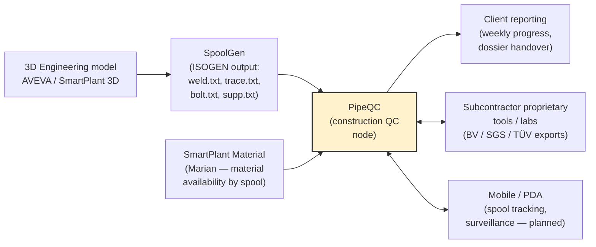
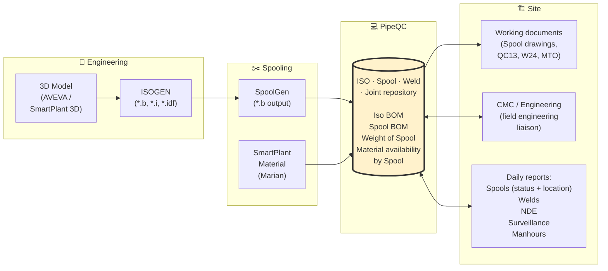
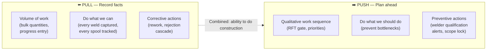
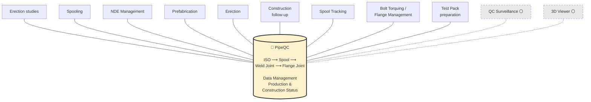
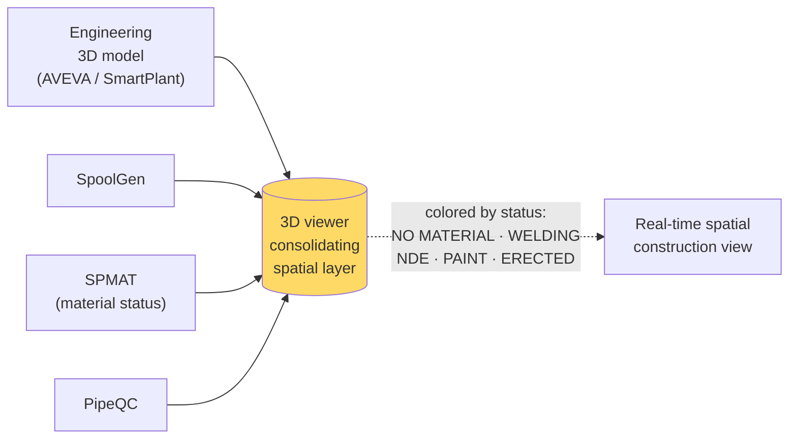
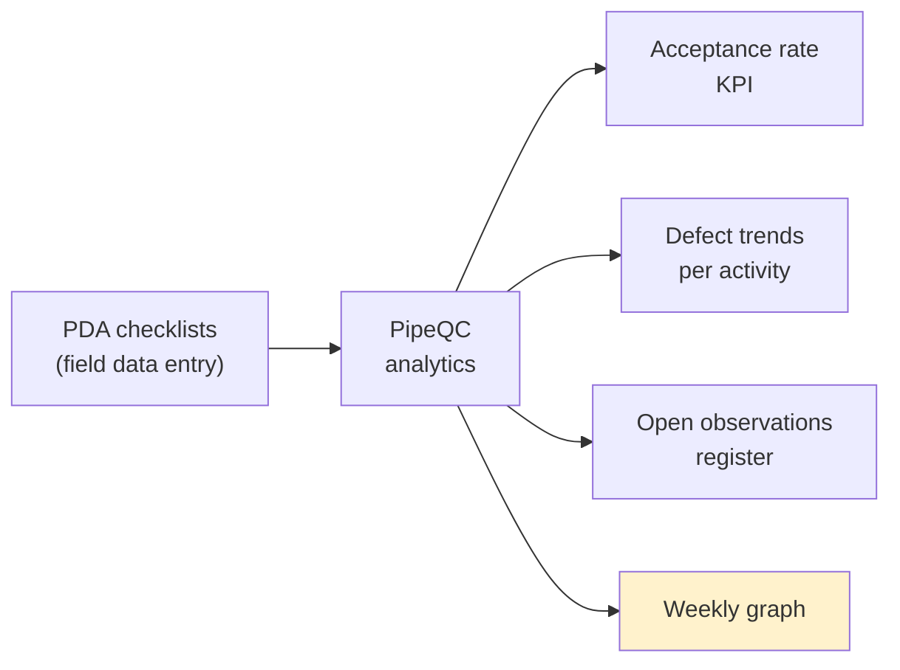

# PipeQC — Part 1: PSMS Overview

> **Структурный template** — следует pattern'у оригинальной Technip PSMS overview (40 слайдов, 5 секций: suite intro → industry process → product description → satellite tools → deployment / SOW).
>
> **Назначение** — обзорная презентация партнёру, чтобы показать (а) понимание индустрии трубопроводного строительства, (б) понимание собственного приложения PipeQC структурно и функционально, в привязке к рабочему lifecycle'у.
>
> **Не копируем содержимое Easy Piping deck'ов** — только структурный pattern (TOC + section dividers + Features/Functions/Outputs + SOW matrix). Все факты, диаграммы, тексты — про PipeQC.
>
> **Источники:** [pipeline_construction_guide.md](../pipeline_construction_guide.md), [docs/role_matrix/](../role_matrix/), [docs/research/presentation_findings.md](../research/presentation_findings.md), [config/navigation.ts](../../config/navigation.ts).
>
> **Использование:** каждый «## Slide N» — отдельный слайд в Google Slides. Mermaid рендерить через [mermaid.live](https://mermaid.live) → PNG/SVG.

---

## Slide 1 — Title

> **Содержимое слайда:**

# Piping Construction Management

## PipeQC

### Part 1 — PSMS Overview

_2026 · Construction QA/QC platform for industrial piping projects_

---

## Slide 2 — Section divider · «PipeQC suite»

> **Содержимое слайда (большое название секции):**

# PipeQC

### Presentation of the construction QC suite

_Section 1 / 5_

---

## Slide 3 — Table of contents

> **Содержимое слайда:**

# Table of contents

1. **PipeQC**
   _Presentation of the construction QC suite_

2. **Piping construction management**
   _Process of piping construction · Spooling · Material run by spool · Methodology for operational procedure_

3. **PipeQC description**
   _Objectives · Architecture · Main organization · Navigation and homepage · Piping construction process · Features, functions and outputs_

4. **Satellite tools**
   _Spool tracking · Mobile / PDA · Future integrations_

5. **PipeQC deployment**
   _Modules — example of SOW · Roles × responsibilities_

---

## Slide 4 — PipeQC suite

> **Содержимое слайда — что мы есть:**

### PipeQC — Presentation of the suite

- **PipeQC is a construction QA/QC platform** purpose-built for piping packages of industrial EPC projects (НПЗ, ГПЗ, LNG, химия, энергетика).
- It is the overall system that **digitizes every fabrication and QC activity** on the piping scope — from ISO transmittal to hydrotest handover.
- Single source of truth across **6 roles**: System Admin, Spooling Team, QC Engineer, NDE Inspector, Subcontractor, Project Manager.
- Built for **EPC contractor's QA/QC department** as primary user — read-mostly for PM, edit-heavy for QC / NDE, scope-locked for Subcontractor.
- PipeQC is in **active development** — core lifecycle is in place; deep domain logic (penalty shoot automation, scope lock, real reporting) is rolled out in named tracks (A / H / J / K / N / S).

---

## Slide 5 — PipeQC suite · data exchanges

> **Содержимое слайда (диаграмма + bullets):**

### Interfaces with the construction data ecosystem



- **Upstream**: 3D design + SpoolGen output + SmartPlant Material (CSV import).
- **Downstream**: client-facing reports, subcontractor exports, mobile sync.
- **Customizable** for data exchange with client / subcontractor proprietary tools.

---

## Slide 6 — Section divider · «Piping construction management»

> **Содержимое слайда:**

# Piping construction management

### Process of piping construction · Spooling · Material run by spool · Methodology

_Section 2 / 5_

---

## Slide 7 — Process of piping construction (data architecture)

> **Содержимое слайда — флагманская диаграмма всей презентации:**

### Where PipeQC sits in the data architecture



**Каждая стрелка — реальный data exchange:**

- `*.b / *.i / *.idf` (ISOGEN output) → SpoolGen режет ISO на spools
- SpoolGen → PipeQC: ISO numbering, spool numbering, weld locations, pipe cuts (через `weld.txt`, `trace.txt`, `bolt.txt`, `supp.txt`)
- SmartPlant Material → PipeQC: material availability by spool, weight of spool
- PipeQC → Site: working documents (printed spool drawings, QC13 forms, MTO sheets)
- Site → PipeQC: ежедневные отчёты — статус spool'а, прогресс welds, результаты NDE, manhours

---

## Slide 8 — Spooling · physics that defines the rules

> **Содержимое слайда — три блока: транспорт / prefab / erection:**

### 1️⃣ FIX SPOOLING OPTIONS — transportation constraints

| Constraint              | Standard       | Notes               |
| ----------------------- | -------------- | ------------------- |
| Truck (normal)          | 12 × 2.4 × 3 m | hard physical limit |
| Out-of-size road weight | varies         | project-specific    |
| Bridges / culverts      | route survey   | NA on most sites    |
| Tunnels                 | route survey   | NA on most sites    |
| Overhead obstacles      | route survey   | NA on most sites    |
| Gates                   | route survey   | NA on most sites    |

### PREFAB SCOPE — maximize work in shop

- ✅ No extra lengths on spools (exact cut)
- ✅ No tack-welded flanges at shop
- ✅ Small-bore spooled where possible
- ✅ Shop welding of large-bore welded valves
- ✅ Weldolets welded at shop
- ✅ Supports welded to pipe at shop

### 2️⃣ PERFORM ERECTION STUDIES → 3️⃣ SPOOLING

**MAXIMIZE:** Shop welding · straight length pipes dragging on racks · 5G positions for field welds · rotation welding (shop + double/triple jointing at site) · pre-assembly welds noted as PAW

**CONSIDER:** Accesses to field welds · 3D spool erection constraints · lifting methods and constraints

**MINIMIZE:** Scaffolding (avoid additional rigs)

**ERECTION:** weight of spool — no limit (defined by lifting capability per area)

> **Why this is PipeQC's job:** every shop weld is recorded as **Shop Weld (SW)**, every field weld as **Field Weld (FW)**, every pre-assembly weld as **PAW**. PipeQC tracks the **prefab % per spool** and surfaces shop/field split on Fabrication and Erection dashboards. Bad spool boundaries → cost ×3–5 in the field.

---

## Slide 9 — Spooling · revision management by Spooling Team

> **Содержимое слайда — выгоды + бенчмарк в одном слайде, как у Easy Piping:**

### Spooling & revisions managed by a skilled team

**Tooling chain:** `SmartPlant → SpoolGen → PipeQC` — single skilled team owns the loop.

**Operational benefits of PipeQC-managed spooling:**

| Benefit                                             | Что меняет это в проекте                            |
| --------------------------------------------------- | --------------------------------------------------- |
| **Electronic data generation & transfer**           | Нет paper-bottleneck'а между Engineering и Spooling |
| **BOM by spool** (not by ISO)                       | Точный workfront forecast on 100% of material       |
| **Constructability screening**                      | Spooler видит ошибки до резки металла               |
| **Control of deviations** (modification impact)     | Revision cascade рассчитывается автоматически       |
| **Control of priorities / schedule**                | Какие spools режем первыми → drives weekly program  |
| **Less technical query from subcontractor**         | Sub видит свой scope в PipeQC без звонков           |
| **Immediate update** + reliability + exhaustiveness | One source of truth, без Excel-расходящихся версий  |
| **Homogeneity / consistency of documents**          | Все spool drawings из одного шаблона                |
| **High quality and legibility**                     | Печать прямо из системы, не из Excel в PDF в почту  |
| **Reduce spooling time and paper work**             | Sub-week per ISO вместо недель, бумаги почти нет    |

**Real project benchmark (PMP, Technip EPC reference):**

| Metric               | Total project | Largest single unit |
| -------------------- | ------------: | ------------------: |
| Spooled ISOs issued  |         5 003 |               2 447 |
| Spools               |        23 168 |              12 105 |
| Shop dia inch        |       325 970 |             158 599 |
| Assembly dia inch    |        59 382 |              29 614 |
| Field dia inch       |        30 599 |              11 886 |
| **Total dia inch**   |   **415 951** |         **200 099** |
| Prefab % of dia inch |           78% |                 79% |

> **Что это значит для PipeQC:** приложение должно держать **десятки тысяч spools + сотни тысяч welds** в одном проекте без деградации UX. Это фактическая нагрузка одного среднего НПЗ.

---

## Slide 10 — Transportation & prefab scope

> **Содержимое слайда:**

### Physics that defines spool boundaries

**Transportation constraints (typical):**

| Aspect                       | Standard       | Notes                 |
| ---------------------------- | -------------- | --------------------- |
| Truck dimensions             | 12 × 2.4 × 3 m | hard physical limit   |
| Road weight                  | varies         | site-specific         |
| Bridges / culverts / tunnels | varies         | route survey required |

**Prefab scope (maximize work in shop):**

- ✅ No extra lengths on spools — exact cut
- ✅ No tack-welded flanges at shop
- ✅ Small-bore spooled when possible
- ✅ Weldolets welded at shop
- ✅ Supports welded to pipe at shop

**Erection optimization (minimize field):**

- Maximize: shop welding, automatic / rotation welding, pre-assembly welds (PAW)
- Consider: field weld accessibility, 3D erection constraints, lifting methods
- Minimize: scaffolding (avoid additional rigs)

> **Why this matters for PipeQC:** every shop weld costs ×1, every field weld costs ×3–5. PipeQC tracks the **shop/field split per spool** and surfaces it on the Fabrication / Erection dashboards.

---

## Slide 11 — SmartPlant Material · run by spool

> **Содержимое слайда:**

### Material availability is calculated **per spool**, not per ISO

- Spool BOMs are automatically generated by SpoolGen and loaded into Marian (SmartPlant Material).
- SmartPlant Material **forecast runs** are executed **by spool** (not by ISO) — gives accurate work-front readiness per individual fab unit.
- **Runs report** informs whether a spool is prefabricable now or gives the delivery date of the latest item.

**Operational benefits (why run-by-spool matters):**

- Significant **work-front increase** at beginning of prefabrication.
- Improved **leveling** of prefabrication workload — minimizes peak manpower / shop facilities resource demand.
- Allows **more prefabrication as per priority schedule** (urgent test packs first).
- Accurate work-front forecast for **100% of material per spool** — no partial issuance, no man-hour losses, no traceability confusion.

**Что приходит в PipeQC:** CSV from Marian with columns:

```
FAH CODE, Run Number, Run Date, Unit, Area, Line, Sheet,
Iso No, Spool No, Issue Status, Weight,
Completion Status, Completion Date
```

> Spooling Team ingests this CSV through `/spooling/iso-workflow` → spool record получает material readiness flag.

---

## Slide 12 — Methodology for operational procedure

> **Содержимое слайда:**

### Powerful management of piping construction — daily data flow

```mermaid
flowchart TB
    subgraph PROJ["📋 Project setup phase"]
        SG["SpoolGen<br/>(ISO breakdown)"]
        SM["SmartPlant Material<br/>(BOM per spool)"]
    end

    subgraph DAILY["⚡ Daily operational phase"]
        EP["PipeQC"]
        SITE["Site<br/>(Fab + Erection)"]
        PDA["PDA / mobile<br/>(spool tracking)"]
    end

    SG -->|spools + welds + joints| EP
    SM -->|material availability| EP
    EP <-->|Daily update:<br/>· spools status<br/>· welds (progress)<br/>· NDE results<br/>· manhours| SITE
    EP <-->|Daily update with PDA:<br/>· spool location<br/>· QC surveillance| PDA

    style EP fill:#fff2cc,stroke:#333,stroke-width:2px
```

**Что PipeQC делает с собранными данными:**

- Selection of welds to be examined (NDE batch suggestions per Matrix)
- **Penalty shoot** trigger after compounding rejections
- **Tracer joint** management (T1 → T1-1 / T1-2 cascade)
- RT film quantity estimations
- Examination program issuance (Work Order PDFs to NDE labs)
- Welder statistics + qualification expiry alerts
- NDE backlog tracking + bottleneck identification
- Revision management cascade
- **RFT gate enforcement** before hydrotest

---

## Slide 13 — Section divider · «PipeQC description»

> **Содержимое слайда:**

# PipeQC description

### Objectives · Architecture · Main organization · Navigation and homepage · Piping construction process · Features, functions and outputs

_Section 3 / 5_

---

## Slide 14 — PipeQC objectives · construction supervision

> **Содержимое слайда:**

### Two parallel modes of construction supervision



- **PULL leg** — operational record-keeping: every action becomes a row in the system. QC / NDE / Subcontractor live here.
- **PUSH leg** — forward planning: system enforces gates and surfaces what's blocking. PM lives here.
- **Combined** = the ability to actually do construction without losing control or quality.

---

## Slide 15 — PipeQC objectives · life cycle management

> **Содержимое слайда:**

### A tool to manage the entire life cycle of piping construction activities

**By monitoring and controlling step by step, each and every fabrication and QC activity in sequence.**

### Improve the overall piping performance

EPC and subcontractor(s) work in **close collaboration** through one shared data layer:

- EPC sees full project state in real time
- Subcontractor sees own scope only (scope lock)
- QA/QC inspectors gate every release point
- PM watches dashboards and drills into specific blockers

### Enter the «construction cockpit»

Different methods and tools are needed than for engineering or procurement. PipeQC supplies them:

- Real-time progress dashboards
- Live RFT pursuit for hydrotest planning
- Welder performance trends
- Auditable QC trail per joint / per spool

---

## Slide 16 — PipeQC architecture

> **Содержимое слайда — центральный узел + спутники, как у Easy Piping:**

### Cascading ISO · Spool · Weld Joint data repository

**Convergence & Interoperability — the deepest level of itemization achieved**



**Производственная архитектура — 4 слоя, одна база:**

| Слой                   | Что лежит в этом слое                                                      |
| ---------------------- | -------------------------------------------------------------------------- |
| **ISO level (line)**   | Service class, fluid, pressure, paint system, NDE matrix per ISO           |
| **Spool level**        | BOM, weight, material availability, status (Start Fab → Erected), location |
| **Weld Joint level**   | Type (FW/SW/PAW), WPS, welder, root/cap %, NDE method, defects history     |
| **Flange Joint level** | Bolt size, torque value, gasket type, blinding status, jointer code        |

> Solid lines = active modules · Dashed ⚪ = planned (future tracks)
>
> **Самая глубокая itemization в индустрии:** каждый weld joint — first-class объект с собственной историей, паспортом, владельцем действия. Это и есть тот «cockpit» из slide 15.

---

## Slide 17 — PipeQC main organization

> **Содержимое слайда:**

### Organization based on site activities

**Main functionalities (site-activity-based modules):**

| Module                | Sub-sections                                                                                                            | Status |
| --------------------- | ----------------------------------------------------------------------------------------------------------------------- | ------ |
| **Setup / Admin**     | Project Definition · System Referential · Project Referential · Access Rights · Imports                                 | 🟡     |
| **Preparation**       | Engineering Transmittals · ISO Workflow · Spooling Transmittal                                                          | 🟡     |
| **Fabrication**       | Spool Fab (Material Check / QC Release / PWHT / Paint / Laydown) · Shop Weld Progress                                   | 🟢     |
| **Erection**          | Spool Erection (To Site / Field Mat. Check / Erected / Welded-Bolted / Supported / Field QC / RFT) · Site Weld · Flange | 🟢     |
| **NDE management**    | Batch Management · Dashboard                                                                                            | 🟡     |
| **Test Pack**         | Builder · Explorer · Pressure Test                                                                                      | 🟢     |
| **Flange Management** | Bolt torquing · Blinding / Reinstatement balance                                                                        | 🟢     |

**Transversal functionalities:**

| Transversal module         | Status                                                   |
| -------------------------- | -------------------------------------------------------- |
| Spool tracking             | 🟡 dashboard shell only — Track S                        |
| Reports                    | 🟡 catalog + shell, downloads = mock — Track C           |
| Planning, target and alert | ⚪ future track                                          |
| Revision control           | ⚪ future track (folded into Track K)                    |
| QC Surveillance (PDA)      | ⚪ future track — not Easy Piping parity, differentiator |

🟢 working · 🟡 partial · ⚪ planned

---

## Slide 18 — PipeQC navigation & homepage (1/2)

> **Содержимое слайда — UI walkthrough:**

### Left navigation = lifecycle order

```
┌───────────────────────────┐
│ Logo (back to project home)│
├───────────────────────────┤
│ SETUP                     │
│  └─ Admin Module          │  ← System Admin / PM
│                           │
│ PREPARATION               │  ← Spooling Team / PM
│  └─ Spooling              │
│                           │
│ CONSTRUCTION              │  ← QC Eng / NDE / Sub / PM
│  ├─ Fabrication           │
│  ├─ Erection              │
│  ├─ Tracking              │
│  └─ NDE Module            │
│                           │
│ TESTING                   │  ← QC Eng / PM / NDE
│  ├─ Testpack              │
│  └─ Flange Management     │
│                           │
│ REPORTS                   │  ← PM / QC Eng
│                           │
│ CONFIGURATION             │  ← all roles
│  ├─ Settings              │
│  └─ Documentation         │
└───────────────────────────┘
```

**Top bar:** username · role · project · date · logout · change project · help.

> **Design principle:** sections are ordered **top-to-bottom in lifecycle sequence**. No "Reports" at the top, no "Dashboard" in the middle. The menu **is** the project's progress map.

---

## Slide 19 — PipeQC navigation & homepage (2/2)

> **Содержимое слайда — что на homepage:**

### Homepage = the construction cockpit

**Key elements (top to bottom):**

- **Header strip** — project name, current user role chip, KPIs at a glance (Fab progress %, Erection %, RFT-ready test packs)
- **Notifications feed** — sorted by severity (red → amber → blue); deep-link to problem screens (e.g. _"BTH-105: 3 welds rejected — TP-205 RFT blocked"_)
- **Progress charts area** — fabrication, erection, pressure tests curves over time
  - Toggle: by dia inch / by spool count / by weight
  - Filters: WBU, material type, size range, from-date / to-date
- **Schedule adherence area** — actual vs planned progress
- **Spool tracking summary** — overall scanned % + last 7-day trend
- **Construction surveillance** — quick-link panel (future track)

> **Что отсюда видно для PM (Anna's morning):** open app → red notification visible immediately → click → already on the problem screen. **Goal: less than 30 seconds from app open to identifying today's blocker.**

---

## Slide 20 — Piping construction process (canonical workflow)

> **Содержимое слайда — большая workflow-диаграмма:**

### Full lifecycle workflow — what gets recorded at each stage

```mermaid
flowchart TB
    subgraph PREP["📋 PREPARATION"]
        P1["Spooling<br/>(SpoolGen ingestion)"]
        P2["Material<br/>(Marian sync)"]
        P3["Test pack builder"]
    end

    subgraph FAB["🏭 FABRICATION (Spool level)"]
        F1["Fabrication start"]
        F2["Material issued (MIR)"]
        F3["Material allocation check"]
        F4["Fabricated"]
        F5["QC released"]
        F6["Sent to paint"]
        F7["Painted"]
        F8["Final QC"]
        F9["Laydown"]
        F10["Sent to site"]
    end

    subgraph WELD["🔥 WELDING (Joint level)"]
        W1["Cutting"]
        W2["Bevelling"]
        W3["Fit-up"]
        W4["Preheat"]
        W5["Welding"]
        W6["PWHT"]
        W7["Dimensional check"]
        W8["Traceability check"]
        W9["Grinding OF"]
    end

    subgraph NDE_BLOCK["🔬 NDE"]
        N1["NDE program"]
        N2["NDE results"]
        N3["Pad test (if applicable)"]
    end

    subgraph ERECT["🏗️ ERECTION"]
        E1["Erected"]
        E2["Welded / bolted"]
        E3["Supported"]
        E4["Released for test (RFT)"]
    end

    subgraph TEST["💧 TESTING"]
        T1["Line check"]
        T2["Item clearance"]
        T3["Blinding"]
        T4["Pressure test"]
        T5["Reinstatement Y"]
        T6["Reinstatement Z"]
        T7["Pre-commissioning"]
    end

    PREP --> FAB
    FAB --> WELD
    WELD --> NDE_BLOCK
    NDE_BLOCK --> ERECT
    ERECT --> TEST

    style FAB fill:#fff2cc
    style ERECT fill:#dae8fc
    style NDE_BLOCK fill:#d5e8d4
    style TEST fill:#ffe6cc
```



**Cross-cutting tracking layers** (visible at every stage):

- Spool tracking (physical location)
- Flange management (joint level + flange joint level)
- Welders monitoring (qualification + performance)
- Revision control (⚪ future)
- Planning / targets / alerts (⚪ future)

---

## Slide 21 — Features, functions and outputs · Preparation

> **Содержимое слайда:**

### Main functionalities — Preparation module

**Spooling status (PipeQC routes: `/spooling/iso-workflow`):**

- All detailed characteristics of the work: joint sizes, joint types, material type, thickness, piping class, paint system, NDE & PWHT requirements
- Quantity monitoring: spools count, welds count, weights, dia inch
- Revision management: revision tracking, impact measurement, history records (all revisions + their progress kept in memory)

**Material availability by spool (`/spooling/iso-workflow` → Material tab):**

- Forecast date of material availability per spool
- Construction priorities per spool

**Progress monitoring (cross-module rollup):**

- Spool progress: Start Fab → MIR → Material check → Fabricated → QC released → Paint → Final QC → Laydown → Site → Erected → Welded/Bolted → Supported → RFT
- Weld progress: Cutting → Bevelling → Fit-up → Preheat → Welding → PWHT
- Examination progress: NDE program → NDE results → traceability checks
- Painting progress: Blasting → Primer → Intermediate → Final coats

> **PipeQC status:** spooling shell built (`/spooling/*`), SpoolGen parser is demo-only. Real parser = part of **Track K** (Iso lifecycle / Spooling).

---

## Slide 22 — Features, functions and outputs · Welding & NDE management

> **Содержимое слайда — 15 функций:**

### Welding and NDE management functionalities

1. **Daily progress reporting** — welder, WPS, root/cap % per joint
2. **Welder statistics & performance analysis** — per-welder rejection rates, trends
3. **Validation of welder's qualification** with selected WPS for every joint (soft alert when expired) ⚠️ Track N
4. **Multiple welders for single joint** (root vs cap pass) ❌ Track N
5. **Selection of weld to be examined** — progressive sampling per NDE Matrix; PipeQC suggests welds considering NDE % + priorities
6. **Repair joint management** — auto-create R1/R2/R3 joints in NDE100 ❌ Track N
7. **Penalty shoot management** — auto-trigger after 2nd-level tracer OR 4 rejections → flip remaining batch to SS ❌ Track N (flagship demo)
8. **RT film quantity estimations** — report based on film qty per diameter referential
9. **Work order for NDE and PWHT activities** — printable PDF with Request No
10. **Repair % and types of defects monitoring**
11. **NDT progress and backlogs**
12. **PWHT progress and backlogs**
13. **Material traceability records** — heat number tracking against Project Piping Material List
14. **Spool Final QC clearance tracking** — auto-rollup when all joints released
15. **Balance work and bottleneck identification** at every stage

✅ live · ⚠️ partial · ❌ missing (assigned to track)

> **PipeQC coverage today:** ~10/15 partial. Missing concentrated in NDE deep logic = **Track N** focus.

---

## Slide 23 — Features, functions and outputs · Construction & QC

> **Содержимое слайда:**

### Fabrication & Erection — site activities

**Fabrication module (`/fabrication/*`):**

- Spool fabrication sub-stages: Material Check · QC Release · PWHT Release · Paint · Laydown
- Shop weld progress entry (welder, WPS, root/cap %, foreman confirm)
- Material check sign-off per spool (heat numbers validation against Project Piping Material List ⚠️)
- QC release sign-off per spool (4-item checklist: VT / dim / NDE / heat trace)
- PWHT release per joint (for CrMo / heavy CS thickness) ⚠️ Track N

**Erection module (`/erection/*`):**

- Spool erection sub-stages: To Site · Field Material Check · Erected · Welded/Bolted · Supported · Field QC Release · RFT
- Field weld progress (parallel to shop weld, but with field-specific position codes)
- Flange progress (bolt torquing, gasket type, jointer code)
- Field QC release (analogous to shop QC release)

**Common across both:**

- Multi-welder per joint (root + cap) ❌ Track N
- WPS qualification validation soft alert at weld entry ⚠️ Track N
- 4-item spool QC checklist with hard-stop on missing data

---

## Slide 24 — Features, functions and outputs · Spool tracking + Surveillance

> **Содержимое слайда:**

### Spool tracking module (`/tracking`)

- Area mapping — locations grid with capacity vs current count
- Barcode printing — Excel export to external Zebra software (industry-standard)
- PDA synchronisation — daily sync of scan events
- Data analysis — location vs status, inconsistency check (4 tabs: Spool / Location / Design Area / Consolidation Reports)
- Spool location records — full history per spool, audit-preserving moves
- Physical inventory count — by location
- Spool status report analysis
- Transport management — transit-out flag if scanned out + not scanned in >2 days
- Trends and KPIs — area capacity, scan trend curves

### Construction surveillance ⚪ future track

- Checklists definition loaded in PDA — itemized inspection points
- Observations recording with PDA (touch input)
- PDA synchronisation
- KPI and statistics — acceptance rate, level of supervision
- Report of opened observations

> **PipeQC status:** Spool tracking dashboard shell exists (`components/spool-tracking-dashboard.tsx`), data analysis tabs = **Track S**. Construction surveillance = not Easy Piping parity (they never finished) — **PipeQC differentiation opportunity** as future mobile-web track.

---

## Slide 25 — Features, functions and outputs · Flange management

> **Содержимое слайда:**

### Flange management module (`/flange`)

- **Numbering and quantifying works** — every flange joint as first-class object
- **Identify joints performed before vs after test** — drives requirement for permanent or temporary gasket
- **Identify method of tightening required** — manual / hydraulic / stud tensioning
- **Define torquing values** — per flange size × rating × material (from System Referential `Torquing Method`)
- **Records execution progress and traceability** — jointer code, torque value applied, date
- **Track bolt torquing on time** in accordance with Test Pack priorities
- **Plan torquing / tensioning activity** — visible workfront for jointers
- **Calculate estimations** — number of jointings forecast, manpower planning
- **Edit torquing program** — printable schedule per shift / per crew
- **Compile records** — full jointing history per test pack for handover dossier

> **Critical safety feature: Blinding / Reinstatement balance.**
> PipeQC enforces **count(blinds installed) == count(blinds removed)** before test pack can be marked complete. If a temporary blind is forgotten, the system flags it — preventing the catastrophic «plugged line at startup» scenario.

---

## Slide 26 — Features, functions and outputs · Test Pack

> **Содержимое слайда:**

### Test Pack preparation + Pressure Test (`/testpack/*`)

**Test pack builder (`/testpack/builder`):**

- Excel template export / fill / import
- Manual add / modify
- Spool selection by isometric (multi-select tree)
- Summary panel at top
- **Hard prerequisite:** System + Sub-system referentials (admin) must exist before import

**Test pack explorer (`/testpack/explorer`):**

- Test packs "Release For Test" tracking (8-gate RFT engine)
- Test packs testing status
- Completion of all construction activities (rollup)
- Completion of all NDE and QC activities (rollup)
- Isometric-at-spool-level browser (drill-down)

**Pressure test workflow (`/testpack/pressure-test`):**

- Line checking management (Punch List Cat X / Y / Z)
- Item clearance management (Cat-X items blocking RFT)
- Blinding management (temporary blinds tracking)
- Reinstatement in connection with flange management (balance enforcement)
- Testing & pre-commissioning progress entry

> **Pitch moment:** PM cannot manually schedule hydrotest if RFT gate is not green. This is **by design** — defends against wishful planning. The gate engine is real and operational today.

---

## Slide 27 — Features, functions and outputs · Production planning

> **Содержимое слайда:**

### Production planning functionality ⚪ future track

**Production activities scope:** Fabrication · NDE · PWHT · Painting · Erection.

**Planned features:**

- System set up with **erection sequence at spool level** (piping erection schedule) and **production capacity definitions** (per organization and resources)
- Calculate **equivalent working quantities** of each production activity for «fair» dispatch across subcontractors
- Display **remaining qualified workfront** for each activity
- Display **current available qualified workfront** (resources + materials ready)
- Issuance of the **weekly production schedule** for each production activity (list of spools and welds to complete next week)
- Dispatch of work as per production organization + capacity

> **Status:** ⚪ planned. This was the **«Production module»** that Easy Piping **never delivered** ("under development" marker in their decks 2017–2021). PipeQC differentiation opportunity for production / planning scope. Reasonable to defer — not blocking core demo flow.

### 3D viewer ⚪ future track

- 3D model used to **visualize PipeQC data**
- Spool status + location from material availability up to «ready for test»
- Test pack / system completion overlay
- Visualization helps to **plan construction sequence** and qualify workfront

---

## Slide 28 — Section divider · «Satellite tools»

> **Содержимое слайда:**

# Satellite tools

### 3D piping plan · Spool tracking architecture · Mobile / PDA · Construction surveillance

_Section 4 / 5_

---

## Slide 29 — Satellite A · 3D viewer consolidating

> **Содержимое слайда:**

### A — 3D viewer consolidating data sources



- 3D model + SpoolGen geometry + SPMAT material status + PipeQC construction status → consolidated spatial view.
- Color-coded by status: grey = no material, yellow = welding, orange = NDE, blue = paint, green = erected.
- Goal: PM / Site Engineer sees **whole plant area** with status of every spool at a glance.

> **PipeQC status:** ⚪ future track. 3D viewer integration depends on chosen 3D engine (potentially open-source: Three.js + IFC.js, or commercial like Navisworks API). Not a near-term track — but architecturally PipeQC's data model already supports the spatial coordinates field per spool (PDS Area).

---

## Slide 30 — Satellite B · Erection plan at spool level

> **Содержимое слайда:**

### B — Erection plan at spool level (3D + schedule)

```
Design Area S3CB
────────────────────────────────────────
                            October  November  December
────────────────────────────────────────
Spool SP-S3CB-001-A    ▓▓▓▓▓▓
Spool SP-S3CB-001-B           ▓▓▓▓▓
Spool SP-S3CB-002-A           ▓▓▓
Spool SP-S3CB-002-B                ▓▓▓▓▓▓
Spool SP-S3CB-003                      ▓▓▓
...
────────────────────────────────────────
```

- Each spool gets a planned erection date (from schedule).
- 3D visualization shows what's planned this week / month — visible workfront.
- **Production spool list for erection** is generated weekly per design area.

### A + B = 3D piping plan, cascading the schedule down to foreman level

- **Instructions to foremen** — per design area, weekly target sheets generated from PipeQC + planning data.
- Each foreman gets a printable list: «this week, these spools, these welds, these field welds».
- Closes the gap between project schedule (months out) and shop-floor reality (today + tomorrow).

> **PipeQC status:** ⚪ future track (Planning, target, alert). Not in MVP roadmap.

---

## Slide 31 — Satellite · Spool tracking system architecture

> **Содержимое слайда:**

### Spool tracking architecture

```mermaid
flowchart LR
    EP["PipeQC<br/>(spool list +<br/>statuses)"]
    BL["Barcode label<br/>generation<br/>(Excel export)"]
    BP["External barcode<br/>printing software<br/>(Zebra)"]
    SP["Physical spools<br/>(barcode stickers)"]

    EP -->|Spool batch<br/>export| BL
    BL -->|.xlsx| BP
    BP -->|printed labels| SP

    SP -.->|scan events<br/>(PDA)| EP
```

- PipeQC **does not print barcodes itself** — exports an Excel list of spools to print, printing happens in external Zebra software (industry-standard for thermal label printers).
- Each printed label gets stuck onto the physical spool.
- Future: PDA scans the barcode → location update flows back to PipeQC.

> **PipeQC status:** 🟡 partial. Excel export pattern (two-column basket UX) is the design intent — same pattern can power Test Pack Builder spool selection.

---

## Slide 32 — Satellite · Mobile / PDA application overview

> **Содержимое слайда:**

### Mobile application — spool tracking on the field

```
┌─────────────────────────────────────┐
│  📱 PipeQC Mobile (planned)          │
├─────────────────────────────────────┤
│  Operator: Anas Shehada              │
│  Role: Production Engineer           │
│  Connected: ✅ MCL Link              │
├─────────────────────────────────────┤
│  Workflow status:                    │
│   Last scan: SP-PG-001-A             │
│   Location: Laydown Yard L-12        │
│   Time: 09:42                        │
├─────────────────────────────────────┤
│  [ Scan barcode ]                    │
│  [ Edit location (manual override) ] │
│  [ Sync now ]                        │
└─────────────────────────────────────┘

Hardware (reference):
  - Touch screen, rugged form factor
  - 1D / 2D barcode scanning
  - GPS, WWAN, WLAN, WPAN
  - Examples: Motorola MC55, Zebra TC25

Middleware: MCL Link connects PDA to PipeQC DB
PDA fleet: 10 devices on benchmark PMP project
```

**Key UX rules:**

- Scan barcode → spool location updated.
- Edit functionality allows operator to manually fix location if found wrong on field.
- Each scan = new history record (audit-preserving, not destructive overwrite).
- Sync = background; offline mode for areas without coverage.

> **PipeQC status:** ⚪ future track. Mobile-web (PWA) implementation can serve the same purpose without proprietary hardware lock-in — modern Android phones with embedded scanners replace dedicated PDAs.

---

## Slide 33 — Satellite · Construction surveillance

> **Содержимое слайда:**

### Construction surveillance ⚪ future track (Non-QCP recorded inspections)

```
Proactive construction management:
  1. Quickly define subcontractor, discipline, location
  2. Pick the checklist (from PDS Area referential)
  3. Select the latest revision ISO / spool / joint from PipeQC
  4. Validate or reject a checklist action
```

**Activities covered by surveillance checklists:**

- Material allocation check
- Cutting verification
- Beveling check
- Fit-up validation
- Pre-heat verification
- Post-weld visual

**Data analysis output:**

- Acceptance rate KPI per activity
- Trend per ISO / spool / joint
- Trend per inspector
- Results plotted on weekly graph

> **Important context:** Easy Piping marked Construction Surveillance as «under development» across 2017–2021 — **never delivered**. For PipeQC this is **not a parity gap** — it's a **whitespace opportunity**. If built, it should be designed as a PipeQC differentiator (mobile-web, modern UX), not copied from Easy Piping's PDA paradigm.

---

## Slide 34 — Satellite · Statistics & KPIs from surveillance

> **Содержимое слайда:**

### Statistics and Indicators — Construction surveillance module ⚪

**KPIs produced from surveillance data:**

- **Defect quantity and frequency** — per activity, per subcontractor, per inspector
- **Level of surveillance / supervision** — how many checks completed vs target
- **Acceptance rate trend** — weekly + cumulative
- **Inspector workload** — distribution of checklists per inspector

**Report types:**

- Surveillance activity results (PDA-driven)
- Defect quantity + frequency analysis
- Level-of-supervision report (per subcontractor / area)
- Open observations register (active punch-style items)



> Эти отчёты — то, что Easy Piping обещал и не доставил. PipeQC может построить лучшую версию, **если решит инвестировать в этот track**.

---

## Slide 35 — Satellite tools summary

> **Содержимое слайда:**

### Satellite tools at a glance

| Tool                             | Purpose                                      | PipeQC status           | Track   |
| -------------------------------- | -------------------------------------------- | ----------------------- | ------- |
| **3D viewer**                    | Spatial visualization of construction status | ⚪ planned              | future  |
| **Erection plan at spool level** | Schedule cascaded to foreman                 | ⚪ planned              | future  |
| **Spool tracking architecture**  | Barcode label → PDA scan → location history  | 🟡 dashboard shell only | Track S |
| **PDA / mobile application**     | Field data entry, location updates           | ⚪ planned              | future  |
| **Construction surveillance**    | PDA checklists for proactive QC              | ⚪ planned (whitespace) | future  |

🟢 working · 🟡 partial · ⚪ planned

> **Strategic note:** none of these are MVP-blocking. Core construction flow (Setup → Spooling → Fab → Erection → NDE → Testpack) works without them. Satellite tools are **expansion vector** for product differentiation and enterprise sales.

---

## Slide 36 — Section divider · «PipeQC deployment»

> **Содержимое слайда:**

# PipeQC deployment

### Modules — example of SOW · Roles × responsibilities

_Section 5 / 5_

---

## Slide 37 — Deployment · SOW matrix (Setup + Preparation + Fabrication)

> **Содержимое слайда:**

### Modules — example of SOW (Statement Of Work)

**Setup / Admin module:**

| Activity                                                                   | Owner                   |
| -------------------------------------------------------------------------- | ----------------------- |
| Project setup: piping class, NDE matrix, weld type, rework code, thickness | **Spooling Team** (EPC) |
| Define and customize WPS and welder qualifications                         | **Subcontractor**       |
| Setup access rights, roles, scope locks                                    | **System Admin**        |

**Preparation / Spooling module:**

| Activity                                                                   | Owner                             |
| -------------------------------------------------------------------------- | --------------------------------- |
| Import spool data and weld data from SpoolGen                              | **Spooling Team**                 |
| Import material availability, paint data, spool weight from SPMAT (Marian) | **Spooling Team**                 |
| Manage ISO modifications (HO rev — head office revision)                   | **Spooling Team**                 |
| Manage ISO modifications (Site rev — site revision)                        | **Spooling Team + Subcontractor** |

**Fabrication module:**

| Activity                                                      | Owner                   |
| ------------------------------------------------------------- | ----------------------- |
| Input daily reports: welding, painting, spool fab, NDE        | **Subcontractor**       |
| Analyze reports for sequence respect, backlog, QC deviations  | **Subcontractor + EPC** |
| Weekly spool selection for fabrication                        | **Spooling Team (EPC)** |
| Input daily reports: manhours and progress                    | **Subcontractor**       |
| Productivity calculation (cutting, beveling, fit-up, welding) | **Subcontractor + EPC** |

---

## Slide 38 — Deployment · SOW matrix (NDE + Surveillance + Spool tracking)

> **Содержимое слайда:**

### Modules — example of SOW (continued)

**Welding & NDE management module:**

| Activity                                                                    | Owner                   |
| --------------------------------------------------------------------------- | ----------------------- |
| Selection of welds to be examined per PipeQC suggestions (batch management) | **Subcontractor**       |
| Manage progressive sampling and penalty shoot                               | **Subcontractor**       |
| Edit examination program (Work Order PDF)                                   | **Subcontractor**       |
| Input material traceability records (heat numbers)                          | **Subcontractor**       |
| Edit QC forms, weld history registers                                       | **Subcontractor**       |
| Edit welder statistics, control welder performance                          | **Subcontractor + EPC** |
| Analyze reports: backlog, repairs, NDE-on-time vs TP priority               | **Subcontractor + EPC** |

**Construction surveillance module ⚪ future:**

| Activity                                                           | Owner   |
| ------------------------------------------------------------------ | ------- |
| Report surveillance activity (PDA)                                 | **EPC** |
| Edit and analyze statistics: defect quantity, level of supervision | **EPC** |

**Spool tracking module:**

| Activity                                     | Owner                   |
| -------------------------------------------- | ----------------------- |
| Area mapping                                 | **Subcontractor**       |
| System setup and configuration               | **EPC**                 |
| Edit barcode stickers and tag spools         | **Subcontractor**       |
| Scan spool transportation and location (PDA) | **Subcontractor**       |
| Analyze spool movement and stand-by          | **Subcontractor + EPC** |

---

## Slide 39 — Deployment · roles matrix on PipeQC

> **Содержимое слайда:**

### Role × Module access matrix

| Module / Role         | System Admin | Spooling Team | QC Engineer | NDE Inspector | Subcontractor | Project Manager |
| --------------------- | :----------: | :-----------: | :---------: | :-----------: | :-----------: | :-------------: |
| **Setup / Admin**     |      🟢      |       —       |      —      |       —       |       —       |       🟡        |
| **Preparation**       |      —       |      🟢       |      —      |       —       |       —       |       🟡        |
| **Fabrication**       |      —       |       —       |     🟢      |       —       |  🟢 (scope)   |       🟡        |
| **Erection**          |      —       |       —       |     🟢      |       —       |  🟢 (scope)   |       🟡        |
| **NDE Management**    |      —       |       —       |     🟡      |      🟢       |  🟢 (scope)   |       🟡        |
| **Test Pack**         |      —       |       —       |     🟢      |      🟡       |       —       |       🟢        |
| **Flange Management** |      —       |       —       |     🟢      |       —       |  🟢 (scope)   |       🟡        |
| **Spool Tracking**    |      —       |       —       |      —      |       —       |  🟢 (scope)   |       🟢        |
| **Reports**           |      🟡      |      🟡       |     🟢      |      🟡       |       —       |       🟢        |
| **Configuration**     |      🟢      |      🟢       |     🟢      |      🟢       |      🟢       |       🟢        |

🟢 full access · 🟡 read-only (watcher) · 🟢 (scope) = PDS area lock applied

**Key observations:**

- **System Admin** — only role without operational daily loop. Active during setup ramp + maintenance only.
- **Project Manager** — sees all modules in watcher mode → drill into blockers → call people (offline). Never enters data.
- **Subcontractor** — operationally identical to QC + NDE, but scope-locked to assigned PDS areas. **Multi-tenant in a single project.**
- **NDE Inspector** — narrowest scope, deepest logic. The «examination cockpit».

---

## Slide 40 — Closing · what's next

> **Содержимое слайда:**

### What this deck covered, what comes next

**This deck (Part 1 — PSMS overview):**

- Industry context: piping construction process, ISO → spool → weld data flow, SmartPlant Material run-by-spool methodology
- PipeQC architecture: 7 active modules + 3 future tracks, all sharing one ISO/spool/weld data repository
- Navigation, homepage, lifecycle workflow
- Features per module (Preparation, Fabrication, NDE, Erection, Testpack, Flange, Tracking)
- Satellite tools (3D viewer, mobile, surveillance)
- SOW matrix and role × module access

**Next deck series (planned):**

| #   | Deck                              | Focus                                                                                     |
| --- | --------------------------------- | ----------------------------------------------------------------------------------------- |
| 2   | **PipeQC Administration**         | Project Definition · System Referential · Project Referential · Access Rights · Imports   |
| 3   | **PipeQC Preparation / Spooling** | ISO lifecycle state machine · SpoolGen integration · Revision cascade · Test Pack Builder |
| 4   | **PipeQC Fabrication**            | Spool fab sub-stages · Weld progress · Material check · QC release · Multi-welder         |
| 5   | **PipeQC NDE / Welding**          | Batch lifecycle · Tracer cascade · Penalty shoot automation · Examination program         |
| 6   | **PipeQC Erection**               | Site flow · Field welds · Flange management · Field QC · RFT cascade                      |
| 7   | **PipeQC Test Pack**              | Builder · Explorer · Pressure Test · Reinstatement balance · Client handover dossier      |
| 8   | **PipeQC Spool Tracking**         | Data analysis tabs · Inconsistency flags · Transit-out · Future mobile-web                |
| 9   | **PipeQC Roles deep dive**        | Day-in-the-life per role · Scope lock UX · PM read-only mode                              |

> Каждый следующий deck — в том же template'е: Title → TOC → Section dividers (Introduction · Sub-modules · Features · Reports) → Deployment / SOW.

---

## Конец deck'а

**Структурный pattern (для сверки с оригиналом):**

| Слайды | Секция                             | Соответствие в Easy Piping PSMS overview |
| ------ | ---------------------------------- | ---------------------------------------- |
| 1      | Title                              | Slide 1                                  |
| 2–3    | Section divider + TOC              | Slides 2–3                               |
| 4–5    | Section 1: PipeQC suite            | Slides 4–5 (Easy plant)                  |
| 6–12   | Section 2: Piping construction     | Slides 6–12                              |
| 13–27  | Section 3: PipeQC description      | Slides 13–27 (Easy piping description)   |
| 28–35  | Section 4: Satellite tools         | Slides 28–35                             |
| 36–39  | Section 5: PipeQC deployment / SOW | Slides 36–39                             |
| 40     | Closing / next decks               | Slide 40                                 |

**Список mermaid-диаграмм для рендеринга через [mermaid.live](https://mermaid.live):**

| Слайд | Диаграмма                         | Приоритет |
| ----- | --------------------------------- | --------- |
| 5     | Data exchanges (interfaces)       | ⭐        |
| 7     | 8 phases of project lifecycle     | ⭐        |
| 8     | Data pipeline 3D → ISO → Spool    | ⭐        |
| 12    | Daily data flow methodology       | ⭐        |
| 14    | PULL / PUSH dual-leg supervision  |           |
| 16    | Modules constellation around core | ⭐⭐      |
| 20    | Full lifecycle workflow (large)   | ⭐⭐      |
| 29    | 3D viewer consolidating           |           |
| 31    | Spool tracking architecture       |           |
| 34    | Surveillance KPI flow             |           |

**Color palette (по модулям):**

- Setup / Admin — серый `#E8EAED`
- Preparation / Spooling — голубой `#E8F4FD`
- Fabrication — янтарный `#FFF2CC`
- Erection — синий `#DAE8FC`
- NDE — зелёный `#D5E8D4`
- Testing / Testpack — розовый `#FFE6CC`
- Tracking — коралл `#F8CECC`
- Flange — фиолетовый `#E1D5E7`
- Highlighted (PipeQC core, RFT gate, etc.) — `#FFD966` (стандартный янтарный)

---

_Version 2 — restructured to match Technip PSMS overview template (40 slides, 5 sections)._
_Made for: партнёрская презентация · 2026-05-23_
