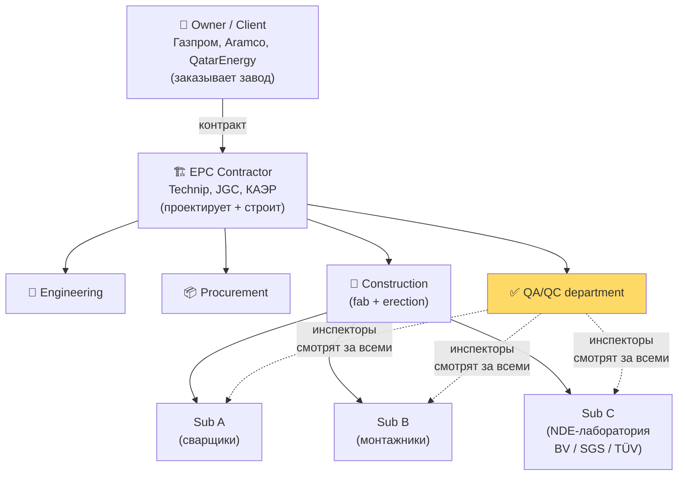
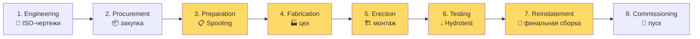
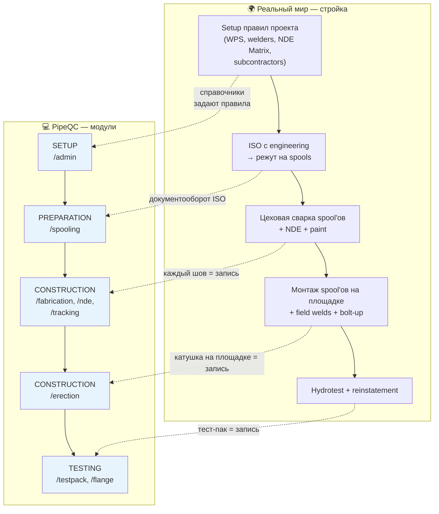
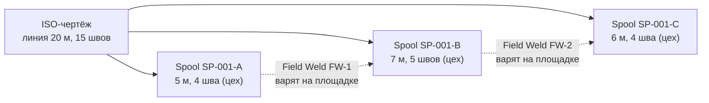
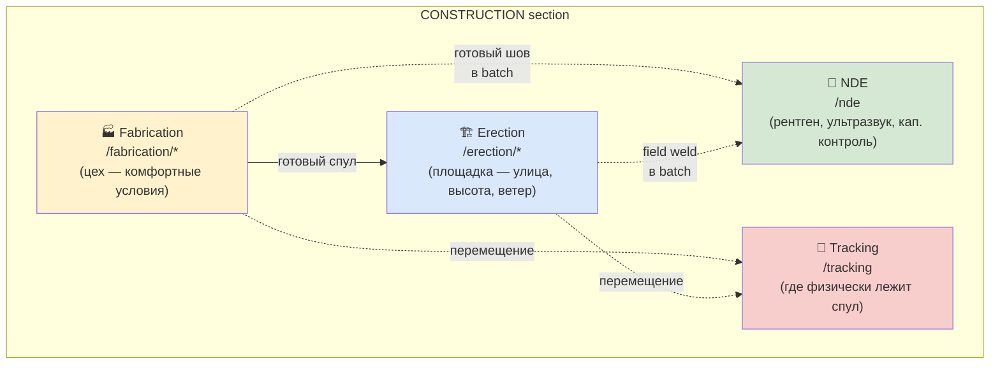
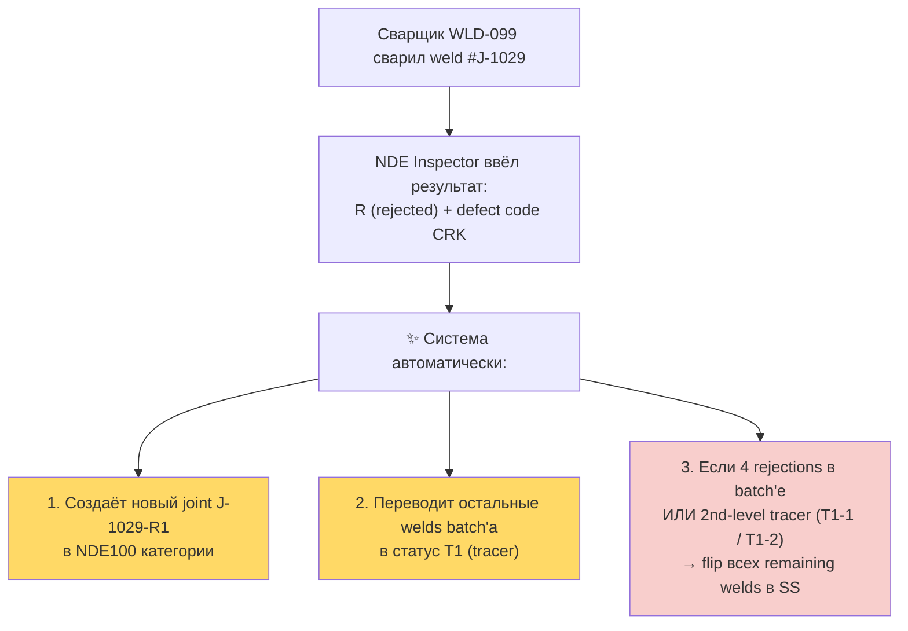
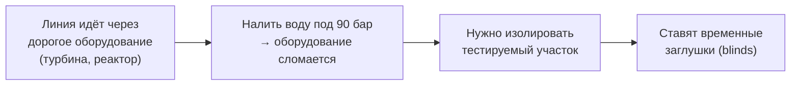
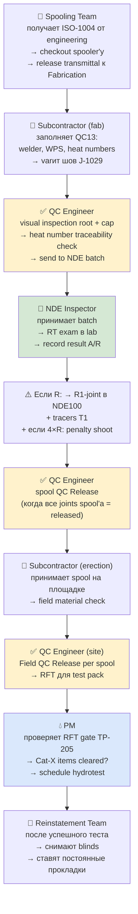
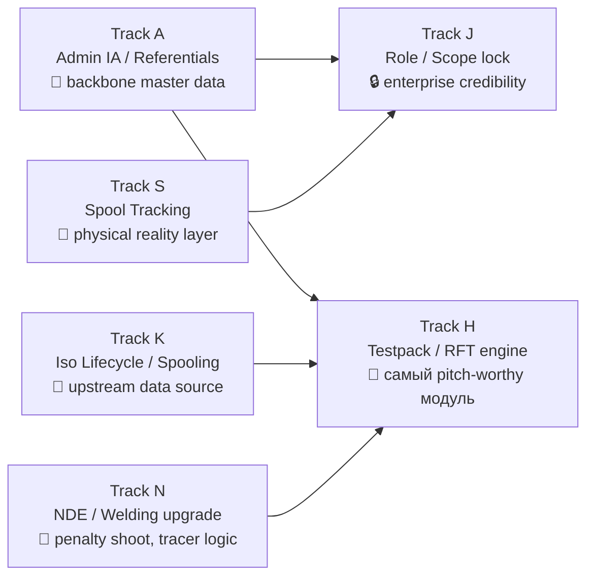

# PipeQC — Overview deck

> Первая обзорная презентация. Назначение — показать партнёру, что я **(а)** понимаю предметную область трубопроводного строительства и **(б)** понимаю, как наше приложение PipeQC ложится на эту предметную область — структурно (модули, экраны) и в динамике (ролевые сценарии, lifecycle).
>
> Глубина — **обзорная**. Подробные модульные deck'и (Spooling, Fabrication, NDE, Testpack) — отдельно, потом.
>
> Формат — один параграф = один слайд для Google Slides. Diagrams — mermaid (Google Slides рендер не поддерживает, но я скопирую как картинку через mermaid.live или просто перерисую блоками).
>
> Источники: [pipeline_construction_guide.md](../pipeline_construction_guide.md) (домен), [docs/role_matrix/](../role_matrix/) (роли), [docs/research/presentation_findings.md](../research/presentation_findings.md) (сравнение с Easy Piping), [config/navigation.ts](../../config/navigation.ts) (структура IA).

---

## Slide 1 — Title

> **Содержимое слайда:**

# PipeQC

**Construction QA/QC platform for industrial piping projects**

Overview deck · 2026

_(подзаголовок) От ISO-чертежа до hydrotest — один цифровой паспорт на каждый шов и каждую катушку._

> **Presenter note:** одна фраза-якорь. Здесь главная мысль всего продукта — управлять lifecycle'ом каждого weld'а и spool'а на стройке промышленного завода.

---

## Slide 2 — Что мы вообще строим (контекст домена)

> **Содержимое слайда:**

### Не магистральные трубопроводы. Трубы **внутри заводов**.

PipeQC живёт в проектах:

- Нефтеперерабатывающие заводы (НПЗ)
- Газоперерабатывающие, LNG-терминалы
- Химия, удобрения
- Электростанции (ТЭЦ, АЭС)
- Фарма, целлюлоза

**Масштаб одного проекта (типичный LNG / НПЗ):**

| Объект                | Длина труб | Сварных швов     | Длительность стройки |
| --------------------- | ---------- | ---------------- | -------------------- |
| Средний нефтехим. цех | 30–80 км   | 15 000 – 40 000  | 1.5 – 3 года         |
| Крупный НПЗ / LNG     | 200–500 км | 80 000 – 200 000 | 3 – 6 лет            |

> **Главный pain point заказчика:** каждый из этих десятков тысяч швов должен иметь паспорт — кто варил, какими электродами, по какому WPS, кто проверял, какой результат RT. Без программы — Excel-ад. PipeQC закрывает именно это.

---

## Slide 3 — Цепочка участников проекта

> **Содержимое слайда:**



> **Кому продаём:** **EPC contractor** — это наш заказчик. Внутри EPC главный пользователь — **QA/QC department** (жёлтым). PipeQC — это в первую очередь инструмент именно для них, плюс read-mostly мониторинг для PM и edit-доступ для subcontractor'ов в рамках их scope.

---

## Slide 4 — Производственный pipeline проекта (макро-карта)

> **Содержимое слайда:**

### 8 фаз стройки. PipeQC живёт в фазах 3–7.



**До PipeQC:** Engineering и Procurement — это AVEVA, SmartPlant 3D, SAP. Это не наша зона.

**После PipeQC:** Commissioning — отдельные SCADA / asset-management системы.

**PipeQC = жёлтые блоки** = вся construction + testing pipeline = ~70% длительности проекта по времени.

---

## Slide 5 — От производственного pipeline к pipeline приложения

> **Содержимое слайда — главный слайд презентации:**

### Мы воспроизвели real-world pipeline в архитектуре приложения 1-в-1.



> **Ключевое сообщение:** пользователь не учит «структуру приложения». Он работает в порядке, **в котором ему диктует физика стройки**. Слева в навигации — справочники проекта. Справа — финальная приёмка. Между — производство.

---

## Slide 6 — IA приложения: 5 разделов навигации

> **Содержимое слайда:**

### Левая боковая навигация — 5 секций в строгом порядке lifecycle:

```
┌─────────────────────────────────────┐
│  SETUP                              │
│   └─ Admin Module                   │  ← System Admin / PM
│       ├─ Project Definition         │
│       ├─ System Referential         │
│       ├─ Project Referential        │
│       ├─ Access Rights              │
│       └─ Import Settings            │
│                                     │
│  PREPARATION                        │
│   └─ Spooling                       │  ← Spooling Team / PM
│       ├─ Engineering Transmittals   │
│       ├─ ISO Workflow               │
│       └─ Spooling Transmittal       │
│                                     │
│  CONSTRUCTION                       │
│   ├─ Fabrication                    │  ← QC Eng / Sub / PM
│   │   ├─ Spool Fabrication          │
│   │   │   ├─ Material Check         │
│   │   │   ├─ QC Release             │
│   │   │   ├─ PWHT Release           │
│   │   │   ├─ Paint                  │
│   │   │   └─ Laydown                │
│   │   └─ Shop Weld Progress         │
│   ├─ Erection                       │  ← QC Eng / Sub / PM
│   │   ├─ Spool Erection (7 sub)     │
│   │   ├─ Site Weld Progress         │
│   │   └─ Flange Progress            │
│   ├─ Tracking                       │  ← Sub / PM
│   └─ NDE Module                     │  ← NDE Insp / QC Eng
│                                     │
│  TESTING                            │
│   ├─ Testpack                       │  ← QC Eng / PM / NDE
│   │   ├─ Builder                    │
│   │   ├─ Explorer                   │
│   │   └─ Pressure Test              │
│   └─ Flange Management              │
│                                     │
│  REPORTS                            │  ← PM / QC Eng
│                                     │
│  CONFIGURATION                      │  ← все роли
│   ├─ Settings                       │
│   └─ Documentation                  │
└─────────────────────────────────────┘
```

> **Главное:** порядок секций сверху вниз — это **порядок lifecycle'а проекта**. Никаких "Reports" сверху, никакого "Dashboard" по середине. Меню — это карта прогресса стройки.

---

## Slide 7 — SETUP. Сначала правила, потом игра. _(вторичная глубина)_

> **Содержимое слайда:**

### Admin module = «фундамент под фундаментом»

До того, как первый чертёж попадёт в систему, кто-то с ролью **System Admin** должен заполнить **справочники**. Иначе приложение «не знает», что хорошо, а что плохо.

**5 подразделов Admin Module** (`/admin/*`):

| Подраздел                     | Что задаём                                                                                                       | Аналогия                          |
| ----------------------------- | ---------------------------------------------------------------------------------------------------------------- | --------------------------------- |
| **1. Project Definition**     | Имя проекта, owner, contractor, лого, активный код, max transit time                                             | «Открываем казино»                |
| **2. System Referential**     | Глобальные: марки сталей, film qty per diameter, UT-коэффициенты, torquing methods                               | «Правила игры в покер»            |
| **3. Project Referential**    | Локальные (~30 справочников): subcontractors, PDS Areas, WPS, welder qualifications, **NDE Matrix**, rework code | «Бейджи дилеров казино»           |
| **4. Access Rights**          | Кто какую роль на каком проекте имеет; **subcontractor scope lock**                                              | «Кому в какую комнату пускать»    |
| **5. Import Settings**        | Excel-шаблоны для bulk-загрузки: Weld Thickness, NDE Matrix, Material List и т.д.                                | «Загрузка списков игроков скопом» |

> **Demo-нота:** в текущем приложении 2 справочника из 30 имеют CRUD (Subcontractors, Teams). Остальное — shell + demo data. **Это сознательное решение** — мы не строим вслепую 30 CRUD-форм; строим то, что нужно для основного demo flow. См. _Track A — Admin IA_ в [roadmap_v3](../roadmap_v3.md).

---

## Slide 8 — PREPARATION (Spooling). Чертежи → задачи на цех.

> **Содержимое слайда:**

### Превращаем engineering чертежи в физические задачи на сварку.

**ISO-чертёж** (изометрия) — это **одна линия трубы** от точки А до точки Б. На завод приходят 5 000 – 15 000 таких чертежей.

Линия 20 м не лезет в фуру. Её **режут на spools** (катушки ≤ 12 м), каждая катушка делается в цеху целиком.



**Модуль Spooling в PipeQC = `/spooling/*`**:

- `Engineering Transmittals` — приём batch'ей ISO от engineering
- `ISO Workflow` — checkout spooler'у → multi-round verification → release
- `Spooling Transmittal` — outbound batch на cеть Fabrication

> **Кто работает:** роль **Spooling Team**. **Document workflow editor**, не shop floor. Работает с PDF/CAD/CSV/Excel, а не с металлом.
>
> **Связь с другими модулями:** Spooling = upstream для Fabrication. Без spooling'а в Fabrication нечему появиться.

---

## Slide 9 — CONSTRUCTION. Сердце приложения.

> **Содержимое слайда:**

### CONSTRUCTION = 4 параллельных модуля, работающих с одним общим объектом — швом и спулом.



**Главные сущности**:

- **Joint / Weld** — сварной шов. Каждый шов имеет паспорт (Joint Card): welder, WPS, дата, VT result, NDE result, heat numbers, PWHT.
- **Spool** — катушка. Готова к отгрузке, когда **все её швы** прошли VT + NDE + PWHT (если требовалась) + paint + marking.

**Stage rollup-логика**: spool «QC released» **только когда все joint'ы spool'а** имеют статус «released». Это **автоматический rollup**, не ручной чекбокс.

---

## Slide 10 — Fabrication vs Erection: один процесс, разные сцены

> **Содержимое слайда:**

### Те же activities (сварка, material check, NDE, QC release), но в разных условиях.

| Аспект         | **Fabrication** `/fabrication/*` | **Erection** `/erection/*`         |
| -------------- | -------------------------------- | ---------------------------------- |
| Сцена          | Тёплый ангар, поворотные стенды  | Улица, дождь, ветер, 30 м высоты   |
| Сварка         | Любая позиция                    | 5G, 6G (над головой, в стеснении)  |
| NDE            | Стационарная RT-камера           | Передвижная RT-машина / UT         |
| Скорость       | Высокая                          | Низкая, много логистики            |
| Стоимость шва  | ×1                               | ×3–5                               |
| Бизнес-цель    | Максимум работы — в цех          | Минимум полевых швов               |

**Sub-stages Fabrication** (`/fabrication/spool-fabrication/*`):

`Material Check → QC Release → PWHT Release → Paint → Laydown`

**Sub-stages Erection** (`/erection/spool-erection/*`):

`To Site → Field Material Check → Erected → Welded/Bolted → Supported → Field QC Release → RFT`

> **Дизайн-нота:** мы намеренно **дублируем структуру**, а не делаем «универсальный» экран. Reason: foreman в цеху и foreman на площадке думают разными категориями. Унификация всё ломает.
>
> **Анти-Easy Piping выбор:** Easy Piping продублировал ещё и Assembly module как полную копию Erection. Мы этого не делаем — stage = `assembly | erection` решается флагом.

---

## Slide 11 — NDE module. Отдельная вселенная — penalty shoot.

> **Содержимое слайда:**

### NDE = главный domain-критичный модуль. Здесь самая глубокая логика.

**NDE Batch** — это группировка welds по формуле:

```
Batch = (welder × NDE category)
```

Один сварщик может иметь N batch'ей (по одному на каждую NDE-категорию, которую он трогает).

**Что приложение делает автоматически (по требованию domain'а):**



> **Pitch-аргумент:** _«One bad weld doesn't cost one re-examination. It costs four: the original, the repair, and two tracer joints. PipeQC makes welder performance visible the day it happens — before tracer overhead compounds.»_
>
> **Demo moment** (планируется в Track N): инвестор видит, как после 4-го rejection в batch'е все остальные welds **сами** меняют статус. Нулевое вмешательство человека. Это **уникальная domain-логика**, не generic CRUD.

---

## Slide 12 — TESTING (Testpack). Финальный gate перед сдачей клиенту.

> **Содержимое слайда:**

### Test Pack = группа линий, тестируемых одним hydrotest'ом.

В трубу заливают воду, накачивают до 1.5× рабочего давления, держат несколько часов. Если не течёт — линия прошла.

**Почему сложно:**



**3 бригады работают синхронно** (PipeQC координирует все три):

1. **Blinding Team** — ставит временные заглушки **до** теста.
2. **Line Checker Team** — обходит TP перед тестом, сверяет с чертежом, выписывает **Punch List** (Cat X / Y / Z).
3. **Reinstatement Team** — **после** теста снимает заглушки, ставит постоянные прокладки. PipeQC **жёстко считает баланс «поставили / сняли»** — иначе на пуске рванёт.

**RFT gate** (Ready For Test): 8 числовых условий должны быть закрыты — joints to weld, flanges to bolt, joints awaiting NDE, ISOs to QC release, Cat-X items to clear и т.д. **PM не может назначить hydrotest, пока gate не зелёный**. Это by design — защита от wishful thinking.

> **Подразделы**: `/testpack/builder` (компоновка TP), `/testpack/explorer` (drill-down по TP), `/testpack/pressure-test` (RFT pursuit homepage), `/flange` (отдельный flange management — учёт всех фланцевых соединений, моменты затяжки).

---

## Slide 13 — REPORTS + CONFIGURATION. Поддерживающие секции.

> **Содержимое слайда:**

### REPORTS — выгрузка для клиента и руководства

`/reports` — каталог отчётов с фильтром по категории (Fabrication / NDE / Testpack / Welder Performance).

Каждый отчёт = download Excel/PDF. Сегодня — mock-toast (для demo), production-версия = реальная генерация через серверные функции.

**Назначение:**

- **Внутренний loop**: PM смотрит еженедельный fabrication report, видит bottleneck, эскалирует.
- **Внешний loop**: weekly meeting с client'ом (Owner) — PM выгружает «NDE acceptance rate за неделю», обсуждают.
- **Audit dossier**: при closeout проекта весь Weld History sheet выгружается как формальный handover document.

### CONFIGURATION — служебные экраны

- `/settings` — личные настройки пользователя (тема, уведомления, язык).
- `/documentation` — встроенная документация: терминология, статусы, как работать с формами.

> **Дизайн-нота:** конфигурация — единственная секция, видимая **всем ролям**. Остальные секции скрыты по `getVisibleNavigation(role)` в [config/navigation.ts](../../config/navigation.ts).

---

## Slide 14 — Роли в приложении. 6 ролей, разные lifecycle.

> **Содержимое слайда:**

### 6 ролей, у каждой свой ритм и свой набор экранов.

| Роль                | Тип       | Когда активна             | Ритм                                  | Главные экраны                              |
| ------------------- | --------- | ------------------------- | ------------------------------------- | ------------------------------------------- |
| **System Admin**    | Setup     | Pre-project ramp          | Heavy on ramp → maintenance           | `/admin/*` (5 sub-pages)                    |
| **Spooling Team**   | Editor    | Engineering ramp → end    | Длинные thoughtful sessions           | `/spooling/*` (3 sub-pages)                 |
| **QC Engineer**     | Editor    | First weld → closeout     | **Edit-heavy каждые 5 минут весь день** | `/fabrication/*`, `/erection/*`, `/testpack/*` |
| **NDE Inspector**   | Editor    | First batch → closeout    | Длинные batch-level sessions          | `/nde`, `/nde/dashboard`                    |
| **Project Manager** | **Watcher** | Весь lifecycle            | Утренний обход + drill-down at-need    | Dashboards + `/reports`                     |
| **Subcontractor**   | **Restricted Editor** | По мере assigned scope    | Daily entries в рамках своей PDS area | Те же, что QC Eng, но со **scope lock**     |

> **Главное observation:** PM **никогда не вбивает welder ID, не assign'ит batch, не подписывает W24**. Это работа editor-ролей ниже него. PM смотрит итог, drill'ится в проблему, звонит кому надо (вне приложения).
>
> Это меняет дизайн экранов: для PM на тех же страницах action-кнопки должны быть скрыты / disabled. Это _Track J — Subcontractor scope + PM write-lock_.

---

## Slide 15 — Карта «Роль × Модуль». Кто где работает.

> **Содержимое слайда:**

### Heatmap покрытия ролями секций приложения.

| Секция / Роль      | System Admin | Spooling Team | QC Engineer | NDE Inspector | Subcontractor | Project Manager |
| ------------------ | :----------: | :-----------: | :---------: | :-----------: | :-----------: | :-------------: |
| **SETUP**          |      🟢      |       —       |      —      |       —       |       —       |       🟡        |
| **PREPARATION**    |      —       |      🟢       |      —      |       —       |       —       |       🟡        |
| **CONSTRUCTION**   |      —       |       —       |     🟢      |      🟢       |    🟢 (scope) |       🟡        |
| **TESTING**        |      —       |       —       |     🟢      |      🟢       |       —       |       🟢        |
| **REPORTS**        |      —       |       —       |     🟢      |       —       |       —       |       🟢        |
| **CONFIGURATION**  |      🟢      |      🟢       |     🟢      |      🟢       |      🟢       |       🟢        |

`🟢` = full access · `🟡` = read-only / watcher · `🟢 (scope)` = только assigned PDS area

> **Что отсюда видно:**
>
> 1. **System Admin** — единственная роль, у которой нет «operational daily loop». Только setup-фаза и редкое maintenance.
> 2. **Subcontractor** — operationally identical to QC Engineer, но со **scope filter** на всех экранах. Это multi-tenant в рамках одного проекта.
> 3. **Project Manager** — единственная роль, видящая **все секции** через watcher mode. Поэтому навигация PM = «дашборды + drill-down».
> 4. **NDE Inspector** — самая узкая роль, но самая глубокая по логике.

---

## Slide 16 — Динамика. Путь одного weld'а через все роли.

> **Содержимое слайда:**

### Один и тот же шов меняет «владельца» по мере lifecycle'а.



> **Смысл слайда:** один артефакт (joint J-1029, потом spool, потом ISO, потом TP) **передаётся между ролями**. На каждом hand-off — другой экран, другая action-кнопка, другая validation. **Это и есть «динамика приложения»**, которую мы воспроизвели.

---

## Slide 17 — Cross-role coordination. RFT pursuit на TP-205.

> **Содержимое слайда — реальный сценарий:**

### Сценарий: TP-205 запланирован на hydrotest в этот четверг. Сегодня среда утром. **Что внутри приложения происходит между ролями?**

**Anna (PM)** открывает `/testpack/explorer`, выбирает TP-205, тапает **Release Tracking** tab. Видит 8 кликабельных числовых gate'ов:

| Gate                          | Value | Кто закрывает                                   |
| ----------------------------- | :---: | ----------------------------------------------- |
| Joints to be welded           |   0   | Subcontractor (fab/erection) — daily progress   |
| Flanges to be bolted          |   0   | Subcontractor + QC Engineer                     |
| Joints awaiting NDE           |   0   | NDE Inspector — examination + result entry      |
| ISOs to complete              |   0   | Spooling Team — transmittal closure             |
| ISOs to return from line check |  0   | Line Checker Team (через role «subcontractor»)  |
| **Items Cat-X to clear**      | **1** | **QC Engineer + Finishing Team** ← ⚠️ блокер!    |
| ISOs to QC release            |   0   | QC Engineer                                     |
| ISOs ready for test           | 4/5   | автоматический rollup от всех гейтов выше       |

Anna кликает на **«1»** Cat-X item → popup с конкретным punch item:

```
PI-009 · Cat X · ISO-1004
originator LC-01 (Line Checker)
opened 2026-05-15
assigned to FT-02 (Finishing Team)
status Open
```

Anna теперь знает причину. Звонит FT-02 leader (вне приложения). Возвращается → `/testpack/explorer` → Progress Status tab → видит % completion по фазам. Hydrotest на четверг остаётся в плане.

> **Главное:** один экран в одной роли — это бесполезно. **Ценность приложения = в том, что роли видят результаты работ друг друга в реальном времени**. PM не звонит каждому подрядчику — он видит, кто блокирует, и звонит **точечно**.

---

## Slide 18 — Что построено сегодня. Честный статус.

> **Содержимое слайда:**

### Покрытие модулей в текущей версии PipeQC (demo state, 2026-05-23):

| Модуль                          | Статус | Что построено                                                                                              |
| ------------------------------- | :----: | ---------------------------------------------------------------------------------------------------------- |
| **Admin module**                |   🟡   | Routes + IA shell + 2 working CRUD (Subcontractors, Teams), 28 справочников = demo-shell.                  |
| **Spooling (preparation)**      |   🟡   | IA shell + demo import + validation table. Real SpoolGen parser отсутствует.                               |
| **Fabrication**                 |   🟢   | Полный flow: spool fabrication 5 sub-stages + weld progress + dashboard.                                   |
| **Erection**                    |   🟢   | Полный flow: 7 sub-stages + field weld + flange progress + dashboard.                                      |
| **NDE module**                  |   🟡   | Batch operational list + result entry. **Penalty shoot automation, tracer cascade, NDE100 = Track N**.     |
| **Tracking**                    |   🟡   | Dashboard shell, нет data analysis tabs.                                                                   |
| **Testpack**                    |   🟢   | Builder + Explorer + Pressure Test homepage + RFT gate engine.                                             |
| **Flange Management**           |   🟢   | Working CRUD + torquing.                                                                                   |
| **Reports**                     |   🟡   | Каталог + filter, downloads = mock-toast.                                                                  |
| **Multi-tenant / scope lock**   |   🔴   | Subcontractor видит всё. **Track J — обязательно для production**.                                          |

Легенда: 🟢 working · 🟡 shell + partial · 🔴 missing.

> **Что это значит для партнёра:**
>
> Базовая каркасная архитектура построена end-to-end: можно пройти от Admin до Hydrotest через все роли в одной сессии. **Это уже сегодня**.
>
> Глубинная domain-логика (penalty shoot, scope lock, real SpoolGen import, dossier-grade reports) — следующая волна. Прицельно строится **по трекам** (Tracks A / H / J / K / N / S — см. roadmap_v3).

---

## Slide 19 — Что дальше. Roadmap волн.

> **Содержимое слайда:**

### Не «25 backlog items», а 6 приоритизированных треков.



**Принцип triage:**

- **Каждая функция в матрице** имеет три тега: **Status** (live / partial / missing / planned) + **Priority** (P0 / P1 / P2 / P3) + **Decision** (build / defer / reject / redesign).
- **Не всё missing — это backlog.** Часть — это сознательное «не строим как у Easy Piping» (e.g. Construction Surveillance PDA, Assembly как duplicate). Часть — _defer_ до production-фазы.

> **Главное сообщение:** мы строим **не «копию Easy Piping»**. Мы строим **их недостроенное** (penalty shoot, scope lock) **+ их непостроенное** (mobile-web, real-time PM dashboards) **+ архитектурно лучше** (single shared layout, multi-tenant scope lock, real RFT gate engine).

---

## Slide 20 — Закрытие. Главные мысли.

> **Содержимое слайда:**

### 5 главных take-away'ев

1. **Мы не магистральные трубопроводы.** Мы — индустриальные стройки (НПЗ, LNG, химия). На один объект — десятки тысяч сварных швов. На каждый шов — паспорт с историей.

2. **Real-world pipeline → app pipeline 1-в-1.** Setup → Preparation → Construction → Testing → Reports. Пользователь работает в порядке, который ему диктует физика стройки, а не выдумывает порядок сам.

3. **Главный пользователь — QA/QC department EPC-подрядчика.** Это edit-heavy роль (QC Engineer, NDE Inspector). Project Manager — watcher (дашборды + drill-down). Subcontractor — restricted editor со scope lock'ом.

4. **Один артефакт (шов / спул / ISO / TP) проходит через все роли.** Ценность приложения — не в одном экране, а в координации между ролями в реальном времени.

5. **Сегодня каркас end-to-end построен. Глубинная domain-логика — следующая волна, по трекам.** Особенно critical: NDE penalty shoot (flagship demo), subcontractor scope lock (enterprise credibility), RFT gate engine (уже работает, но углубляем).

---

## Slide 21 — Что в следующих deck'ах

> **Содержимое слайда:**

### Эта презентация — обзор. Дальше — по модулям, прицельно.

| Следующий deck                       | Что там                                                                                  |
| ------------------------------------ | ---------------------------------------------------------------------------------------- |
| **02 — Spooling deep dive**          | ISO lifecycle state machine, SpoolGen integration, revision cascade, hold management.    |
| **03 — Fabrication + NDE deep dive** | Joint Card, multi-weld-point, welder qualification gate, penalty shoot automation.       |
| **04 — Erection + Tracking**         | Field flow vs shop flow, RFT gate cascade, spool tracking dashboard, inconsistency flags. |
| **05 — Testpack + Flange**           | Builder UX, Release Tracking, Pressure Test workflow, Reinstatement balance.             |
| **06 — Roles deep dive**             | Каждая роль — отдельный story map (a day in the life), gap matrix, scope lock UX.        |
| **07 — Reports + Audit dossier**     | Что выгружается клиенту, формат, governance.                                              |

> Каждый следующий deck в той же структуре: **бизнес-процесс → как живёт в приложении → роли в динамике → что построено / что в roadmap**.

---

## Конец deck'а

**Список диаграмм / визуализаций** (для подготовки в Google Slides):

| Слайд | Тип визуализации                            | Сервис для рендера                                                |
| ----- | ------------------------------------------- | ----------------------------------------------------------------- |
| 3     | Mermaid flowchart (Owner → EPC → Subs)      | [mermaid.live](https://mermaid.live) → export PNG                 |
| 4     | Mermaid flowchart (8 фаз lifecycle)         | mermaid.live                                                      |
| 5     | Mermaid flowchart (real ↔ app mapping)      | mermaid.live · ⭐ ключевая диаграмма                              |
| 6     | ASCII-tree IA                               | вставить как монопространный текст / скриншот                     |
| 8     | Mermaid flowchart (ISO → 3 spools)          | mermaid.live                                                      |
| 9     | Mermaid flowchart (4 CONSTRUCTION модуля)   | mermaid.live                                                      |
| 11    | Mermaid flowchart (NDE rejection cascade)   | mermaid.live · ⭐ pitch-worthy                                    |
| 12    | Mermaid flowchart (testpack blind logic)    | mermaid.live                                                      |
| 15    | Таблица (heatmap Role × Module)             | нативная таблица Google Slides + раскраска ячеек                 |
| 16    | Mermaid flowchart (путь weld'а через роли)  | mermaid.live · ⭐ ключевая диаграмма для динамики                |
| 19    | Mermaid flowchart (Tracks dependency)       | mermaid.live                                                      |

**Цвета (рекомендация):**

- Setup / Admin — серый `#E8EAED`
- Preparation / Spooling — голубой `#E8F4FD`
- Construction (Fab) — янтарный `#FFF2CC`
- Construction (Erection) — синий `#DAE8FC`
- NDE — зелёный `#D5E8D4`
- Testing / Testpack — розовый `#FFE6CC`
- Tracking — красный/коралл `#F8CECC`

---

_Made for: партнёрская презентация · 2026-05-23 · версия 1 (overview)_
