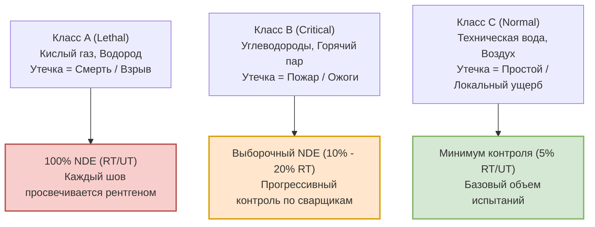
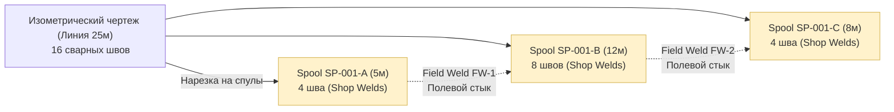
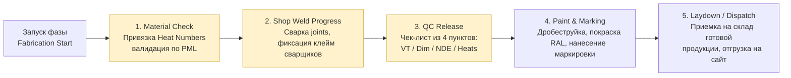
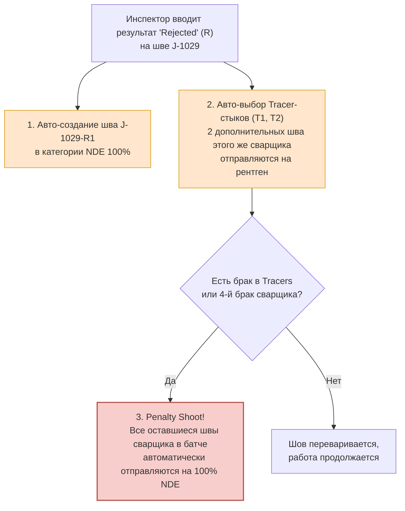
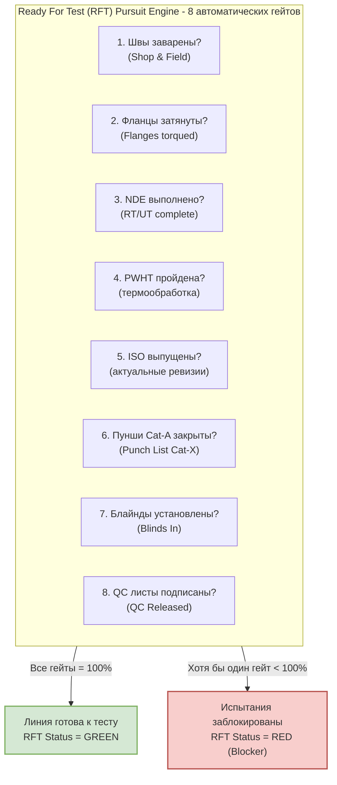
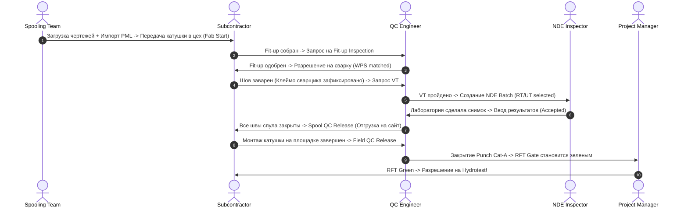

# PipeQC — Технический и функциональный обзор платформы (Product Overview Deck)

> **Назначение презентации:** Показать партнеру глубокое понимание предметной области промышленного трубопроводного строительства и того, как бизнес-процессы напрямую маппятся на интерфейсы, модули и ролевую модель приложения PipeQC.
>
> **Фокус:** В отличие от «продающей» презентации, этот дек является структурным и техническим разбором продукта. Он показывает, как физические шаги стройки оцифрованы на уровне конкретных экранов, полей, авто-валидаций и ролевых сценариев.
>
> **Использование:** Каждый блок «## Слайд N» представляет собой отдельный слайд для Google Presentations. Текст внутри структурирован так, чтобы его можно было напрямую скопировать на слайд. Все схемы Mermaid можно скопировать и отрендерить через [mermaid.live](https://mermaid.live) для вставки в виде изображений.

---

## Слайд 1 — Титульный

# Платформа управления качеством PipeQC

### Технический и функциональный обзор архитектуры

_От изометрического чертежа до гидроиспытаний: оцифрованный жизненный цикл каждого сварного шва и катушки_

**PipeQC 2026** · QA/QC цифровая среда для технологических трубопроводов крупных EPC-проектов (НПЗ, ГПЗ, LNG)

> **Примечание для презентации:** Наша цель сегодня — не «продать» продукт с точки зрения коммерции, а объяснить его прикладную суть, логику интерфейсов, связь с физическим миром стройки и ролевую динамику в приложении.

---

## Слайд 2 — Контекст домена: Что именно мы контролируем?

### Технологические трубопроводы (Inside Battery Limits) — масштаб и сложность

Мы работаем в сегменте крупных промышленных объектов (НПЗ, ГПЗ, LNG, химия, энергетика). Это не магистральные линейные трубы, а плотное переплетение систем внутри установки.

- **Масштаб одного проекта:** 100–500 км технологических труб, от 15 000 до 80 000+ сварных соединений, 10–30 субподрядчиков.
- **Цена ошибки:** Утечка взрывоопасных сред (водород высокого давления, кислый газ $H_2S$, хлор) ведет к катастрофическим последствиям.
- **Главный вызов QA/QC:** Каждый из десятков тысяч швов обязан иметь прозрачный бумажный и цифровой след (паспорт шва) — кто варил, какими электродами, по какому рецепту (WPS), результаты визуального (VT) и неразрушающего (NDE) контроля.
- **Традиционный подход:** Excel-ад из сотен разрозненных файлов, где на 3-й месяц никто не знает реальный статус готовности.
- **Решение PipeQC:** Единый цифровой паспорт на каждый шов (Joint Card) и каждую катушку (Spool Card) с жестким сквозным контролем качества.

---

## Слайд 3 — Мастер-данные: Классы трубопроводов и NDE Matrix

### Как требования ASME B31.3 ложатся в основу правил PipeQC

Физическая опасность среды определяет требования к трубам и строгость неразрушающего контроля (NDE):



- **Piping Material Specification (PMS):** Справочник классов трубопроводов (`A1A`, `CS-150`, `1B12`), определяющий марки сталей, толщины стенок и типы фланцев.
- **NDE Matrix:** Системная матрица правил в PipeQC. Она автоматически рассчитывает объем контроля: при импорте чертежа швы получают требования к контролю на основе своего класса без ручного вмешательства.

---

## Слайд 4 — Модуль SETUP (Администрирование)

### `/admin/*` — «Фундамент правил казино» до начала игры

Прежде чем первый чертеж попадет в систему, роль **System Admin** формирует справочники. Это жесткие рамки, которые приложение использует для авто-валидации на всех последующих этапах.

```
┌────────────────────────────────────────────────────────────────────────┐
│ ADMIN MODULE SITEMAP & CORE REFERENTIALS                               │
├──────────────────────────┬─────────────────────────────────────────────┤
│ 1. Project Definition    │ Настройки проекта, лимиты транзита, лого    │
├──────────────────────────┼─────────────────────────────────────────────┤
│ 2. System Referential    │ Глобальные: марки сталей, UT-коэффициенты   │
├──────────────────────────┼─────────────────────────────────────────────┤
│ 3. Project Referential   │ Локальные: Subcontractors, WPS, Welders,   │
│                          │ PDS Areas, Systems/Subsystems, NDE Matrix   │
├──────────────────────────┼─────────────────────────────────────────────┤
│ 4. Access Rights         │ Ролевая матрица, Subcontractor Scope Lock  │
├──────────────────────────┼─────────────────────────────────────────────┤
│ 5. Import Settings       │ Шаблоны bulk-загрузки (PML, Welder Quals)   │
└──────────────────────────┴─────────────────────────────────────────────┘
```

- **WPS (Welding Procedure Specification):** Цифровой технологический рецепт сварки. Каждый шов в системе обязан ссылаться на действующий WPS.
- **Welder Qualifications:** Профиль сварщика. Содержит допуски по материалам, толщинам и позициям. Если сварщик с клеймом `W-15` просрочил аттестацию или пытается сварить нержавейку вместо углеродистой стали — система выдаст предупреждение.

---

## Слайд 5 — Модуль PREPARATION (Подготовка и Spooling)

### `/spooling/*` — Нарезка линий на транспортабельные катушки

**ISO-чертеж (Изометрия)** — это одна длинная линия трубы (до 50-100м) от аппарата к аппарату. В собранном виде ее невозможно привезти на площадку. **Spooling Team** режет ее на **спулы (катушки)** длиной до 12м (габариты фуры).



- **Shop Welds (Цеховые швы):** Выполняются в цеху в комфортных условиях (поворотные стенды, защита от ветра). Себестоимость = **×1**.
- **Field Welds (Полевые стыки):** Варятся на высоте, эстакадах, в стесненных условиях. Себестоимость = **×3 – ×5**.
- **Интеграция с Marian (SmartPlant Material):** PipeQC сопоставляет катушки со статусом готовности материалов на складе. Катушка не уйдет в производство, пока все ее детали не будут на 100% доступны.

---

## Слайд 6 — Структура интерфейса и информационная архитектура

### Левая боковая навигация как оцифрованный физический процесс

Интерфейс PipeQC построен строго в хронологическом порядке жизненного цикла проекта — сверху вниз:

```
┌─────────────────────────────────────┐
│  SETUP                              │
│   └─ Admin Module                   │  ← Управление правилами и справочниками
│                                     │
│  PREPARATION                        │
│   └─ Spooling                       │  ← Загрузка чертежей, нарезка, импорт материалов
│                                     │
│  CONSTRUCTION                       │
│   ├─ Fabrication                    │  ← Цеховое производство: контроль материалов,
│   │                                 │    сварка shop-joints, покраска, выпуск с цеха
│   ├─ Erection                       │  ← Монтаж на площадке: доставка, сборка на опоры,
│   │                                 │    сварка field-joints, затяжка фланцев
│   ├─ Tracking                       │  ← Логистический складской учет катушек (склады/зоны)
│   └─ NDE Module                     │  ← Неразрушающий контроль: RT/UT/PT/MT батчи и дефекты
│                                     │
│  TESTING                            │
│   ├─ Testpack                       │  ← Подготовка к гидравлике, обход punch-листов, RFT
│   └─ Flange Management              │  ← Учет блайндов (заглушек) и моментов затяжки
│                                     │
│  REPORTS                            │  ← Выгрузка рапортов и сварочных журналов для клиента
│                                     │
│  CONFIGURATION                      │  ← Личные настройки и документация
└─────────────────────────────────────┘
```

> **Дизайн-принцип:** Меню — это не просто список страниц, это карта движения материалов и работ. Пользователь движется по меню сверху вниз по мере готовности проекта.

---

## Слайд 7 — Главный экран: Строительный кокпит (Homepage)

### Управление проектом в реальном времени на основе физических данных

Домашний экран приложения дает моментальную картину готовности пакета работ без необходимости собирать отчеты вручную.

- **Сводные KPI проекта:** Общий прогресс сварки в дюйм-диаметрах (Dia Inch), прогресс монтажа катушек, % закрытия гидравлических тест-пакетов.
- **Лента критических нотификаций:** Ранжирована по серьезности (Красный → Желтый → Синий):
  - _Пример (Красный):_ `«TP-205: 1 Cat-X Punch Item open by Inspector QC-02. Pressure Test blocked!»`
  - _Пример (Желтый):_ `«Welder WLD-005: rejection rate reached 12.5% in NDE Category 2. Watchlist active.»`
- **Динамические графики прогресса:**
  - S-кривые готовности (План vs Факт). Toggles: по количеству стыков, дюйм-диаметрам или весу катушек.
  - Фильтрация данных по установкам (Unit), технологическим зонам (PDS Area) и маркам сталей.
- **Складской баланс Tracking:** Текущая вместимость laydown-площадок, количество отсканированных катушек за последние 7 дней.

---

## Слайд 8 — Фаза CONSTRUCTION: Модуль Fabrication (Цех)

### `/fabrication/*` — Конвейер цехового производства катушек

На этом этапе из отдельных труб и фитингов собирается готовая катушка. Модуль состоит из шагов оцифрованного контроля качества:



- **Material Check (Контроль плавок):** Сварщик вписывает номера плавок (Heat Numbers) с физического металла. PipeQC проверяет их наличие в справочниках и блокирует дальнейшие операции при несовпадении.
- **QC Release (Финальная приемка катушки в цеху):** Жесткий чек-лист. Спул не может быть выпущен из цеха, пока все его внутренние швы не будут закрыты в статусе Accepted, а геометрия не будет подтверждена инспектором.

---

## Слайд 9 — Фаза CONSTRUCTION: Модуль Erection (Сайт)

### `/erection/*` — Финальная сборка промышленного пазла на площадке

После доставки катушки из цеха на строительную площадку начинается ее монтаж на эстакады и эрекция в проектное положение.

```
┌───────────────────────────────┬───────────────────────────────────────────┐
│ ЭКРАН И МАРШРУТ               │ ФИЗИЧЕСКОЕ ДЕЙСТВИЕ НА ПЛОЩАДКЕ           │
├───────────────────────────────┼───────────────────────────────────────────┤
│ 1. To Site                    │ Катушка сканируется при выезде из цеха и  │
│    `/erection/to-site`        │ въезде на площадку. Контроль транзита.    │
├───────────────────────────────┼───────────────────────────────────────────┤
│ 2. Field Material Check       │ Входной контроль на сайте: проверка на    │
│    `/erection/material-check` │ отсутствие повреждений при перевозке.     │
├───────────────────────────────┼───────────────────────────────────────────┤
│ 3. Erected                    │ Катушка поднята краном и временно         │
│    `/erection/erected`        │ установлена на проектные опоры.           │
├───────────────────────────────┼───────────────────────────────────────────┤
│ 4. Welded / Bolted            │ Физическая стыковка: сварка полевых швов  │
│    `/erection/welded-bolted`  │ (FW) и затяжка фланцев (Flanges).         │
├───────────────────────────────┼───────────────────────────────────────────┤
│ 5. Supported                  │ Монтаж постоянных подвесок, опор и        │
│    `/erection/supported`      │ пружинных блоков. Выравнивание линии.     │
├───────────────────────────────┼───────────────────────────────────────────┤
│ 6. Field QC Release           │ Финальная инспекция монтажа инспектором.  │
│    `/erection/field-qc-release`│ Подписание актов качества.                │
├───────────────────────────────┼───────────────────────────────────────────┤
│ 7. RFT (Ready For Test)       │ Автоматическая проверка готовности линии  │
│    `/erection/rft`            │ к гидравлическим испытаниям.              │
└───────────────────────────────┴───────────────────────────────────────────┘
```

> **Ключевое отличие от цеха:** Работы выполняются на открытом воздухе. Логистические плечи и высотные работы жестко оцифрованы для минимизации простоев техники.

---

## Слайд 10 — Модуль NDE: Управление неразрушающим контролем

### `/nde/*` — Интеллектуальный контроль качества сварных соединений

Неразрушающий контроль (NDE: Radiography, Ultrasound, Dye Penetrant, Magnetic) — самый дорогой и сложный этап. PipeQC автоматизирует его управление через концепцию **Батчей (Batches)**.

- **Авто-группировка по Батчам:**
  $$\text{Batch} = (\text{Welder ID} \times \text{NDE Category})$$
  Система сама объединяет швы, сваренные одним сварщиком в рамках определенной категории контроля.
- **Алгоритм прогрессивной выборки (Progressive Sampling):**
  Вместо того чтобы инспектор сам выбирал, какие швы светить рентгеном (что часто ведет к коррупции или халатности), PipeQC на основе NDE Matrix выдает случайную рекомендацию швов для контроля, учитывая процент выборки (например, 10% или 20%) и приоритеты тест-пакетов.
- **NDE Dashboard:** Контроль backlog'а лабораторий. Показывает, сколько стыков отправлено на RT, сколько ожидает снимков, а какие зависли из-за погодных условий.

---

## Слайд 11 — Глубинная доменная логика: Цепочка Rework и Penalty Shoot

### Как PipeQC автоматизирует борьбу с браком сварщиков

Если рентген показывает брак (Rejection), в системе мгновенно и без участия человека запускается регламент наказания бракоделов:



- **Экономика брака:** Один плохой шов в реальности стоит EPC-подрядчику не один пересвеченный снимок, а минимум **четыре** (ремонтный стык + 2 трассирующих + повторный контроль). PipeQC делает эту скрытую стоимость видимой для менеджмента в тот же день.

---

## Слайд 12 — Модуль TESTING: Flange Management (Управление фланцами)

### `/flange` — Гарантия герметичности и безопасности перед пуском

Затяжка фланцев — критическая точка. Недозатянутый фланец сорвет давлением при испытаниях, а перезатянутый деформирует прокладку.

- **Реестр фланцевых соединений:** Каждый фланец оцифрован как самостоятельный объект. Каждому фланцу система сопоставляет требуемый крутящий момент (Torque Value в Н·м) на основе его диаметра, давления и типа прокладки из системного справочника.
- **Трассируемость монтажника:** Запись клейма слесаря (Jointer Stamp), даты сборки и фактического момента затяжки динамометрическим ключом.
- **Критическая функция безопасности: Баланс заглушек (Blinding Balance):**
  Перед гидравлическим испытанием оборудование изолируется временными стальными заглушками (Blinds). PipeQC жестко контролирует баланс:

$$\sum \text{Blinds Installed} == \sum \text{Blinds Removed}$$

Система физически не позволит закрыть тест-пакет, если хотя бы одна временная заглушка осталась в трубе. Забытая заглушка на пуске завода = взрыв или разрушение оборудования.

---

## Слайд 13 — Модуль TESTING: Testpack и 8-Gate RFT pursuit

### `/testpack/*` — Финальный шлюз сдачи систем заказчику

После монтажа связанные линии объединяются в **Тест-пакеты (Testpacks)** для проведения гидравлических испытаний под высоким давлением (обычно $1.5 \times$ от рабочего).



- **Защита от «wishful thinking»:** Менеджер проекта или субподрядчик не могут назначить дату гидравлики «на глаз», пока RFT-движок PipeQC не покажет зеленый свет по всем 8 позициям. Это защищает проект от срыва сроков и выездов инспекции вхолостую.

---

## Слайд 14 — Закрытие контура: Модуль REPORTS (Отчетность)

### `/reports` — Автоматический сбор доказательной базы для сдачи объекта

Сдача трубопроводов заказчику требует формирования огромных папок документов — **QC Dossier (Handover Dossier)**. Без специализированного софта на это уходят недели ручной работы архивариусов.

- **Weld History Sheet (Сварочный журнал):** Главный отчет проекта. PipeQC генерирует его автоматически по каждому тест-пакету. Журнал содержит полную историю каждого стыка, клейма сварщиков, номера плавок металла, даты сварки, номера отчетов RT/UT и подписи инспекторов.
- **Срез по дефектам сварки (Welder Performance Log):** Аналитический инструмент для выявления системного брака. Позволяет увидеть процент брака по каждому сварщику и по каждому типу материалов за выбранный период.
- **Каталог отчетности в один клик:**
  - Сводки по backlog'у NDE (Outstanding NDE)
  - Отчет по незакрытым недоделкам (Outstanding Punch Items)
  - Баланс затяжки фланцев и снятия заглушек.

---

## Слайд 15 — Ролевая матрица в интерфейсе PipeQC

### Разделение прав доступа и специализированные рабочие сценарии

В PipeQC работают 6 ключевых ролей. Система жестко разграничивает их права и адаптирует интерфейс под их задачи.

| Роль в системе      | Основная функция           | Специфика интерфейса и сценариев                                                                                                                     |
| :------------------ | :------------------------- | :--------------------------------------------------------------------------------------------------------------------------------------------------- |
| **System Admin**    | Настройка и referentials   | Полный доступ к `/admin/*` для конфигурации правил проекта. Не участвует в ежедневном вводе данных.                                                  |
| **Spooling Team**   | Подготовка и импорт данных | Работает в `/spooling/*` с чертежами, деталями катушек и импортом спецификаций.                                                                      |
| **QC Engineer**     | Контроль и приемка работ   | Самая активная **edit-heavy** роль. Видит кнопки подписей в `/fabrication/*`, `/erection/*`, `/testpack/*`.                                          |
| **NDE Inspector**   | Неразрушающий контроль     | Управляет батчами и вносит результаты контроля в `/nde`. Defect entry формы.                                                                         |
| **Subcontractor**   | Ввод объемов (Scope Lock)  | **Restricted Editor**. Видит те же экраны, что и QC, но dropdown субподрядчиков заблокирован на его компании. Доступ только к своей зоне (PDS Area). |
| **Project Manager** | Анализ и координация       | **Watcher Mode**. Кнопки действий скрыты. Активны дашборды, отчеты `/reports` и drill-down по блокировкам RFT.                                       |

---

## Слайд 16 — Операционная динамика: Путь катушки и стыка в системе

### Сквозная передача ответственности между ролями

Сварной шов и катушка непрерывно меняют статус и своего владельца по мере движения по физическому и цифровому конвейеру PipeQC:



---

## Слайд 17 — Живой сценарий: Борьба за тест-пакет TP-205

### Пример совместной работы ролей для устранения реального блокера

- **Контекст:** Среда утро. На четверг запланировано важное гидравлическое испытание тест-пакета `TP-205` на площадке.
- **Действие 1 (Project Manager):** Анна (PM) открывает домашний экран PipeQC и видит красную нотификацию: `«TP-205 RFT Blocked: 1 outstanding Cat-X punch item»`.
- **Действие 2 (PM Drill-down):** Анна кликает по нотификации, попадает в `/testpack/explorer` на вкладку _Release Tracking_ и видит, что гейт №6 (Cat-X Punch Items) горит красным, а именно: `«Punch ID PI-009: Не установлена постоянная опора под задвижкой V-105»`.
- **Действие 3 (Координация):** Анна звонит руководителю монтажной бригады субподрядчика. Тот оперативно монтирует опору на площадке.
- **Действие 4 (Subcontractor & QC):** Слесарь субподрядчика отмечает в приложении, что работа выполнена. Инспектор QC Engineer заходит в `/testpack/pressure-test/item-clearance/progress`, проверяет опору вживую и подписывает пункт чек-листа в приложении.
- **Результат:** Статус гейта №6 автоматически переключается в 100%, RFT-статус тест-пакета `TP-205` загорается зеленым. Анна видит это на дашборде и дает официальное добро на проведение теста в четверг.

---

## Слайд 18 — Текущий статус разработки PipeQC

### Честная картина функционального покрытия приложения (Demo State 2026)

Мы построили полноценный сквозной каркас приложения — от настройки правил в Admin-панели до финальных RFT-ворот в Тест-пакетах.

```
┌──────────────────────────────────────┬─────────┬───────────────────────────────────────────┐
│ ФУНКЦИОНАЛЬНЫЙ МОДУЛЬ                │ СТАТУС  │ ЧТО РЕАЛИЗОВАНО СЕГОДНЯ                   │
├──────────────────────────────────────┼─────────┼───────────────────────────────────────────┤
│ Setup / Admin (`/admin/*`)           │    🟡   | Базовая IA, CRUD субподрядчиков и команд. │
│                                      │         │ Ограниченный набор справочников.          │
├──────────────────────────────────────┼─────────┼───────────────────────────────────────────┤
│ Spooling (`/spooling/*`)             │    🟡   | Страница импорта чертежей, интерфейс      │
│                                      │         │ валидации и версионности.                 │
├──────────────────────────────────────┼─────────┼───────────────────────────────────────────┤
│ Fabrication (`/fabrication/*`)       │    🟢   | Полный цикл: 5 цеховых подстадий, ввод    │
│                                      │         │ швов, QC-чеклист, дашборд цеха.           │
├──────────────────────────────────────┼─────────┼───────────────────────────────────────────┤
│ Erection (`/erection/*`)             │    🟢   | Полный цикл монтажа: 7 подстадий, полевые │
│                                      │         │ швы, фланцы, RFT-стадия, дашборд.         │
├──────────────────────────────────────┼─────────┼───────────────────────────────────────────┤
│ NDE Management (`/nde/*`)            │    🟡   | Управление батчами, ввод результатов.     │
│                                      │         │ Penalty shoot и R1-автокаскад в разработке│
├──────────────────────────────────────┼─────────┼───────────────────────────────────────────┤
│ Flange Management (`/flange`)        │    🟢   | Учет фланцев, моментов затяжки и блайндов.│
├──────────────────────────────────────┼─────────┼───────────────────────────────────────────┤
│ Testpack (`/testpack/*`)             │    🟢   | Builder катушек, Explorer, RFT-движок     │
│                                      │         │ и страница проведения Pressure Test.      │
└──────────────────────────────────────┴─────────┴───────────────────────────────────────────┘
```

> **Резюме для партнера:** PipeQC готов к демонстрации полноценного сквозного бизнес-процесса. Пользователь может пройти путь катушки от чертежа до сдачи за одну демонстрационную сессию. Глубокая логика (penalty shoot, subcontractor scope lock) — следующая волна развития продукта.
