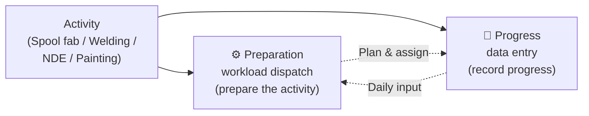
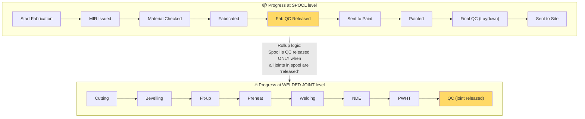
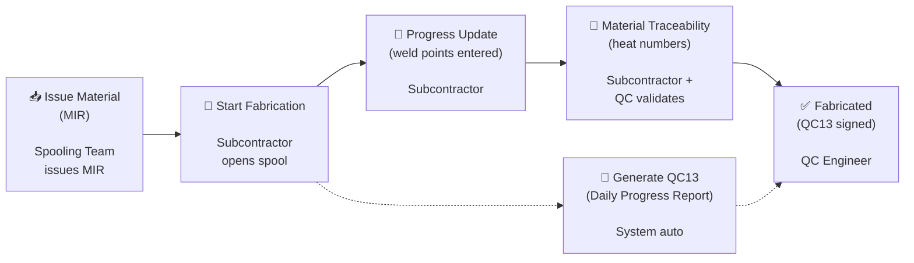
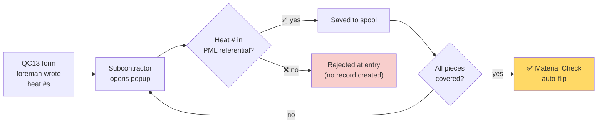
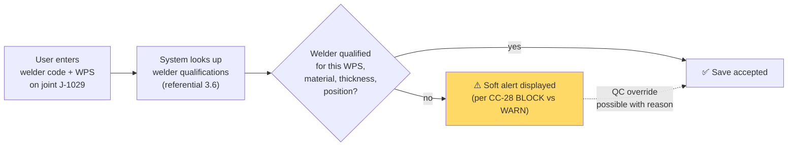
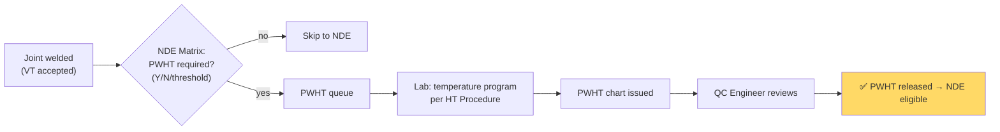
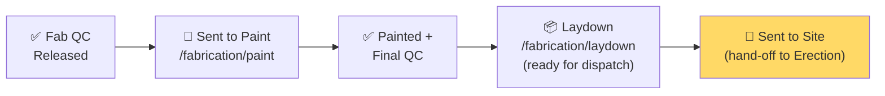
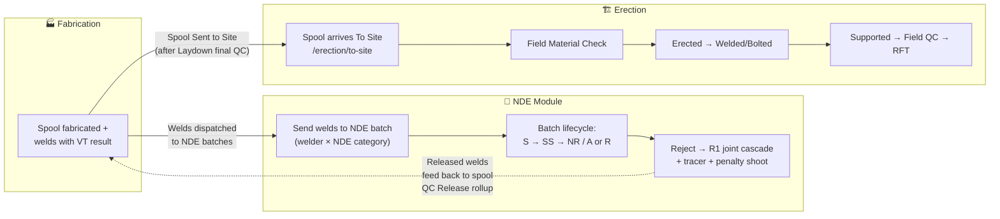

# PipeQC — Part 4: Fabrication

> **Structure template** — mirrors Technip Easy Piping `4.EasyPiping Fabrication_10032021.pptx` (30 slides, sections: Introduction → Spool Fabrication & Welding → NDE). Этот deck покрывает Spool Fabrication + Welding (NDE — отдельным deck'ом #5).
>
> **Goal** — показать, как наш модуль Fabrication воспроизводит реальный shop-floor lifecycle: от приёма spool'а от Spooling Team через материал-чек / сварку / NDE / PWHT / paint / laydown до отгрузки на площадку.
>
> **Sources**: [Easy Piping Fabrication deck research](../research/presentation_findings.md), [QC Engineer role matrix](../role_matrix/qc_engineer.md), [Subcontractor role matrix](../role_matrix/subcontractor.md), [config/navigation.ts](../../config/navigation.ts), [app/fabrication/](../../app/fabrication/).
>
> **Usage:** один `## Slide N` = один слайд в Google Slides. Mermaid → [mermaid.live](https://mermaid.live) → PNG.

---

## Slide 1 — Title

> **Содержимое слайда:**

# Piping Construction Management

## PipeQC

### Part 4 — Fabrication

_2026 · Shop-floor lifecycle from spool receipt to «sent to site»_

---

## Slide 2 — Table of contents

> **Содержимое слайда:**

# Table of contents

1. **Introduction**
   _Fabrication module organization · Fabrication status · Progress entry_

2. **Spool fabrication and welding**
   _MIR → Material check → Welding → Heat traceability → PWHT → QC release → Paint → Laydown · QC13 form generation · Fabrication reports_

3. **Roles & SOW**
   _Role × function matrix · Day in the life · Hand-off to NDE and Erection_

> NDE deep-dive — отдельный deck (Part 5).

---

## Slide 3 — Section divider · Introduction

> **Содержимое слайда:**

# 1. Introduction

### Fabrication module organization · Fabrication status · Progress entry

_Section 1 / 3_

---

## Slide 4 — Fabrication module organization

> **Содержимое слайда:**

### PipeQC organization is based on site activities

**Main modules covered by Fabrication scope:**

The Fabrication module is divided into sub-sections that correspond to different shop-floor activities:

| Sub-section            | Route                              | What it does                                                                                 |
| ---------------------- | ---------------------------------- | -------------------------------------------------------------------------------------------- |
| **Dashboard**          | `/fabrication/dashboard`           | KPI tiles, 8-tile funnel widget, charts, per-stage drill-through                             |
| **Spool Fabrication**  | `/fabrication/spool-fabrication`   | Parent route — 5 sub-stages below                                                            |
| ↳ Material Check       | `/fabrication/material-check`      | Heat numbers vs Project Piping Material List validation                                      |
| ↳ QC Release           | `/fabrication/qc-release`          | 4-item shop QC checklist sign-off per spool                                                  |
| ↳ PWHT Release         | `/fabrication/pwht-release`        | Post-weld heat treatment release for CrMo / heavy CS                                         |
| ↳ Paint                | `/fabrication/paint`               | Coating per Paint Code Matrix (blast / primer / intermediate / final)                        |
| ↳ Laydown              | `/fabrication/laydown`             | Storage tracking — spool ready for dispatch                                                  |
| **Shop Weld Progress** | `/fabrication/weld-progress`       | Joint-level entries: welder, WPS, root %, cap %, foreman confirm                             |

**Related modules** (covered in other decks):

- **NDE Module** (`/nde`) — receives welds from `weld-progress`, manages batch lifecycle. _See Deck #5._
- **Erection Module** (`/erection`) — receives spools after `Laydown → Sent to Site`. _See Deck #6._

---

## Slide 5 — Preparation + Progress sub-modules split

> **Содержимое слайда:**

### Each activity is divided into two sub-modules



**Preparation sub-modules** allow the user to **prepare the activity** — select welds for NDE, dispatch workload to teams, generate work orders.

**Progress sub-modules** allow the user to **enter data** regarding the progress of the corresponding activity.

| Activity            | Preparation                                                                    | Progress              |
| ------------------- | ------------------------------------------------------------------------------ | --------------------- |
| Spool fabrication   | ❌ not built (Easy Piping never finished — **PipeQC greenfield, Track F**)    | 🟢 our 5 sub-stages   |
| Welding             | ❌ not built (Easy Piping never finished — **PipeQC greenfield, Track F**)    | 🟢 `/weld-progress`   |
| NDE                 | 🟡 partial (Easy Piping's only complete preparation) — **Track N**            | 🟡 batch list + entry |
| Painting            | ❌ not built (Easy Piping never finished — **defer**)                          | 🟢 `/fabrication/paint` |

> **Strategic note:** Easy Piping only delivered NDE-Preparation. The other Preparation tabs were «structural promise», never functional. For PipeQC this is **whitespace opportunity** — we can design real workload-dispatch UX (weekly program of spools-to-fabricate, weld-to-do-this-shift, etc.) as a differentiator.

---

## Slide 6 — Fabrication status · two levels

> **Содержимое слайда — флагманская диаграмма:**

### The fabrication module tracks progress at **two levels**



**Key rollup rule** (Easy Piping verbatim, PipeQC plans to enforce):
> **A spool is «QC released» when all joints belonging to the spool have status «released».**

This is **auto-rollup**, not manual checkbox. Currently in PipeQC: rollup logic stub exists in `lib/weld-data.ts` / `useWeldsStore`; **wiring as enforcement gate = Track G** sub-task.

**Steps are customizable per project** in admin set-up. Default flow above is the «typical EPC» preset; the listed transitions (Material Check, MIR Issued, etc.) can be added/removed per project agreement before kick-off.

---

## Slide 7 — Progress entry · universal UX template

> **Содержимое слайда:**

### All progress screens share the same functioning

This applies to **Spool Fabrication / Welding / NDE / Painting Progress** — one shell, parameterized.

```
┌──────────────────────────────────────────────────────────┐
│ 🔍 Intelligent search field (mandatory) *                 │
│    by isometric / by barcode                              │
├──────────────────────────────────────────────────────────┤
│ 📋 Item summary panel (selected ISO or spool)             │
│    - Pipe class, material, paint system                   │
│    - Total welds count, completed %                       │
│    - PDS area, system, sub-system                         │
├──────────────────────────────────────────────────────────┤
│ 📊 Grid of spools (or joints)                             │
│    [−] Collapse row | [−] Hide group                      │
│    Editable cells per stage                               │
│    Quick "default date" + "date input assistance"         │
├──────────────────────────────────────────────────────────┤
│ 📄 Report section                                          │
│    Generate QC13 · MIR · Welder log · Paint record         │
│    Popup with custom options per report                    │
├──────────────────────────────────────────────────────────┤
│ ⬆ Excel template — bulk progress import                    │
└──────────────────────────────────────────────────────────┘
```

**Why a shared template:** if every progress screen invents its own UX, foremen retrain on each tab. Easy Piping confirmed this pattern (CC-9 in research). For PipeQC this means **Track F — Progress Entry shared shell** (refactor candidate after demo).

> **Roles using this template:**
> **Subcontractor** (primary editor) — fills daily entries · **QC Engineer** (validates + signs off) · **PM** (read + drill-down).

---

## Slide 8 — Section divider · Spool fabrication and welding

> **Содержимое слайда:**

# 2. Spool fabrication and welding

### MIR · Material check · Welding · Heat trace · PWHT · QC release · Paint · Laydown · QC13 · Reports

_Section 2 / 3_

---

## Slide 9 — Spool fabrication · process overview

> **Содержимое слайда — workflow:**

### From spool receipt to «Sent to site» — 6 operational moments



**Сцена:** fabrication shop — крытый ангар, обычно рядом с площадкой или в другом городе. Сюда приходит **Spooling Transmittal** из `/spooling/spooling-transmittal` — batch'и spool'ов готовы к производству.

**Что должно произойти, чтобы spool ушёл на площадку:**

1. **MIR Issued** — Material Issue Request передан subcontractor'у
2. **Start Fabrication** — дата начала зафиксирована, QC13 form сгенерирована
3. **Progress Update** — каждый weld point заведён в `/fabrication/weld-progress`
4. **Material Traceability** — heat numbers сверены с Project Piping Material List
5. **Fabricated** — QC13 подписана всеми, статус spool = «Fabricated»
6. **Fab QC Released** — auto-rollup когда все joints спула = «released»

Дальше → Paint → Laydown → Sent to Site (см. slide 15).

---

## Slide 10 — Issue material (MIR)

> **Содержимое слайда:**

### Spool fabrication · Issue material

**Step name in PipeQC:** «MIR issued» (Material Issue Request).

**What happens IRL:**

- Spooling Team прислала spool в fabrication queue
- Storekeeper отгружает физические трубы / фланцы / болты subcontractor'у
- Foreman принимает материал, расписывается в MIR
- Если материала не хватает — spool остаётся в статусе `Start Fabrication` без перехода в `MIR Issued`

**Purpose of this step:** **monitor any delay in material collection.** Если spool неделю в `Start Fab` без `MIR Issued` — это flag для PM.

**Routes & UI in PipeQC:**

- Update happens на **`/fabrication/material-check`** или из spool detail panel.
- Auto-flag в Fabrication Dashboard: «N spools awaiting MIR — оldest = M days».

**Roles involved:**

| Role           | Action                                                                |
| -------------- | --------------------------------------------------------------------- |
| **Spooling Team** | Releases spool transmittal → MIR generated downstream            |
| **Subcontractor** | Confirms physical receipt of materials, marks MIR Issued         |
| **QC Engineer**   | Spot-checks MIR vs spool BOM (optional gate)                     |
| **PM**            | Watches dashboard for «MIR delay > X days» KPI                   |

> **PipeQC status:** 🟡 partial. Spool moves through status, but MIR PDF generation = part of QC13 module (Track G5).

---

## Slide 11 — Material check · heat traceability popup

> **Содержимое слайда:**

### Spool fabrication · Material traceability (heat number flow)

**The canonical heat-number flow:**

1. Foreman пишет heat numbers на печатной форме QC13 в цеху (rows per spool component)
2. Subcontractor user открывает **«Material traceability»** popup в weld progress screen
3. User вводит каждый heat number per piece (pipe / elbow / flange / valve)
4. **PipeQC validates** heat numbers against **Project Piping Material List** (referential `3.12`)
5. ⚠️ **Invalid heat numbers are REJECTED at entry** — system does NOT accept the record
6. When all heat numbers entered + valid → **«Material check» status of spool auto-flips ✅**



**Roles involved:**

| Role           | Action                                                                       |
| -------------- | ---------------------------------------------------------------------------- |
| **System Admin**  | Maintains Project Piping Material List (referential 3.12)                |
| **Subcontractor** | Enters heat numbers in traceability popup                                |
| **QC Engineer**   | Validates physical material vs entered heat #s, sign-off as «owner»     |
| **PM**            | Sees «material check overdue» on dashboard                               |

> **PipeQC status:** ⚠️ partial. Material Check route + UI exists; heat-number validation against PML = **Track G2** (currently PML is seed-only, no admin CRUD).

---

## Slide 12 — Welding progress · WPS validation alert

> **Содержимое слайда — критическая бизнес-логика:**

### Spool fabrication · Welding progress entry

**Where:** `/fabrication/weld-progress` — joint-level grid с filters (PDS area, subcontractor, material type, service class, status, date range).

**Per-joint entry fields:**

- Joint ID (auto from spool drawing)
- Welder code (lookup → welder qualifications referential)
- WPS code (lookup → WPS referential)
- Root % completion
- Cap % completion
- Foreman confirmation
- Heat number reference (links to Material Traceability popup)
- Date welded

**Critical business logic — WPS qualification check:**



**Multiple welders per joint** (root + cap pattern):

> Verbatim from Easy Piping: _«In case of two weld points for one joint, the user can enter different information for the two points (multi welder etc.)»_

```
Joint J-1029
 ├─ Weld point 1 (welder A, WPS-X, heat-123, root pass)
 └─ Weld point 2 (welder B, WPS-Y, heat-456, cap pass)
```

**Roles involved:**

| Role           | Action                                                                         |
| -------------- | ------------------------------------------------------------------------------ |
| **System Admin** | Maintains WPS + welder qualifications referentials (3.5, 3.6)                |
| **Subcontractor** | Enters daily weld progress (welder + WPS per joint per weld point)          |
| **QC Engineer**  | Visual inspection root + cap pass; signs W24; overrides soft alerts          |
| **NDE Inspector** | Receives qualified welds in batches (next deck)                              |
| **PM**            | Sees «WPS validation failed» count on dashboard, welder performance trends   |

> **PipeQC status:** WPS validation = ⚠️ partial. Logic exists in `lib/welder-qual.ts`, but **not wired to UI yet**. Multi-weld-point = ❌ missing (single welder field). Both = **Track N — NDE / Welding Quality Upgrade**.

---

## Slide 13 — PWHT release per joint

> **Содержимое слайда:**

### Spool fabrication · Post-Weld Heat Treatment (PWHT)

**Where:** `/fabrication/pwht-release`.

**When PWHT is required:**

- CrMo (P11, P22) alloy joints — always
- Heavy thickness CS joints (typically >19.05 mm) — driven by NDE Matrix `PWHT requirement` field
- **NDE Matrix tri-state rule** (Easy Piping definitive): `Y` (always) / `N` (never) / threshold number (auto-Y if joint thickness > threshold)

**Process:**

1. After welding completion, joint goes to PWHT queue
2. Heat treatment lab moves joint into furnace, runs program (temp / time per Heat Treatment Procedure referential)
3. Lab issues PWHT chart (temperature graph) + signature
4. QC Engineer reviews chart vs procedure
5. **PWHT released** → joint becomes eligible for NDE



**Roles involved:**

| Role           | Action                                          |
| -------------- | ----------------------------------------------- |
| **System Admin** | Maintains Heat Treatment Procedures referential |
| **Subcontractor** (HT lab) | Executes PWHT, issues chart           |
| **QC Engineer**   | Reviews chart, releases PWHT (release point #2 in QC role lifecycle) |
| **NDE Inspector** | Cross-references PWHT release before exam (CC-18 RFT gate feeder) |

> **PipeQC status:** ⚠️ partial. Route exists; full integration (PWHT-blocks-NDE gate) = **Track N**.

---

## Slide 14 — Spool QC Release (4-item checklist)

> **Содержимое слайда:**

### Spool fabrication · Fab QC Released — release point #3

**Where:** `/fabrication/qc-release`.

**Easy Piping verbatim:** «The progress form QC13 can be reprinted anytime with actual value in the system. After signature that all works are completed it will be used to enter the **«fabricated» status** of the spool.»

**PipeQC QC release checklist (4 items per spool):**

| #   | Check                                                                             | Source data                                       |
| --- | --------------------------------------------------------------------------------- | ------------------------------------------------- |
| 1   | **Visual inspection** (VT) — all welds in spool accepted                          | Rollup from `weld-progress` VT field             |
| 2   | **Dimensional check** — spool matches drawing within tolerance                    | Manual checkbox (QC sign-off)                     |
| 3   | **NDE complete** — all required NDE methods executed + accepted                   | Rollup from `/nde` batch results                  |
| 4   | **Heat number traceability complete** — all pieces have valid heat #s in PML      | Rollup from Material Traceability popup          |

When all 4 ✅ → spool status flips to **«Fab QC Released»**. Spool is now ready for paint (or direct laydown if no paint required).

**Reject-to-rework path** (currently ⚠️ missing in PipeQC, **Track G**):

- If any item fails → spool goes to «Rework» status with rework code (per Rework Code referential 3.10)
- Affected welds become eligible for repair (R1/R2/R3 joints in NDE100 category — see deck #5)

**Roles involved:**

| Role           | Action                                                                                  |
| -------------- | --------------------------------------------------------------------------------------- |
| **QC Engineer**   | **Owner of release** — physically checks spool, signs each of 4 items              |
| **Subcontractor** | Submits spool for QC after self-check                                              |
| **NDE Inspector** | Provides NDE result rollup data                                                    |
| **PM**            | Sees «spool QC bottleneck» KPI on Fabrication Dashboard                            |

> **PipeQC status:** ⚠️ partial. Route + UI exist, but real heat-trace hard block + reject-to-rework path = Track G.

---

## Slide 15 — Paint, Laydown, Sent to Site

> **Содержимое слайда:**

### Spool fabrication · final stages (Paint → Laydown → Sent to Site)



**Paint** (`/fabrication/paint`):
- Coating per **Paint Code Matrix** (admin referential): blast → primer → intermediate coat → final coat
- Each coat: Y/N + applied date + RAL code per spec
- Subcontractor enters progress per coat; QC inspects DFT (dry film thickness) at final
- Paint not required for SS / FRP spools → skip directly to Laydown

**Laydown** (`/fabrication/laydown`):
- Spool physically moved to laydown yard
- Location tracked (PDS Area + Yard ID)
- **Final QC** sign-off — last 4-item check before dispatch (paint compliant + marking complete + barcode label + dossier complete)
- Spool waits here for site readiness call

**Sent to Site:**
- Loading trip recorded (truck plate + date + driver)
- Spool location flips to «In Transit»
- **Hand-off to Erection module** — spool appears in `/erection/to-site` for arrival confirmation

**Roles involved:**

| Stage         | Owner role                                            |
| ------------- | ----------------------------------------------------- |
| Paint         | Subcontractor (paint sub) + QC Engineer (DFT check)  |
| Laydown       | Subcontractor (storekeeper) + QC Engineer (final QC) |
| Sent to Site  | Subcontractor (transport) + Spool Tracking sub        |

> **PipeQC status:** 🟢 all 3 sub-stages are live with working routes + state persistence.

---

## Slide 16 — QC13 · Daily Progress Report form

> **Содержимое слайда:**

### Generate the reporting form (QC13)

**What QC13 is** — _«the»_ physical form bridging shop reality and the digital system.

**Lifecycle of one QC13:**

1. PipeQC **auto-generates QC13** right after «Start Fab» date is recorded for a spool
2. QC13 gets a **unique auto-assigned number** (e.g. `QC13-2026-04521`)
3. Foreman prints it, takes it to shop floor
4. Workers fill in details per joint:
   - Heat numbers per component
   - Weld points per joint
   - Welder code per weld point
   - Visual inspection result
5. Foreman signs at end of shift
6. Subcontractor user **enters data back into PipeQC** (or scans QC13 if OCR-enabled in future)
7. After full data entry + signature → user moves spool status to **«Fabricated»**
8. QC13 can be **reprinted anytime** with current system values (reflects latest state)

```
┌─────────────────────────────────────────────────────────────┐
│ QC13 · Daily Progress Report                                 │
│ No.: QC13-2026-04521              Date: 2026-04-15           │
│ Project: LNG-Block-A   Spool: SP-PG-001-A   Pipe Class: A1A  │
├─────────────────────────────────────────────────────────────┤
│ Joint  | Component  | Heat #     | Welder | WPS  | VT  | Sig │
├──────────────────────────────────────────────────────────────┤
│ J-1029 | Pipe 6"    | HT-30412   | W-15   | WPS-1| OK  | ___ │
│ J-1029 | Elbow 90°  | HT-30418   | W-15   | WPS-1| OK  | ___ │
│ J-1030 | Flange WN  | HT-30420   | W-22   | WPS-1| OK  | ___ │
│ ...                                                          │
├──────────────────────────────────────────────────────────────┤
│ Foreman signature: _______________   Date: ______            │
│ QC Engineer:       _______________   Date: ______            │
└─────────────────────────────────────────────────────────────┘
```

> **PipeQC status:** ❌ QC13 PDF generation **not built yet** — **Track G5 — QC13 generator** (high demo impact, low engineering cost: jsPDF / Puppeteer).
>
> **Why it's a strong demo artifact:** clickable button → produces stamped PDF with project header, spool ID, date, signature block. High perceived fidelity for partner / investor demo.

---

## Slide 17 — Fabrication reports (5 production reports)

> **Содержимое слайда:**

### Reports for Production Management

| #   | Report                  | Pivot           | What it shows                                                                                          | PipeQC status |
| --- | ----------------------- | --------------- | ------------------------------------------------------------------------------------------------------ | :-----------: |
| 1   | **Weekly progress – Fab** | Cumulative      | Quantities completed between selected dates and cumulative; breakdown by **Type of spool (LB/SB)** × Material | 🟡            |
| 2   | **Fabrication report**    | Per design area | For each design area + overall: spooling (spool count, dia inch), material availability (spool, dia inch), fabrication steps in dia inch (cut, bevel, fit-up, welding), fabrication completed (spool count), QC released, sent to paint, final QC, in laydown | 🟡            |
| 3   | **Summary report**        | Per spool       | For each spool — achievement dates of each fabrication step                                            | 🟡            |
| 4   | **Spool report**          | Per spool       | Trace graph to analyze fabrication steps (visual timeline)                                            | ❌            |
| 5   | **Welders Production**    | Per welder      | Production of welders between selected dates (joints completed, dia inch, rejection rate)             | 🟡            |

**Where in app:** `/reports` (filter by category «Fabrication» / «Welder Performance»).

**Current state:**

- Caталог + filter работает
- Downloads = mock-toast (планируется real PDF/Excel generation в **Track C — Reports**)

**Coverage assessment:** **2/5 conceptually covered** (Fabrication Progress chart in dashboard + Welder Performance Log в `/reports`). Missing: design-area breakdown report, trace-graph per spool, weekly LB/SB × Material breakdown — low-cost additions to flesh out before partner demo.

**Roles using these reports:**

| Role            | Most-used reports                                                          |
| --------------- | -------------------------------------------------------------------------- |
| **PM**             | #1 (weekly meeting with client), #2 (monthly board), #5 (welder issues) |
| **QC Engineer**    | #5 (welder rejection trends), #3 (audit trail per spool)               |
| **Subcontractor**  | #1 (own scope), #5 (own welders performance — productivity bonus)      |
| **Project Manager (client)** | #2 (overall design-area progress)                            |

---

## Slide 18 — Section divider · Roles & SOW

> **Содержимое слайда:**

# 3. Roles & SOW

### Role × function matrix · Day in the life · Hand-off to NDE and Erection

_Section 3 / 3_

---

## Slide 19 — Role × function matrix for Fabrication

> **Содержимое слайда — главный слайд секции:**

### Who does what in Fabrication module

| Function / Role                         | System Admin  | Spooling Team |   **QC Engineer**   |  NDE Inspector  |   **Subcontractor**   |    Project Manager     |
| --------------------------------------- | :-----------: | :-----------: | :-----------------: | :-------------: | :-------------------: | :--------------------: |
| **Define WPS, welder qualifications**   | 🟢 maintains  |       —       |  uses + overrides   |        —        |     proposes new      |           —            |
| **Issue MIR, receive material**         |       —       |   sends MIR   |     spot-check      |        —        |  🟢 confirms receipt  |     watches delay      |
| **Material check (heat numbers)**       |    🟢 PML     |       —       |    🟢 validates     |        —        |   🟢 enters heat #s   |      watches KPI       |
| **Shop weld progress entry**            |       —       |       —       | 🟢 oversees + signs | receives batch  |   🟢 daily entries    |   watches throughput   |
| **WPS qualification soft alert**        |  configures   |       —       | 🟢 sees + overrides |        —        |      sees alert       |           —            |
| **Multi-weld-point entry (root/cap)**   |       —       |       —       | 🟢 signs each pass  |        —        |  🟢 enters per point  |           —            |
| **Visual inspection (VT) per weld**     |       —       |       —       |      🟢 owner       |        —        |   foreman pre-check   |           —            |
| **PWHT release**                        | 🟢 procedures |       —       |      🟢 owner       |    cross-ref    |    HT lab executes    |    watches backlog     |
| **Spool QC Release (4-item checklist)** |       —       |       —       |      🟢 owner       | NDE result feed |        submits        |  watches release rate  |
| **Paint progress + DFT check**          | 🟢 RAL codes  |       —       |    🟢 DFT check     |        —        | 🟢 paint sub-progress |           —            |
| **Laydown + Final QC**                  |       —       |       —       |  🟢 Final QC sign   |        —        |  🟢 storekeeper move  |    watches dispatch    |
| **Sent to Site (hand-off)**             |       —       |       —       |   🟢 closes spool   |        —        |     🟢 transport      | watches site readiness |
| **QC13 generation + signature**         |       —       |       —       |    counter-signs    |        —        |     foreman signs     |           —            |
| **Fabrication Dashboard monitoring**    |       —       |       —       |        view         |        —        |   view (own scope)    |        🟢 owner        |
| **Weekly progress reports**             |       —       |       —       |        view         |        —        |   view (own scope)    |      🟢 generates      |
|                                         |               |               |                     |                 |                       |                        |

🟢 = primary owner / heavy actor · empty = no involvement

> **Two key takeaways for the partner:**
>
> 1. **QC Engineer** is the most-coverage role in Fabrication (12 of 15 functions). This matches the role matrix `qc_engineer.md` — _«edit-heavy роль. В отличие от PM (watcher), QC Engineer трогает данные каждые 5 минут весь день.»_
> 2. **Subcontractor** is the second-heaviest editor (9 functions), but **all with scope lock** (planned in Track J). Today the scope lock is not enforced; once it is — sub sees only own PDS area's spools / welds.

---

## Slide 20 — Day in the life · QC Engineer in Fabrication

> **Содержимое слайда — сценарий:**

### Maria's morning in the fab shop (typical day)

**Context:** Maria is QC Engineer at LNG Block A project. Shop has ~200 active spools, ~3000 welds in various stages. She works 7:00–17:00 in shop office, walks the floor 3–4 times daily.

**07:00 — Morning queue check**
1. Opens PipeQC → `/fabrication/dashboard`
2. Sees red KPI: **«3 spools awaiting Material Check >2 days»**
3. Clicks → filtered list → calls foreman, asks why heat numbers not yet entered

**08:30 — Floor walk #1**
4. Goes to fab shop with tablet
5. Visual inspection on 12 newly-welded joints (J-1029 through J-1041)
6. On her tablet → `/fabrication/weld-progress` → filter by today's date
7. For each: marks VT result, takes photo if defect, comments

**10:00 — Heat trace popup batch**
8. Foreman brings stack of QC13 forms from previous shift
9. Maria opens **Material Traceability popup** for each spool
10. Enters heat numbers from forms → PipeQC validates against PML
11. ⚠️ Heat HT-30418 not in referential → **system rejects** → Maria walks to storekeeper, asks for mill cert PDF → checks → finds heat # is `HT-30148` (foreman typo). Re-enters. Accepts.

**11:30 — WPS qualification override**
12. Subcontractor reports welder W-15 finished joint J-1056
13. Maria opens weld → **⚠️ soft alert: «Welder W-15 qualification expires 2026-04-30 (5 days)»**
14. Maria checks paper file → confirms qualification still valid for this WPS/material → overrides alert with reason «Verified physical certificate, renewal in progress»
15. Saves entry

**13:00 — PWHT release**
16. CrMo joints J-2010, J-2011 finished welding yesterday → in PWHT queue
17. HT lab sends chart PDFs
18. Maria reviews → temperature curve correct → opens **`/fabrication/pwht-release`** → marks released

**15:00 — Spool QC Release**
19. Subcontractor submits **SP-PG-005-B** for QC release
20. Maria opens `/fabrication/qc-release` → 4-item checklist:
    - VT ✅ (all 8 welds accepted)
    - Dim ⏳ — measures spool dimensions vs drawing → ✅
    - NDE ✅ (batch result fed from `/nde`)
    - Heat trace ✅ (PML validated yesterday)
21. Signs → spool status: **«Fab QC Released»**
22. PipeQC auto-rolls up: «Sent to Paint» enabled

**17:00 — End-of-day**
23. Generates Welder Performance Report → exports → emails to PM Anna

> **Single source of truth used 50+ times today.** Excel would mean 5 spreadsheets × 12 tabs.

---

## Slide 21 — Day in the life · Subcontractor in Fabrication

> **Содержимое слайда:**

### Anastasiya at SubcoFab — daily entries (typical day)

**Context:** Anastasiya is Subcontractor user (data entry / project engineer at SubcoFab — fabrication contractor). She owns PipeQC entries for SubcoFab's PDS Areas 200 + 300. **Scope lock applies** (planned) — she sees only own spools.

**08:00 — Receive QC13s from foremen**
1. 4 foremen drop off completed QC13 forms from yesterday's evening + night shifts
2. Anastasiya opens PipeQC → already filtered to PDS 200/300 (scope lock)

**09:00 — Bulk entry — Welding Progress**
3. `/fabrication/weld-progress` → per joint:
   - Welder code (from QC13)
   - WPS used
   - Root % (100% if root pass done) / Cap % (100% if cap done)
   - Foreman confirm: ✅
4. ⚠️ Welder W-22 not qualified for WPS-CS-002 → system alerts → Anastasiya notes, calls foreman: «Did W-22 really weld this, or W-15?» → confirmation: typo, was W-15 → fixes

**10:30 — Material Issued (MIR) entries**
5. 3 new spools arrived materials today
6. For each: opens spool → marks «MIR Issued» + date

**11:30 — Heat number entry (Material Traceability)**
7. For each spool of today → opens Material Traceability popup
8. Enters heat numbers from QC13 components grid
9. PipeQC accepts → Material Check auto-flips for spools fully covered

**13:00 — Daily report submission**
10. `/reports` → filter «Fabrication» → «Subcontractor Daily Productivity»
11. Generates report (auto-filtered to her scope)
12. Sends to SubcoFab head office + EPC PM

**15:00 — Backlog check**
13. `/fabrication/dashboard` → her scope shows:
    - 5 spools at «Start Fab» >3 days (waiting on MIR)
    - 2 spools awaiting QC release
14. Anastasiya walks to QC Engineer Maria: «We have 2 spools waiting on you»

> **Subcontractor never sees full project — only own scope. PM and EPC see her data + everyone else's combined.** This is multi-tenant в рамках одного project.

---

## Slide 22 — Hand-off to NDE and Erection

> **Содержимое слайда — выход из модуля:**

### Where Fabrication ends and the next modules begin



**Two parallel hand-offs from Fabrication:**

1. **Joint-level → NDE Module** (continuous, per weld)
   - Every joint with VT accepted is sent to NDE batch (grouped by welder × NDE category)
   - NDE result feeds back into spool QC release rollup
   - **Deep dive: see Deck #5 — PipeQC NDE / Welding**

2. **Spool-level → Erection Module** (per spool, after Laydown)
   - Spool moves from Laydown → Sent to Site → arrives in `/erection/to-site`
   - Erection takes over with Field Material Check, then physical assembly
   - **Deep dive: see Deck #6 — PipeQC Erection**

**Roles at the hand-off points:**

| Hand-off                  | Owner exits | Owner enters       |
| ------------------------- | ----------- | ------------------ |
| Joint to NDE batch        | QC Engineer | NDE Inspector      |
| Spool Sent to Site        | QC Engineer (Fab) | QC Engineer (Site) + Subcontractor (Erection) |

---

## Slide 23 — Closing · Fabrication module status & next deck

> **Содержимое слайда:**

### Fabrication module · what's built today, what's next

**🟢 Working today (demo-ready end-to-end flow):**

- Fabrication Dashboard with KPI tiles + 8-tile funnel
- Spool fabrication 5 sub-stages: Material Check → QC Release → PWHT → Paint → Laydown
- Shop Weld Progress entry (joint-level grid + filters + side panel)
- Spool/joint rollup (basic, not full enforcement)
- Hand-off to Erection (Sent to Site → `/erection/to-site`)

**🟡 Partial / shell — pencilled into tracks:**

- Welder qualification soft alert (logic exists, not wired to UI) — **Track N**
- Heat number hard validation against PML — **Track G2**
- 4-item QC release checklist with reject-to-rework path — **Track G**
- PWHT release as RFT-gate enforcement — **Track N**
- Real fabrication reports (PDF/Excel generation) — **Track C**

**❌ Missing / planned:**

- Multi-weld-point entry (root + cap with different welders) — **Track N**
- QC13 PDF auto-generator — **Track G5** (high demo impact!)
- Spool fabrication Preparation sub-module (workload dispatch / weekly program) — **Track F** (PipeQC differentiator vs Easy Piping which never finished this)

### Next deck preview

| Deck | Focus                                                                                                |
| ---- | ---------------------------------------------------------------------------------------------------- |
| 5    | **PipeQC NDE / Welding** — Batch concept (welder × NDE category) · Preparation 4 sub-functions · Progress + rejected joint cascade (R1/R2) · Tracer hierarchy · **Penalty shoot automation** (flagship demo) · 8 + 4 quality reports |
| 6    | **PipeQC Erection** — Site flow vs shop flow · Field welds · Flange management · Field QC Release · RFT cascade |

---

## Конец deck'а

**Structural mapping to Easy Piping Fabrication deck:**

| PipeQC slide | Easy Piping slide | Mirrored content                                        |
| :----------: | :---------------: | ------------------------------------------------------- |
| 1            | 1                 | Title                                                   |
| 2            | 2                 | Table of contents                                       |
| 3            | 3                 | Introduction section divider                            |
| 4            | 4                 | Fabrication module organization                         |
| 5            | 5                 | Preparation + Progress sub-modules split                |
| 6            | 6                 | Fabrication status — 2 levels (spool + joint)           |
| 7            | 7                 | Progress entry universal template                       |
| 8            | (—)               | Section divider — Spool fabrication & welding           |
| 9            | 8                 | Spool fab process overview                              |
| 10           | 9                 | Issue material (MIR)                                    |
| 11           | 12                | Material traceability (heat number popup)              |
| 12           | 11                | Welding progress · WPS validation alert + multi-welder |
| 13           | (PWHT — extension) | PWHT release (Easy Piping covers in deck #10)          |
| 14           | 13                | Spool QC Release (Fabricated) — 4-item checklist       |
| 15           | (Paint — deck #10) | Paint, Laydown, Sent to Site                            |
| 16           | 14                | QC13 form generation                                    |
| 17           | 15                | Fabrication reports (5 reports)                        |
| 18           | (—)               | Section divider — Roles & SOW (PipeQC addition)         |
| 19           | (deck #1 SOW)     | Role × function matrix for Fabrication                  |
| 20           | (—)               | Day in the life — QC Engineer (PipeQC addition)         |
| 21           | (—)               | Day in the life — Subcontractor (PipeQC addition)       |
| 22           | (—)               | Hand-off to NDE + Erection (PipeQC addition)            |
| 23           | (—)               | Closing & next deck                                     |

**Diagrams to render via [mermaid.live](https://mermaid.live):**

| Slide | Diagram                                       | Priority |
| :---: | --------------------------------------------- | :------: |
| 5     | Activity → Preparation + Progress             |          |
| 6     | Fab status 2 levels (Spool + Joint)           | ⭐⭐      |
| 9     | Spool fab process overview (6 moments)        | ⭐        |
| 11    | Heat number flow + PML validation             | ⭐        |
| 12    | WPS qualification check                       | ⭐⭐      |
| 13    | PWHT release flow                             |          |
| 15    | Paint → Laydown → Sent to Site                | ⭐        |
| 22    | Hand-off to NDE + Erection                    | ⭐⭐      |

**Color palette** (consistent with Deck #1 Overview):

- Fabrication → янтарный `#FFF2CC`
- Erection → синий `#DAE8FC`
- NDE → зелёный `#D5E8D4`
- Highlighted (key gates) → `#FFD966`
- Alert / reject → коралл `#F8CECC`

---

_Version 1 — created as Part 4 of PipeQC deck series · 2026-05-23._
_Mirrors structure of Technip Easy Piping Fabrication deck (#4), adapted to PipeQC routes + role matrix._
