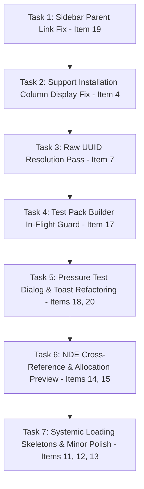

# Track 13 — UX Findings & Polish Implementation Plan

**Track**: Track 13 (UX Findings & Polish Backlog)  
**Target Date**: 2026-08-12  
**Baseline**: Post-Track 12 (`3fb1d88` "feat(release): close Track 12 Demo Lite")  
**Scope**: 20 findings recorded in `docs/acceptance/track-12-demo-release.md` §4  

---

## 1. Executive Summary & Track Choice

During Track 12 Phase C browser acceptance, 20 findings were recorded in `docs/acceptance/track-12-demo-release.md` §4 (*Known limitations*). None of them blocked Track 12's release, so they were recorded and deferred.

**Track Choice**: This plan establishes **Track 13** (*UX Findings & Polish*), following the ad-hoc numbering scheme established by Track 12 (*Demo Lite release*). It is independent of the core T1–T8 domain roadmap (`docs/superpowers/plans/2026-07-30-pipeqc-supabase-master-roadmap.md`).

---

## 2. Complete Finding Triage Matrix (§4 Items 1–20)

Every finding from Track 12 §4 has been independently re-verified against the post-Track 12 working tree (`3fb1d88`):

| §4 Item | Summary | Triage Classification | Action / Slice | Reasoning |
| :--- | :--- | :--- | :--- | :--- |
| **1** | Home page stale `Track 08` / `Track 11` badges | **Already Resolved** | None | Fixed in commit `3fb1d88` (`app/page.tsx:59-81`, verified by `app/page.test.ts:10`). |
| **2** | Card title "Welding Procedures (Supabase)" leaks backend name | **Already Resolved** | None | Fixed in commit `3fb1d88` (`components/admin/supabase-wps-tab.tsx:187`, verified by `components/admin/supabase-wps-tab.test.ts:9`). |
| **3** | NDE Matrix `Incomplete (8)` badge vs Gate C `Referential Complete` | **Design Distinction** | None | Both badges are correct by design: Gate C asserts minimum operational rules exist (1 shop, 1 field), while the matrix badge highlights full Service Class × Weld Type coverage. No code bug. |
| **4** | Support installation record shows `—` in Installed column | **Reproducible Defect** | **Task 2 (Slice 2)** | `loadSupports` (`modules/construction/infrastructure/supabase-construction-repository.ts:440`) fails to unpack the PostgREST array `support_progress_records`, causing `installedOn` to evaluate to `null`. |
| **5** | Toast "Applied N definition rows." wording observation | **Not a Defect** | None | Verification note from test execution; `modules/engineering/ui/revision-workbench.tsx:101` functions correctly. |
| **6** | First synthetic click swallowed after page load | **Tooling Artifact** | None | Automation/browser-agent event timing issue, not a product or end-user defect. |
| **7** | Raw UUIDs printed in tracking Location ID and pressure test worklists | **Reproducible Defect** | **Task 3 (Slice 3)** | Cross-screen raw UUID leak in `modules/tracking/infrastructure/supabase-tracking-repository.ts:77,120` and `modules/pressure-test/ui/pressure-test-progress-screen.tsx:64`. |
| **8** | Welder↔WPS qualification link enforced | **Positive Control** | None | Correct business behavior; verified working as designed. |
| **9** | Session reset lands on "Access pending" | **Operator Note** | None | Process note regarding stale JWTs after database resets; resolved by sign-out/sign-in. |
| **10** | Setup walkthrough top-bar chip does not auto-switch project | **Walkthrough Note** | None | Documentation note for manual project selection in presenter runbook. |
| **11** | Avatar dropdown trigger displays concatenated wall of text for roles | **Reproducible UX Gap** | **Task 7 (Slice 7)** | `components/pipeqc/top-nav.tsx:268` concatenates all functional role labels inline without truncation. |
| **12** | Material check "Heat / trace number" input is free text without PML lookup | **Reproducible UX Gap** | **Task 7 (Slice 7)** | `modules/construction/ui/fabrication/material-check-screen.tsx:227-238` provides no inline PML guidance or autocomplete. |
| **13** | Data-fetching screens render empty states during loading with no skeleton | **Systemic UX Gap** | **Task 7 (Slice 7)** | Systemic adoption gap: 7 of 28 screens use `Skeleton` (`components/ui/skeleton.tsx`), leaving ~21 screens showing empty lists while fetching. |
| **14** | NDE "Allocate Candidates" is a blind action without preview | **Reproducible UX Gap** | **Task 6 (Slice 6)** | `modules/quality/ui/nde-batch-screen.tsx` discards `allocated_count` and provides no candidate preview prior to allocation. |
| **15** | NDE Batches table and Obligations table lack cross-references | **Reproducible UX Gap** | **Task 6 (Slice 6)** | `modules/quality/infrastructure/supabase-quality-repository.ts:53-72` omits `batch_number` on obligations and obligation counts on batches. |
| **16** | Flange Report number and Tag number are free-text inputs | **Design Distinction** | None | Correct given the data model: report/tag numbers represent physical-world identifiers generated at execution time, with no reference catalog. |
| **17** | Test Pack Builder "Create and compose" button lacks in-flight pending guard | **Reproducible Defect** | **Task 4 (Slice 4)** | `modules/pressure-test/ui/test-pack-builder-screen.tsx:104` has no submitting guard, allowing duplicate clicks that bump `revision_no`. |
| **18** | Item clearance / pressure test progress page-wide Event date ambiguity & static notice | **Reproducible UX Gap** | **Task 5 (Slice 5)** | `modules/pressure-test/ui/pressure-test-progress-screen.tsx:35` uses static off-screen text instead of `sonner` toasts and page-wide unanchored date input. |
| **19** | `/testpack` root route unreachable from sidebar | **Reproducible Defect** | **Task 1 (Slice 1)** | `components/pipeqc/sidebar-nav.tsx:101-143` renders parent items with children as collapsible triggers without navigation `<Link>`. |
| **20** | Redesign pressure test progress screen to use per-row Dialog triggers | **Design Recommendation** | **Task 5 (Slice 5)** | Bundled with Item 18: replace static date + worklist layout in `pressure-test-progress-screen.tsx` with `Dialog` triggers matching NDE and Tracking patterns. |

---

## 3. Implementation Tasks & Sequencing

The 12 fixable findings are structured into **7 sequenced implementation tasks**, ordered by severity, dependency, and component coupling:



---

### Task 1: Sidebar Parent Link Navigation (Finding 19)

**Problem**: Clicking "Testpack" in the sidebar expands/collapses the submenu but never navigates to `/testpack` (the Test Pack dashboard containing the RFT tile and release backlog), because `components/pipeqc/sidebar-nav.tsx` renders items with children as collapsible triggers without `<Link>`.

**Files to touch**:
- `components/pipeqc/sidebar-nav.tsx` (lines 101–143)
- `config/navigation.ts` (lines 314–334)

**Proposed Fix**:
Modify `components/pipeqc/sidebar-nav.tsx` so that parent navigation items with an explicit `href` (such as `/testpack`) render the title as an active `<Link href={item.href}>` while rendering an adjacent chevron button for expanding/collapsing the child menu.

**Acceptance Check**:
- **Automated**: Add unit test in `components/pipeqc/sidebar-nav.test.tsx` verifying parent items with children render a clickable link to their `href`.
- **Manual**: In the browser, click "Testpack" in the sidebar; confirm the browser navigates directly to `http://localhost:3000/testpack`.

---

### Task 2: Support Installation Column Display Fix (Finding 4)

**Problem**: On `/fabrication/qc-release` and `/erection/supported`, recording a support installation succeeds in the DB and updates gate counters, but the table row's **Installed** column continues to display `—` and leaves the **Mark installed** button enabled even after page reloads.

**Root Cause**: In `modules/construction/infrastructure/supabase-construction-repository.ts:440`, `toSupportRow` reads `row.support_progress_records?.installed_on`. Because PostgREST returns `support_progress_records` as an array `[{ installed_on, phase }]`, `array.installed_on` resolves to `undefined` (falling back to `null`).

**Files to touch**:
- `modules/construction/infrastructure/supabase-construction-repository.ts` (lines 435–443)
- `modules/construction/infrastructure/supabase-construction-repository.test.ts`

**Proposed Fix**:
Update `toSupportRow` in `supabase-construction-repository.ts`:
```ts
const record = Array.isArray(row.support_progress_records)
  ? row.support_progress_records[0]
  : row.support_progress_records
installedOn: record?.installed_on ?? null
```

**Acceptance Check**:
- **Automated**: Update `supabase-construction-repository.test.ts` with PostgREST array response mock verifying `installedOn` maps correctly.
- **Manual**: Navigate to `/fabrication/qc-release`, mark a support installed; verify the **Installed** column displays the date and the **Mark installed** button becomes disabled immediately and survives page reload.

---

### Task 3: Cross-Screen Raw UUID Resolution Pass (Finding 7)

**Problem**: Raw database UUIDs are rendered in user-facing table columns:
1. `/tracking/data-analysis`: Spool history card's **Location ID** column displays UUIDs (`d966f78c-...`) instead of codes (`LAYDOWN-A`, `FAB-SHOP`).
2. `/testpack/pressure-test/*`: Line check, item clearance, and testing worklists display raw ISO UUIDs, punch UUIDs, and test pack UUIDs in worklist labels.

**Files to touch**:
- `modules/tracking/infrastructure/supabase-tracking-repository.ts` (lines 73–78, 117–121)
- `modules/pressure-test/infrastructure/supabase-pressure-test-repository.ts`
- `modules/pressure-test/ui/pressure-test-progress-screen.tsx`

**Proposed Fix**:
1. In `supabase-tracking-repository.ts`: Map `locationCode` using the joined `project_locations(code)` relation in both event history queries.
2. In `supabase-pressure-test-repository.ts` and `pressure-test-progress-screen.tsx`: Join and display `iso_number`, `punch_code`, and `test_pack_number` in worklist item labels instead of raw UUIDs.

**Acceptance Check**:
- **Automated**: Add repository unit tests asserting `locationCode` resolves to human-readable codes instead of UUID fallbacks.
- **Manual**: Open `/tracking/data-analysis` and `/testpack/pressure-test/line-check/progress`; verify all location and target labels display human-readable codes.

---

### Task 4: Test Pack Builder In-Flight Guard (Finding 17)

**Problem**: On `/testpack/builder`, the **Create and compose** button has no pending/in-flight submission guard (`modules/pressure-test/ui/test-pack-builder-screen.tsx:104`). Rapid multiple clicks route subsequent clicks to the update branch, incrementing `revision_no` unnecessarily (e.g., producing `rev 4` instead of `rev 0`).

**Files to touch**:
- `modules/pressure-test/ui/test-pack-builder-screen.tsx` (lines 80–110)

**Proposed Fix**:
Add an `isSubmitting` state flag to `TestPackBuilderScreen`. Disable the **Create and compose** and **Save metadata** buttons and display a loading spinner while the RPC request is in flight.

**Acceptance Check**:
- **Automated**: Add component test verifying button is disabled during async submission.
- **Manual**: Click **Create and compose** rapidly on a new test pack; verify only 1 RPC request is issued and revision remains `0`.

---

### Task 5: Pressure Test Dialog & Toast Refactoring (Findings 18 & 20)

**Problem**: On `/testpack/pressure-test/*/progress` (`modules/pressure-test/ui/pressure-test-progress-screen.tsx`), the **Event date** is a single page-wide input with ambiguous scope, and completion notices render as static off-screen paragraphs instead of using the app's shared `sonner` toast system.

**Files to touch**:
- `modules/pressure-test/ui/pressure-test-progress-screen.tsx` (lines 20–120)
- `components/ui/dialog.tsx`

**Proposed Fix**:
Refactor `pressure-test-progress-screen.tsx` to match the established NDE "Record Result" and Tracking "Add Event" dialog patterns:
1. Each worklist row renders an action trigger button (e.g., "Record Line Check", "Clear Punch").
2. Clicking the trigger opens a `Dialog` containing the event date picker, result fields, and in-dialog submit button.
3. On successful submission, close the dialog, trigger `toast.success(...)` via `sonner`, and refresh readiness projections.

**Acceptance Check**:
- **Automated**: Component test verifying modal opens per row and triggers toast notification on submit.
- **Manual**: Perform Line Check and Item Clearance completion in browser; verify dialog opens, date is scoped per action, and top-right toast appears on success.

---

### Task 6: NDE Batch/Obligation Cross-Reference & Allocation Preview (Findings 14 & 15)

**Problem**:
1. `/nde`: The Batches table and Obligations table are disconnected—obligations show no batch reference and batches show no obligation count (`modules/quality/ui/nde-batch-screen.tsx`).
2. "Allocate Candidates" runs blindly server-side without a client-side preview of how many candidates will be allocated.

**Files to touch**:
- `modules/quality/infrastructure/supabase-quality-repository.ts` (lines 53–72, 137–149)
- `modules/quality/ui/nde-batch-screen.tsx` (lines 322–327, 412–421)

**Proposed Fix**:
1. In `supabase-quality-repository.ts`: Join `batch_number` into `loadObligations` query and add `allocated_count` / `obligation_count` to batch queries.
2. In `nde-batch-screen.tsx`: Display `Batch #` column in Obligations table, `Obligations` count column in Batches table, and display a candidate count badge on the "Allocate Candidates" button before clicking.

**Acceptance Check**:
- **Automated**: Repository tests verifying `batchNumber` is returned on `NdeObligation` objects.
- **Manual**: Open `/nde`, create and allocate a batch; verify obligation table shows the batch number and batch table shows the obligation count.

---

### Task 7: Systemic Loading Skeletons & UX Polish (Findings 11, 12, 13)

**Problem**:
1. Systemic loading state gap (Finding 13): Data-fetching screens render empty tables during initial fetch with no loading indicator.
2. Top-bar avatar subtitle (Finding 11): `components/pipeqc/top-nav.tsx:268` concatenates all functional role labels into a long unformatted string.
3. Material check heat number input (Finding 12): `modules/construction/ui/fabrication/material-check-screen.tsx:227-238` provides no PML helper hint or lookup guidance.

**Files to touch**:
- `components/pipeqc/top-nav.tsx` (line 268)
- `modules/construction/ui/fabrication/material-check-screen.tsx` (lines 227–238)
- `modules/*/ui/*screen*.tsx` (audit and add `Skeleton` loader during data fetch)

**Proposed Fix**:
1. In `top-nav.tsx`: Truncate or display only the primary access role inline under the avatar, moving the full functional role list into the dropdown menu.
2. In `material-check-screen.tsx`: Add a helper caption and PML reference hint under the heat number text input.
3. Audit data-fetching screens and wrap initial loading states with `<Skeleton />` components from `components/ui/skeleton.tsx`.

**Acceptance Check**:
- **Automated**: Unit test in `top-nav.test.tsx` verifying clean avatar role subtitle rendering.
- **Manual**: Navigate across Fabrication, Erection, and Test Pack screens on a throttled connection; verify smooth skeleton loading states appear during data fetch.

---

## 4. Verification Plan

### Automated Verification
Run full quality test suites after completing the tasks:
```bash
# 1. Typecheck
npm run typecheck

# 2. Unit and Component Tests
npm test

# 3. Database pgTAP Tests
npm run test:pgtap
```

### Manual Acceptance Verification
Re-run the full browser walkthroughs for affected tracks:
```bash
# Verify Track 10 browser acceptance gate
npm run bootstrap:track10-browser-fixtures
```
Verify in browser at `http://localhost:3000`:
1. `/testpack` is accessible directly from the sidebar parent link (Task 1).
2. Support installation dates persist and display correctly in `/fabrication/qc-release` (Task 2).
3. Tracking location codes and pressure test worklists show human-readable codes instead of raw UUIDs (Task 3).
4. Test Pack builder button disables during submission (Task 4).
5. Pressure test progress actions open modal dialogs with top-right toasts (Task 5).
6. NDE tables display batch cross-references (Task 6).
7. Top-bar avatar subtitle renders cleanly and screens show skeleton loaders while fetching (Task 7).

---

## 5. Definition of Done

- [ ] All 7 tasks implemented and verified against unit/component tests.
- [ ] No regression in existing pgTAP test suite (`npm run test:pgtap`).
- [ ] Zero TypeScript errors (`npm run typecheck`).
- [ ] Full Track 10 and Track 12 browser acceptance walkthroughs execute cleanly against `http://localhost:3000`.
