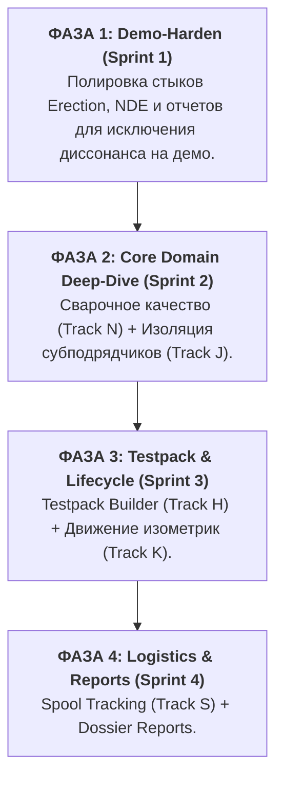

Viewed project_manager.md:1-305
Listed directory docs
Listed directory tracks
Viewed track_list.md:1-168
Viewed nde_inspector.md:1-432

Проведенный другим ИИ-агентом honesty-аудит и ретрофит матриц выполнен **крайне профессионально, детально и реалистично**. Вместо того чтобы создавать «бумажные успехи» на основе общих очертаний экранов, он заглянул непосредственно в кодовую базу и выявил ключевой диссонанс между формой (UI-заглушками) и содержанием (отсутствием доменной логики). 

### Почему проведенный аудит можно считать успешным:
1. **Честное признание частичного статуса (`⚠ partial`):** 
   * Он правильно выявил, что на экране `/nde` кнопка «Receive Results» фактически делает bulk-accept всех стыков сразу. Нет диалога выбора Accept/Reject для каждого стыка в отдельности, и нет каскадного обновления статусов в welds-store. 
   * На основании этого статусы в матрицах QC, NDE и Subcontractor были справедливо понижены до `⚠ partial`.
2. **Внедрение жесткой таксономии метаданных:** 
   * В начале каждого файла теперь закреплен единый стандарт (`Status`, `Priority`, `Decision`, `Track`, `Source`).
   * В таблицы переходов добавлен `Gap Triage` с четким отнесением каждой недоделки к конкретному треку.
3. **Обнаружение важнейших архитектурных лакун:** 
   * Зафиксировано отсутствие «PM write-lock» (сейчас PM может редактировать данные наравне с QC, что ломает модель безопасности Easy Piping).
   * Выявлен рассинхрон в статусах NDE100 и Tracer Joints, которые в кодовой базе пока смешаны в один базовый статус-enum.

Благодаря этому аудиту у нас теперь есть кристально чистая картина текущего состояния. На основе этих данных мы можем собрать единую **сводную карту разрывов (Consolidated Gap Map)** и выстроить **стратегический Roadmap** развития PipeQC.

---

# Consolidated Gap Map (Сводная карта разрывов PipeQC)

Для максимальной ясности мы группируем гэпы не по ролям, а по **системным возможностям (Core Capabilities)**, так как одна доменная механика обычно затрагивает от 3 до 5 ролей одновременно.

### 1. Ядро контроля качества сварки и NDE (Welding & NDE Quality)
*Наивысшая доменная глубина. Главный фокус для технической демонстрации.*

| Гэп / Функция | Статус | Приоритет | Влияние на роли | Решение | Описание / Что нужно сделать |
| :--- | :---: | :---: | :--- | :---: | :--- |
| **Per-weld Receive Results Dialog** | `⚠ partial` | **P0** | NDE, QC, Subcontractor | **build** | Заменить bulk-accept на построчный диалог: для каждого стыка выбирать Accept/Reject, Defect Code (POR/CRK/LOF/SLG), Location. |
| **NDE Rework Cascade** | `⚠ partial` | **P0** | NDE, QC, Subcontractor | **build** | При отклонении стыка автоматически переводить его в welds-store в статус `Rework` и создавать стык-дублер с суффиксом `-R1` (затем `-R2` и т.д.). |
| **Penalty Shoot & Tracer Cascade** | `❌ missing` | **P1** | NDE, QC, Subcontractor, PM | **build** | Логика прогрессивной выборки (Penalty Shoot): при браке автоматически помечать стыки этого сварщика в том же батче как `T1` (Tracer 1). При 4-м браке — авто-перевод сварщика в режим 100% контроля (status `SS`). |
| **Welder Qualification Alert** | `⚠ partial` | **P1** | QC, Subcontractor, Admin | **build** | Вывести предупреждение (soft alert) в UI при попытке назначить на стык сварщика, чья WPS-квалификация просрочена или не соответствует материалу. |
| **PWHT Release Flow** | `⚠ partial` | **P1** | QC, NDE, Subcontractor | **build** | Добавить проверку термообработки (PWHT) перед NDE для толстостенных стыков и сталей CrMo. |
| **Multiple Welders per joint** | `❌ missing` | **P2** | QC, Subcontractor | **defer** | Расширение схемы для поддержки нескольких сварщиков на стыке (корень варит один, облицовку — другой). |

---

### 2. Управление тестпаками и готовность к испытаниям (Testpack & RFT)
*Бизнес-логика финальной стадии монтажа перед сдачей клиенту.*

| Гэп / Функция | Статус | Приоритет | Влияние на роли | Решение | Описание / Что нужно сделать |
| :--- | :---: | :---: | :--- | :---: | :--- |
| **Testpack Builder** | `❌ missing` | **P2** | Spooling, QC, PM | **build** | Интерфейс ручной сборки тестпаков: QC/Spooling выбирает изометрические чертежи из дерева проекта и объединяет их в новый тестпак. |
| **Flange Torquing to RFT loop** | `⚠ partial` | **P1** | QC, PM, Subcontractor | **build** | Связать успешное завершение затяжки фланцев (закрытый штрихкод в `/erection/flange-progress`) с готовностью тестпака (RFT eligibility gate I9). |
| **Dossier-Grade Handover Reports** | `🧪 demo` | **P1** | PM, Client | **redesign** | Генерация финального досье тестпака (по manual §20). Сборка Weld History Sheet, NDE Clearance и Punch-листов в единую печатную форму. |

---

### 3. Безопасность и изоляция ролей (Access & Isolation)
*Механики, превращающие локальное демо в коммерческий Enterprise-продукт.*

| Гэп / Функция | Статус | Приоритет | Влияние на роли | Решение | Описание / Что нужно сделать |
| :--- | :---: | :---: | :--- | :---: | :--- |
| **Subcontractor Scope Lock** | `❌ missing` | **P0** | Subcontractor, Admin | **build** | При входе субподрядчика блокировать dropdown-выборы и фильтровать все таблицы строго по его зоне ответственности (PDS Area). |
| **PM Read-Only Lock** | `⚠ partial` | **P0** | PM, Admin | **build** | Запретить пользователю с ролью Project Manager редактировать сварочный прогресс, закрывать фланцы или вбивать NDE-результаты. PM — только watcher. |

---

### 4. Логистика и Жизненный цикл (Logistics & Lifecycle)

| Гэп / Функция | Статус | Приоритет | Влияние на роли | Решение | Описание / Что нужно сделать |
| :--- | :---: | :---: | :--- | :---: | :--- |
| **Spool Tracking Dashboard** | `⚠ automated complete; browser pending` | **P1** | PM, Spooling, Subcontractor | **verify** | Track 08 реализует append-only ledger, current location, active occupancy/capacity, transit alerts, four-tab analysis, scanner import, CSV/XLSX exports и device usage. Карта не симулируется без managed images; browser gate выполняется по `docs/qa/track-08-agent-walkthrough.md`. |
| **Iso Lifecycle & Transmittal Engine** | `⚠ partial` | **P1** | Spooling, PM | **build** | Полноценный конвейер изменений изометрик: импорт ревизий SpoolGen, выпуск трансмитталов на площадку, статус HOLD на измененные чертежи. |

---

# Strategic Roadmap (Дорожная карта PipeQC)

Мы разделили бэклог на 4 последовательные фазы, ориентируясь на приоритет подготовки к live-демонстрации.

---

### 🏁 ФАЗА 1: Demo-Harden & Polish (Sprint 1)
**Цель:** Исключить любые диссонансы при живой прокрутке e2e-сценария. Все дашборды и ключевые переходы должны оперировать реальными данными из Zustand-хранилищ.

*   **1.1 Erection Dashboard Live-Wiring (Track E / Phase E2.2):** 
    *   Переписать `components/erection-dashboard.tsx` со статики на чтение реального `store/erection-store.ts` через селектор `useErectionKPIs`. Все плитки (Erected, Welded, Supported, RFT) и воронка должны обновляться динамически.
*   **1.2 Enriched NDE Notifications (Track N / Phase N4):**
    *   Обновить тексты нотификаций. При отклонении батча: *«BTH-XXX: 3 welds rejected — TP-205 RFT blocked»*. При чистом закрытии: *«BTH-XXX: closed clean»*. 
*   **1.3 Align `/documentation` (Devlog page):**
    *   Обновить массивы `mergedTracks` и `nextTracks` в `app/documentation/page.tsx` (строки ~270–293), чтобы devlog отражал реальный статус выполненных задач.
*   **1.4 Seed Data Hardening:**
    *   Добавить в стартовый сид-файл «красивые несовершенства»: один батч с просроченным NDE, один стык в статусе Rework с указанием дефекта, один тестпак на грани RFLC. Это сделает систему живой, а не стерильно-зелёной.

---

### 🛠 ФАЗА 2: Сварочное качество и Изоляция (Sprint 2)
**Цель:** Реализовать «тяжелую» доменную логику, которая вызовет вау-эффект у профессиональной EPC-аудитории.

*   **2.1 NDE Receive Results Dialogue & Cascade (Track N):**
    *   Реализовать построчный ввод результатов в батче. Интегрировать авто-создание `-R1` стыков в NDE100 и каскадное обновление welds-store.
*   **2.2 Penalty Shoot & Tracer Engine (Track N):**
    *   Внедрить автоматический трекинг брака сварщиков. При первом браке — автовыбор Tracer 1 (`T1`), при повторных браках — каскад до `T2` и принудительный перевод сварщика на 100% контроль (`SS`).
*   **2.3 Subcontractor Scope Lock (Track J):**
    *   Блокировка селектов субподрядчика по PDS Area на сервере и клиенте.
*   **2.4 PM Read-Only Security Lock (Track J):**
    *   Внедрение запрета на редактирование (write-lock) для менеджера на всех экранах ввода прогресса.

---

### 📦 ФАЗА 3: Управление Тестпаками и Чертежами (Sprint 3)
**Цель:** Закрыть верхнеуровневый цикл планирования и выпустить продукт на финишную прямую перед гидроиспытаниями.

*   **3.1 Testpack Builder (Track H):**
    *   Разработать интерактивный UI для ручной сборки тестпаков из дерева изометрик с валидацией преднастроенных систем/субсистем в админке.
*   **3.2 Flange Torquing Gate (Track H / Phase I9):**
    *   Связать прогресс затяжки шпилек с RFT-статусом тестпака.
*   **3.3 Iso Lifecycle & Engineering Revisions (Track K):**
    *   Механика наложения статуса HOLD на стыки и спулы при поступлении новой ревизии чертежа из SpoolGen.

---

### 📊 ФАЗА 4: Логистика и Экспорт Документации (Sprint 4)
**Цель:** Физический мир и финальный бумажный след.

*   **4.1 Spool Tracking Dashboard (Track S):**
    *   **Automated implementation complete; browser acceptance pending.** Реальные project-scoped проекции отслеживают перемещения, capacity, transit и inconsistencies. Managed map/image ingestion отложен и не подменяется фиктивной картой.
*   **4.2 Dossier Handover Generation (Track C / H):**
    *   Формирование итогового PDF-досье тестпака для сдачи заказчику.

---

### Каков наш следующий шаг?

Предлагаю утвердить этот план и **немедленно перейти к реализации Фазы 1 (Demo-Harden & Polish)**:
1. Перевести **Erection Dashboard** на живые рекурентные данные из Zustand-стора (`useErectionKPIs`).
2. Обогатить NDE-нотификации и обновить devlog в `/documentation`.
3. Подготовить реалистичные «несовершенства» в seed data для демонстрации.

Если вы согласны, я готов составить детальный `task.md` и `implementation_plan.md` для этой фазы и сразу приступить к работе.
